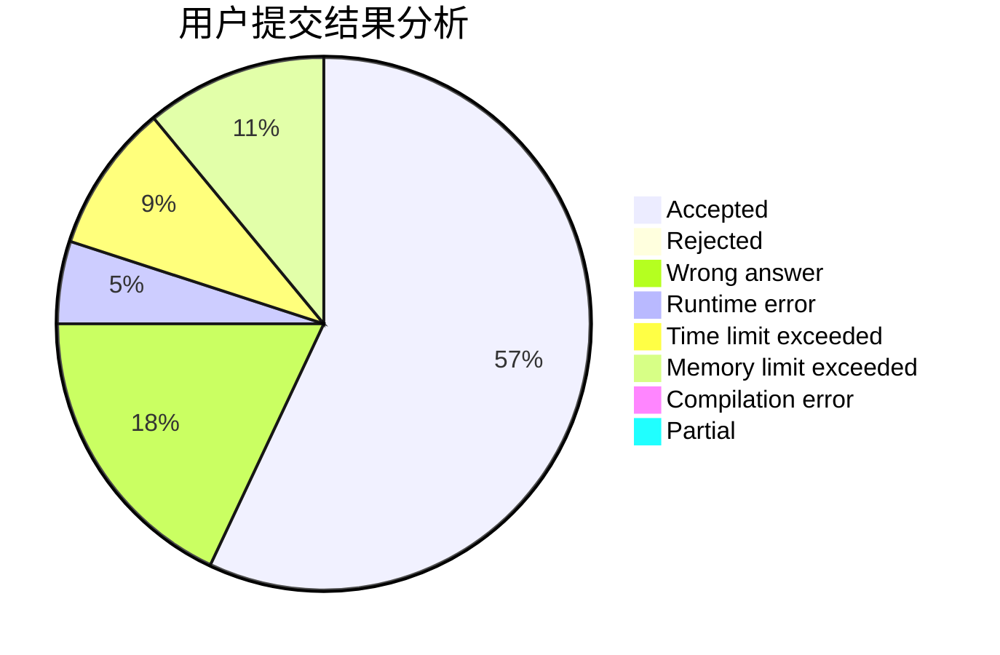
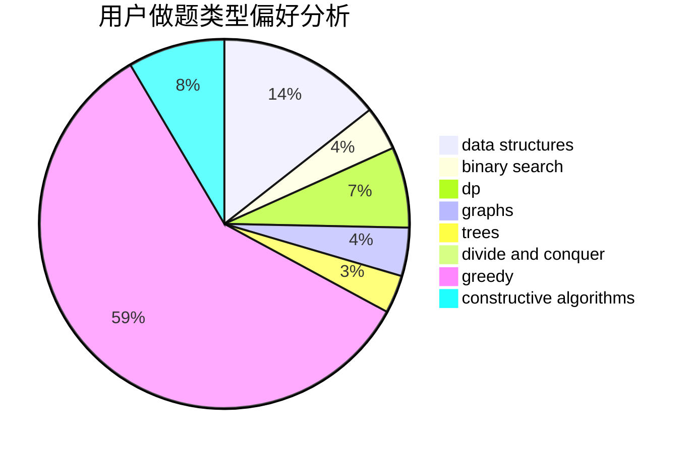

# suyucheng

<!-- tabs:start -->

#### **用户提交结果分析**

#### **用户做题类型偏好分析**

#### **用户错题知识点分析**

<!-- tabs:end -->
# 推荐题目
[1154D](https://codeforces.com/contest/1154/problem/D)		greedy		  
[548C](https://codeforces.com/contest/548/problem/C)		dsu,graphs,sortings,trees		  
[632D](https://codeforces.com/contest/632/problem/D)		brute force,
                        math,
                        number theory		  
[1154C](https://codeforces.com/contest/1154/problem/C)		implementation,
                        math		  
[479C](https://codeforces.com/contest/479/problem/C)		greedy,
                        sortings		  
[1251A](https://codeforces.com/contest/1251/problem/A)		brute force,
                        strings,
                        two pointers		  
[1189B](https://codeforces.com/contest/1189/problem/B)		greedy,
                        math,
                        sortings		  
[1443A](https://codeforces.com/contest/1443/problem/A)		constructive algorithms,
                        math		  
[543A](https://codeforces.com/contest/543/problem/A)		dp		  
[1301D](https://codeforces.com/contest/1301/problem/D)		constructive algorithms,
                        graphs,
                        implementation		  
