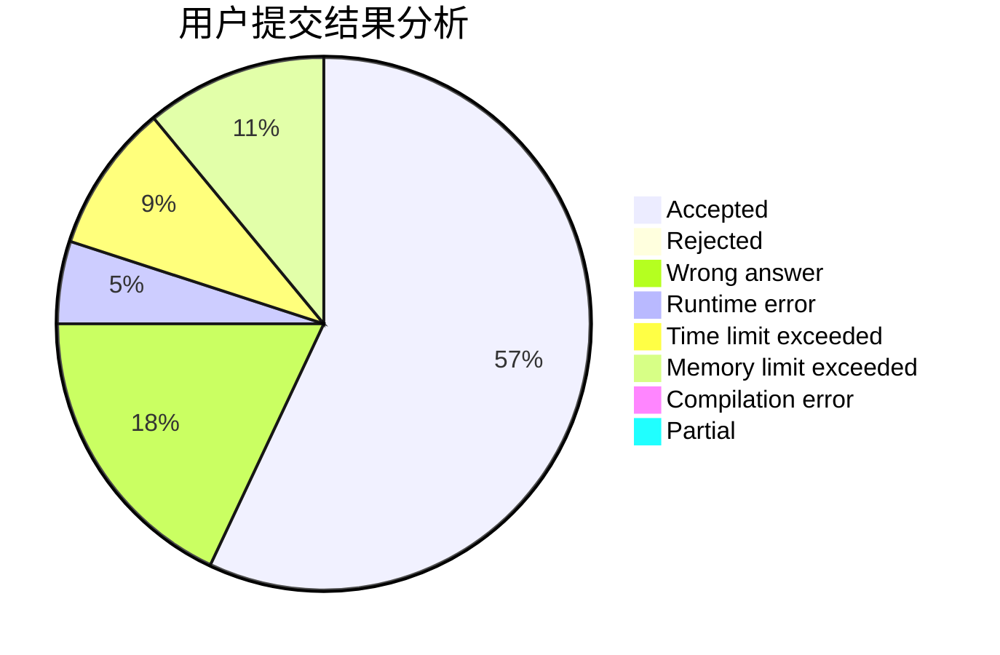
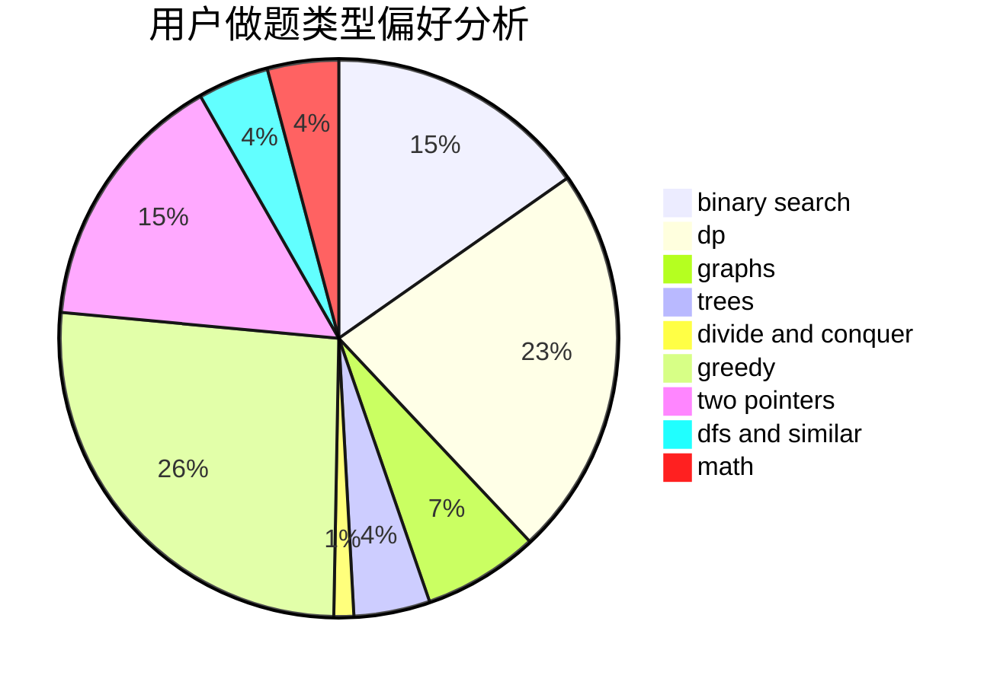

# suyucheng

<!-- tabs:start -->

#### **用户提交结果分析**

#### **用户做题类型偏好分析**

<!-- tabs:end -->
# 推荐题目
[1156D](https://codeforces.com/contest/1156/problem/D)
[573E](https://codeforces.com/contest/573/problem/E)
[664A](https://codeforces.com/contest/664/problem/A)
[1156C](https://codeforces.com/contest/1156/problem/C)
[49E](https://codeforces.com/contest/49/problem/E)
[1256B](https://codeforces.com/contest/1256/problem/B)
[1194D](https://codeforces.com/contest/1194/problem/D)
[1452F](https://codeforces.com/contest/1452/problem/F)
[567C](https://codeforces.com/contest/567/problem/C)
[1311A](https://codeforces.com/contest/1311/problem/A)
