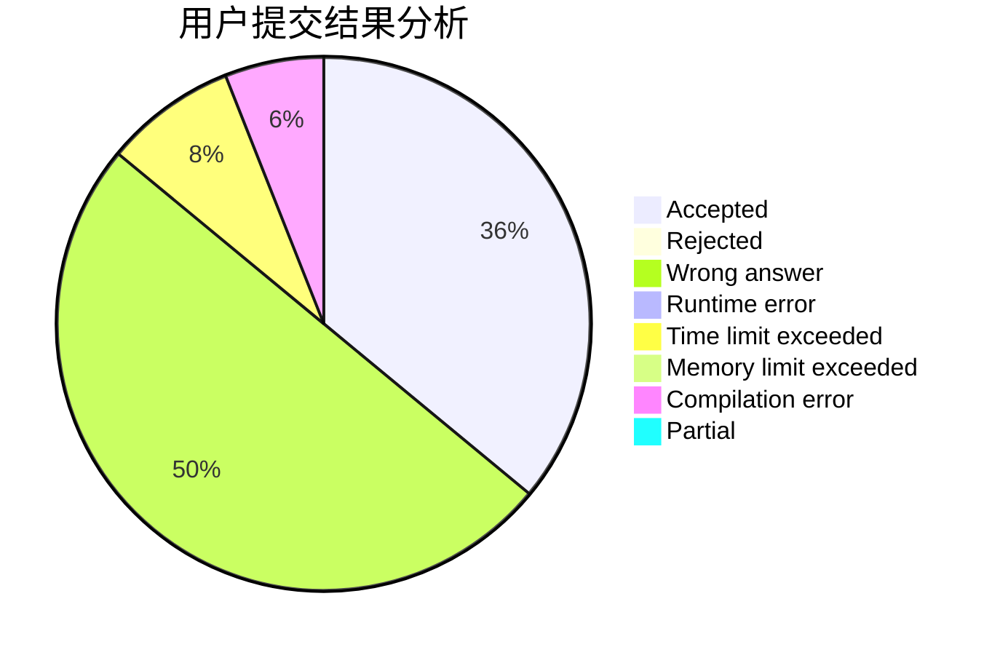
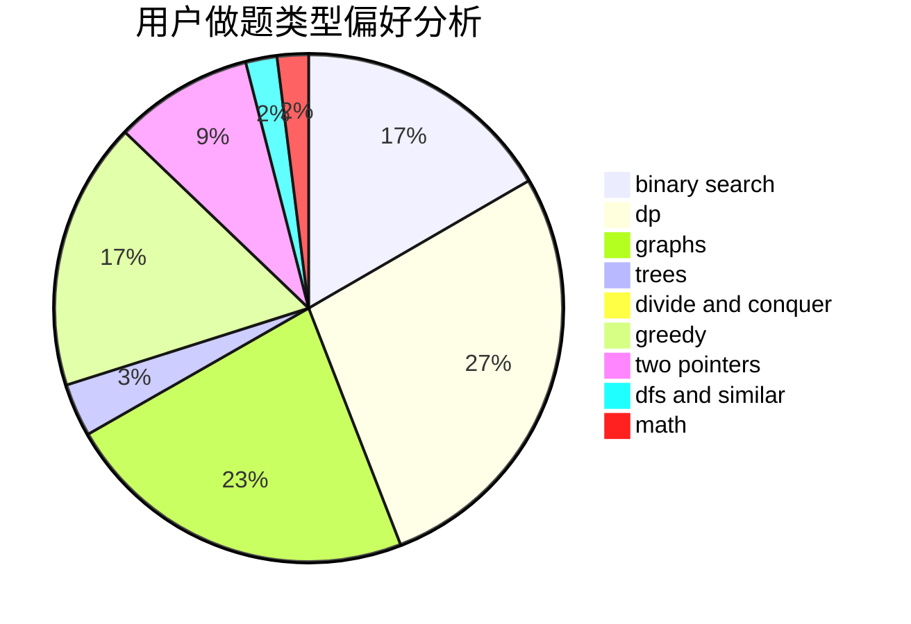

# svr2kos2

<!-- tabs:start -->

#### **用户提交结果分析**

#### **用户做题类型偏好分析**

<!-- tabs:end -->
# 推荐题目
[1067B](https://codeforces.com/contest/1067/problem/B)
[1146A](https://codeforces.com/contest/1146/problem/A)
[1173A](https://codeforces.com/contest/1173/problem/A)
[1248B](https://codeforces.com/contest/1248/problem/B)
[1113D](https://codeforces.com/contest/1113/problem/D)
[746C](https://codeforces.com/contest/746/problem/C)
[11881](https://codeforces.com/contest/1188/problem/1)
[780F](https://codeforces.com/contest/780/problem/F)
[226E](https://codeforces.com/contest/226/problem/E)
[1144B](https://codeforces.com/contest/1144/problem/B)
