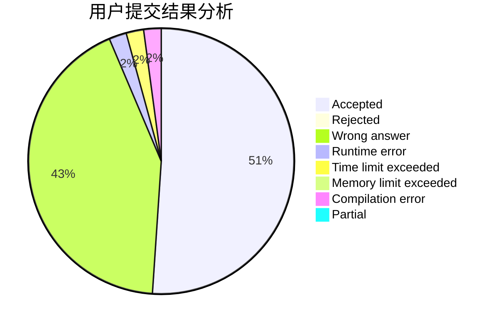
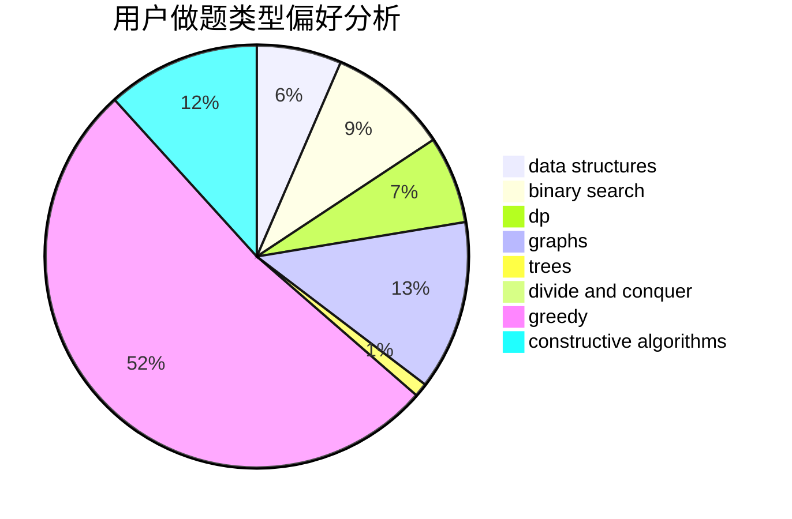

# CRB

<!-- tabs:start -->

#### **用户提交结果分析**

#### **用户做题类型偏好分析**

#### **用户错题知识点分析**

<!-- tabs:end -->
# 推荐题目
[1354B](https://codeforces.com/contest/1354/problem/B)		binary search,
                        dp,
                        implementation,
                        two pointers		  
[1424I](https://codeforces.com/contest/1424/problem/I)		dsu,graphs,sortings,trees		  
[610B](https://codeforces.com/contest/610/problem/B)		constructive algorithms,
                        implementation		  
[1506D](https://codeforces.com/contest/1506/problem/D)		constructive algorithms,
                        data structures,
                        greedy		  
[1428F](https://codeforces.com/contest/1428/problem/F)		binary search,
                        data structures,
                        divide and conquer,
                        dp,
                        two pointers		  
[1213A](https://codeforces.com/contest/1213/problem/A)		math		  
[58A](https://codeforces.com/contest/58/problem/A)		greedy,
                        strings		  
[610C](https://codeforces.com/contest/610/problem/C)		constructive algorithms		  
[1065C](https://codeforces.com/contest/1065/problem/C)		greedy		  
[1131A](https://codeforces.com/contest/1131/problem/A)		math		  
