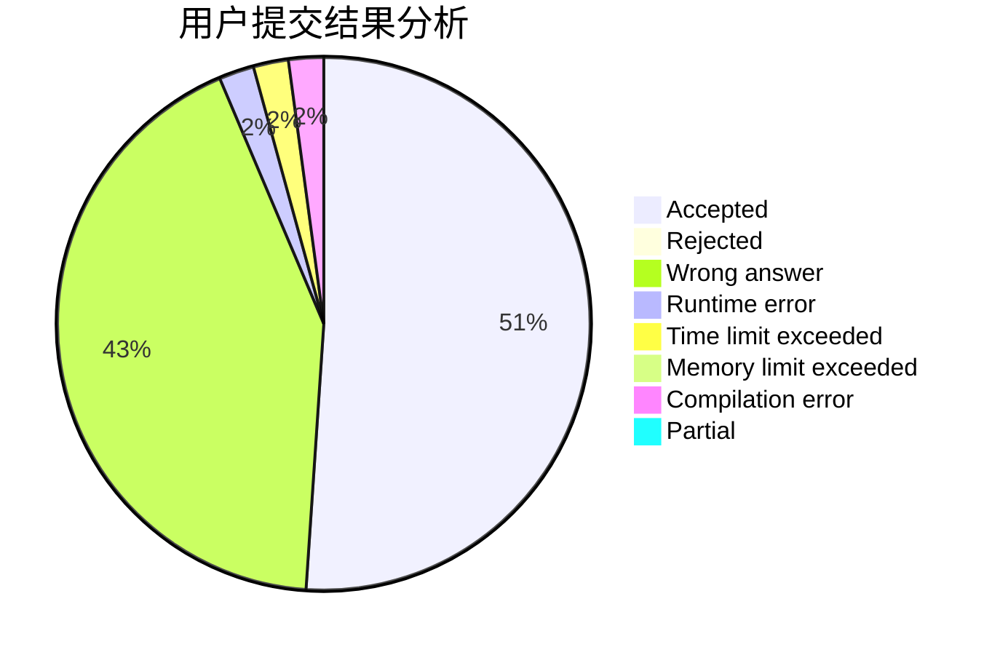
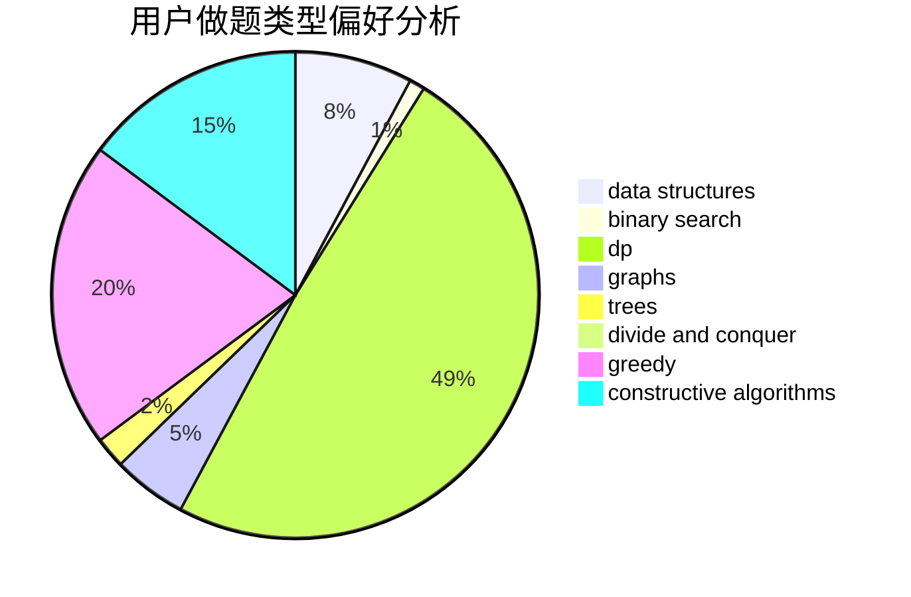

# CRB

<!-- tabs:start -->

#### **用户提交结果分析**

#### **用户做题类型偏好分析**

#### **用户错题知识点分析**

<!-- tabs:end -->
# 推荐题目
[1360F](https://codeforces.com/contest/1360/problem/F)		bitmasks,
                        brute force,
                        constructive algorithms,
                        dp,
                        hashing,
                        strings		  
[1433A](https://codeforces.com/contest/1433/problem/A)		implementation,
                        math		  
[629D](https://codeforces.com/contest/629/problem/D)		data structures,
                        dp		  
[158A](https://codeforces.com/contest/158/problem/A)		*special problem,
                        implementation		  
[1437F](https://codeforces.com/contest/1437/problem/F)		combinatorics,
                        dp,
                        math,
                        two pointers		  
[1217C](https://codeforces.com/contest/1217/problem/C)		binary search,
                        bitmasks,
                        brute force		  
[609B](https://codeforces.com/contest/609/problem/B)		constructive algorithms,
                        implementation		  
[629E](https://codeforces.com/contest/629/problem/E)		combinatorics,
                        data structures,
                        dfs and similar,
                        dp,
                        probabilities,
                        trees		  
[1065G](https://codeforces.com/contest/1065/problem/G)		strings		  
[1132G](https://codeforces.com/contest/1132/problem/G)		data structures,
                        dp,
                        trees		  
