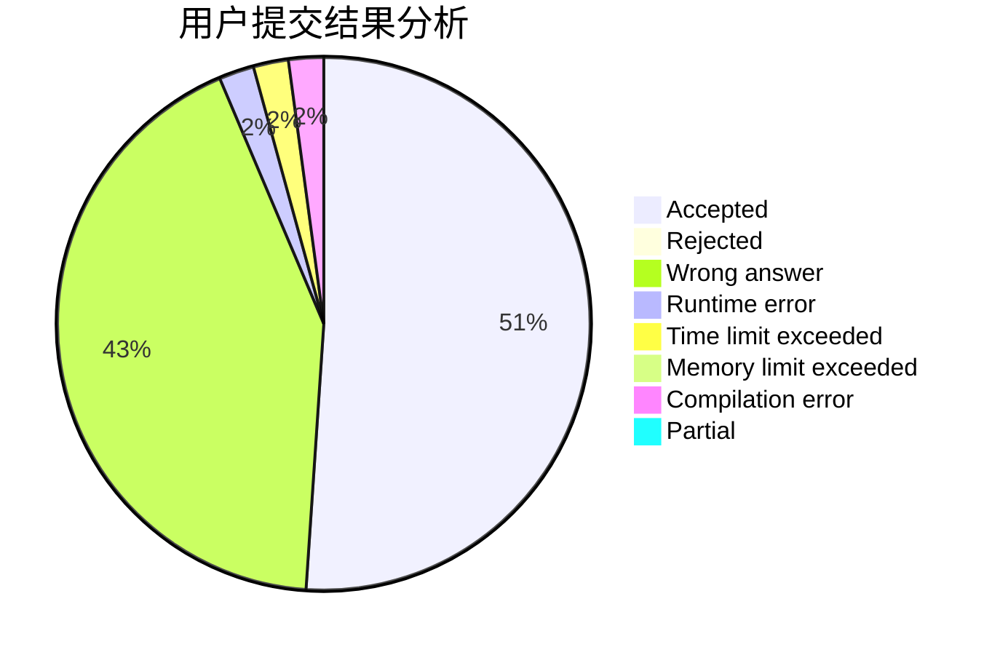
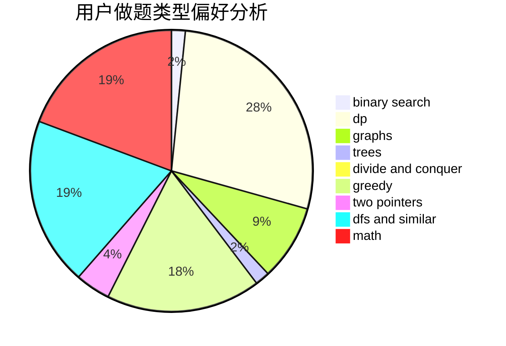

# CRB

<!-- tabs:start -->

#### **用户提交结果分析**

#### **用户做题类型偏好分析**

<!-- tabs:end -->
# 推荐题目
[1360F](https://codeforces.com/contest/1360/problem/F)
[1433A](https://codeforces.com/contest/1433/problem/A)
[629D](https://codeforces.com/contest/629/problem/D)
[158A](https://codeforces.com/contest/158/problem/A)
[1437F](https://codeforces.com/contest/1437/problem/F)
[1217C](https://codeforces.com/contest/1217/problem/C)
[609B](https://codeforces.com/contest/609/problem/B)
[629E](https://codeforces.com/contest/629/problem/E)
[1065G](https://codeforces.com/contest/1065/problem/G)
[1132G](https://codeforces.com/contest/1132/problem/G)
