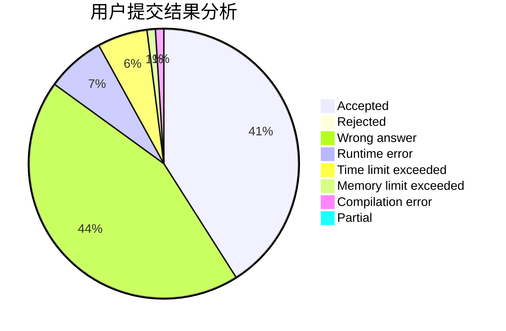
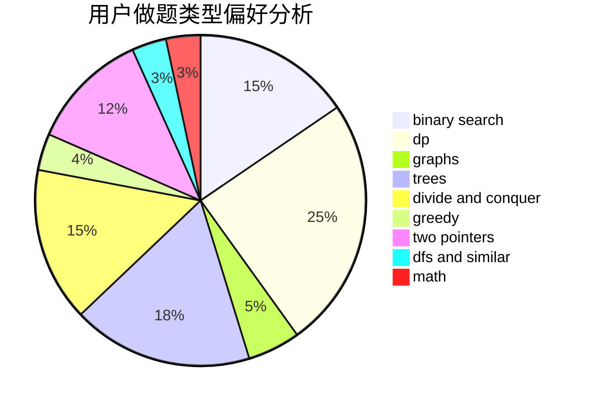

# sweet_fish

<!-- tabs:start -->

#### **用户提交结果分析**

#### **用户做题类型偏好分析**

<!-- tabs:end -->
# 推荐题目
[1059A](https://codeforces.com/contest/1059/problem/A)
[924D](https://codeforces.com/contest/924/problem/D)
[767A](https://codeforces.com/contest/767/problem/A)
[994B](https://codeforces.com/contest/994/problem/B)
[765C](https://codeforces.com/contest/765/problem/C)
[509C](https://codeforces.com/contest/509/problem/C)
[899F](https://codeforces.com/contest/899/problem/F)
[1500F](https://codeforces.com/contest/1500/problem/F)
[474C](https://codeforces.com/contest/474/problem/C)
[598F](https://codeforces.com/contest/598/problem/F)
