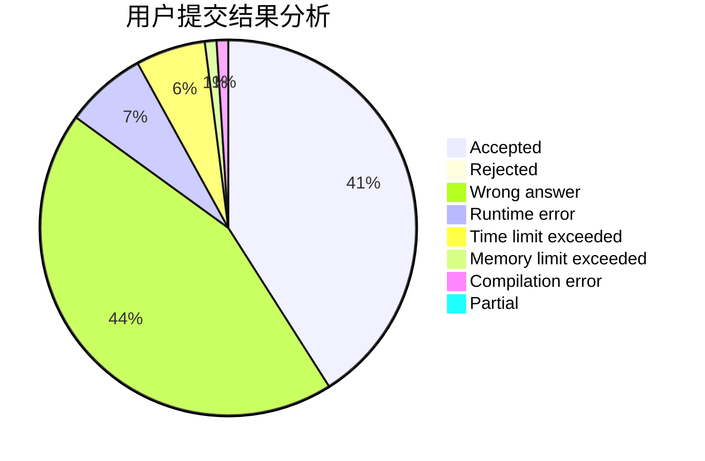
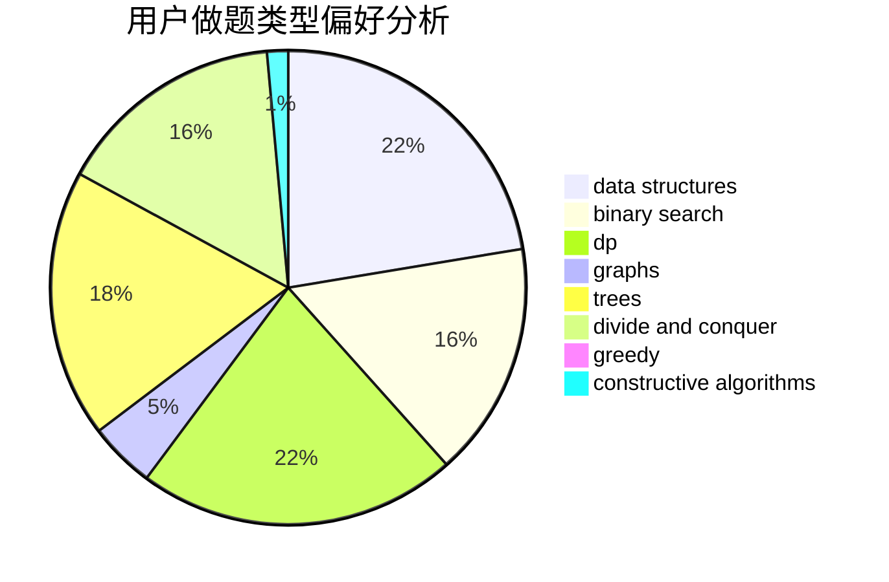
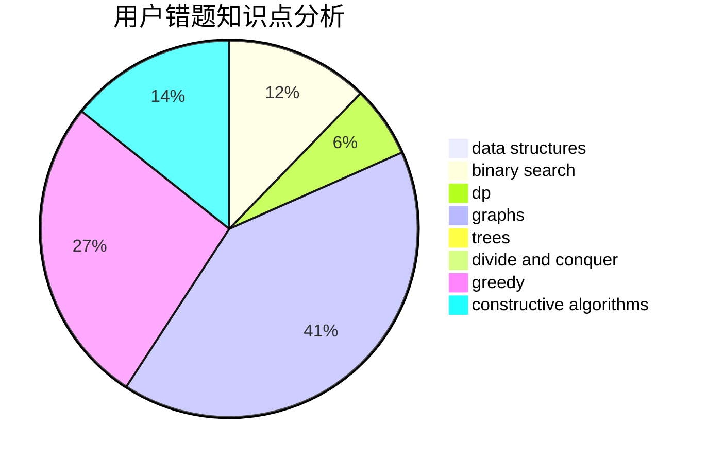

# sweet_fish

<!-- tabs:start -->

#### **用户提交结果分析**

#### **用户做题类型偏好分析**

#### **用户错题知识点分析**

<!-- tabs:end -->
# 推荐题目
[1059A](https://codeforces.com/contest/1059/problem/A)		implementation		  
[924D](https://codeforces.com/contest/924/problem/D)		nan		  
[767A](https://codeforces.com/contest/767/problem/A)		data structures,
                        implementation		  
[994B](https://codeforces.com/contest/994/problem/B)		greedy,
                        implementation,
                        sortings		  
[765C](https://codeforces.com/contest/765/problem/C)		math		  
[509C](https://codeforces.com/contest/509/problem/C)		dp,
                        greedy,
                        implementation		  
[899F](https://codeforces.com/contest/899/problem/F)		data structures,
                        strings		  
[1500F](https://codeforces.com/contest/1500/problem/F)		dp		  
[474C](https://codeforces.com/contest/474/problem/C)		brute force,
                        geometry		  
[598F](https://codeforces.com/contest/598/problem/F)		geometry		  
