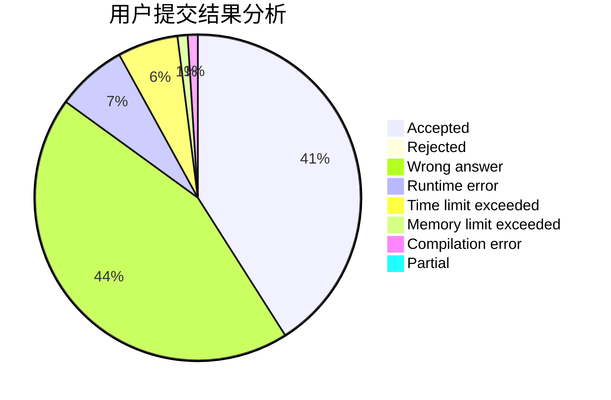
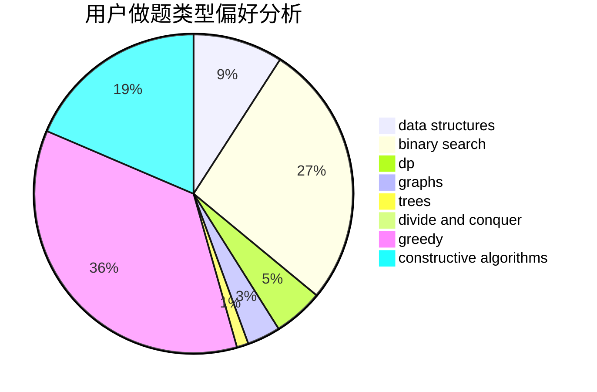
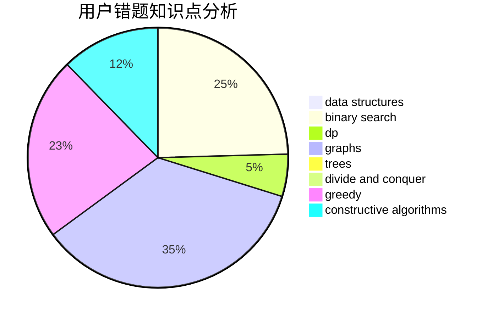

# sweet_fish

<!-- tabs:start -->

#### **用户提交结果分析**

#### **用户做题类型偏好分析**

#### **用户错题知识点分析**

<!-- tabs:end -->
# 推荐题目
[1058C](https://codeforces.com/contest/1058/problem/C)		dsu,graphs,sortings,trees		  
[909F](https://codeforces.com/contest/909/problem/F)		constructive algorithms		  
[747D](https://codeforces.com/contest/747/problem/D)		dp,
                        greedy,
                        sortings		  
[97B](https://codeforces.com/contest/97/problem/B)		constructive algorithms,
                        divide and conquer		  
[746A](https://codeforces.com/contest/746/problem/A)		implementation,
                        math		  
[489B](https://codeforces.com/contest/489/problem/B)		dfs and similar,
                        dp,
                        graph matchings,
                        greedy,
                        sortings,
                        two pointers		  
[879B](https://codeforces.com/contest/879/problem/B)		data structures,
                        implementation		  
[1492E](https://codeforces.com/contest/1492/problem/E)		brute force,
                        constructive algorithms,
                        dfs and similar,
                        greedy,
                        implementation		  
[452C](https://codeforces.com/contest/452/problem/C)		combinatorics,
                        math,
                        probabilities		  
[577A](https://codeforces.com/contest/577/problem/A)		implementation,
                        number theory		  
