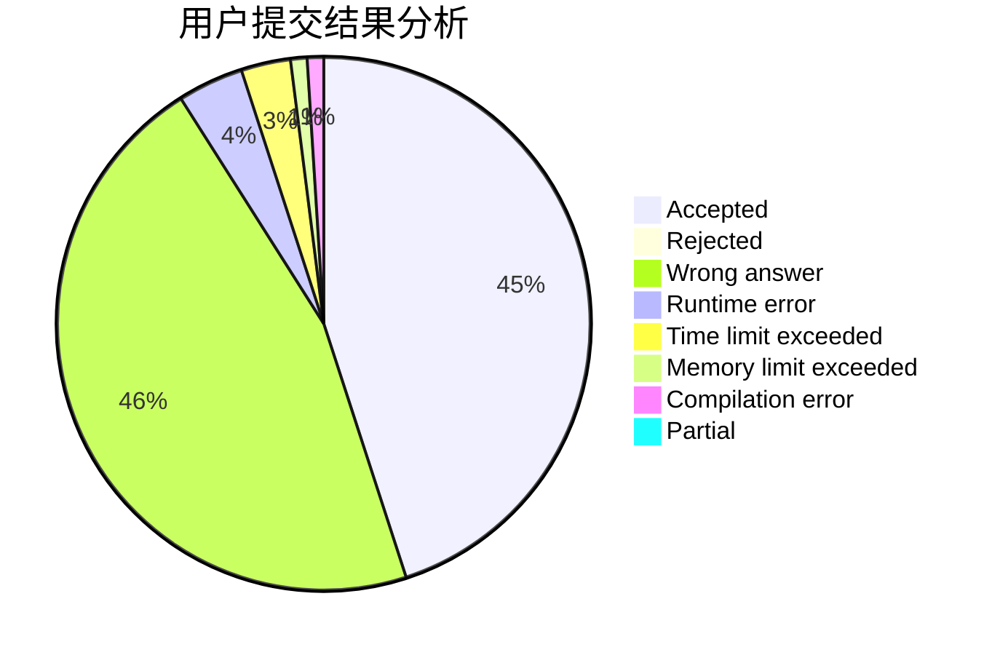
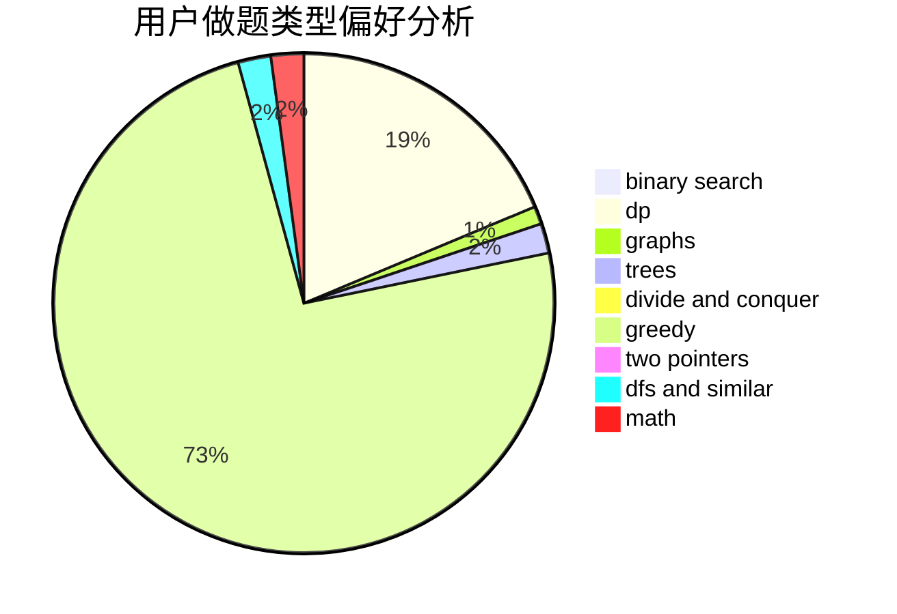

# swift-zym

<!-- tabs:start -->

#### **用户提交结果分析**

#### **用户做题类型偏好分析**

<!-- tabs:end -->
# 推荐题目
[1019A](https://codeforces.com/contest/1019/problem/A)
[1482B](https://codeforces.com/contest/1482/problem/B)
[1487G](https://codeforces.com/contest/1487/problem/G)
[702C](https://codeforces.com/contest/702/problem/C)
[696D](https://codeforces.com/contest/696/problem/D)
[666C](https://codeforces.com/contest/666/problem/C)
[472F](https://codeforces.com/contest/472/problem/F)
[895D](https://codeforces.com/contest/895/problem/D)
[765F](https://codeforces.com/contest/765/problem/F)
[1B](https://codeforces.com/contest/1/problem/B)
