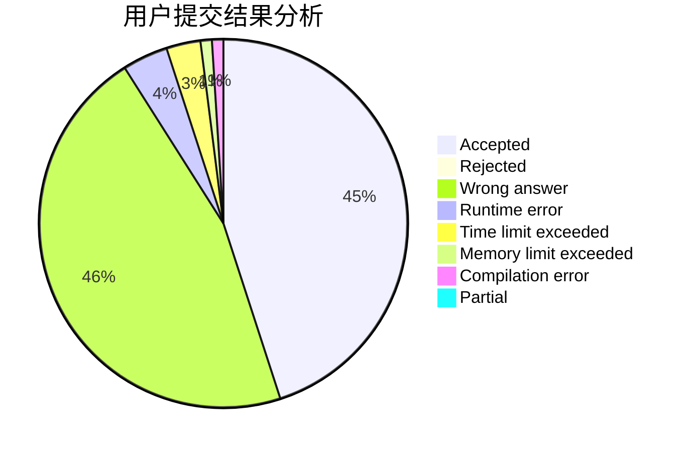
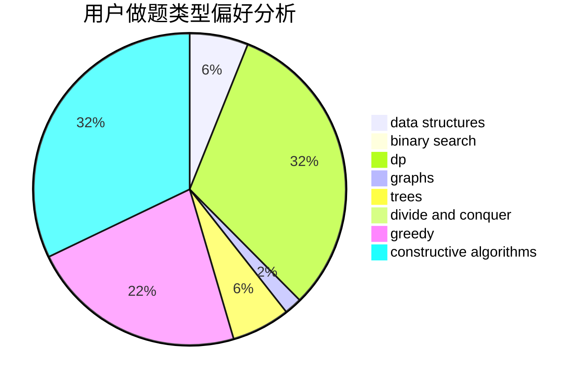
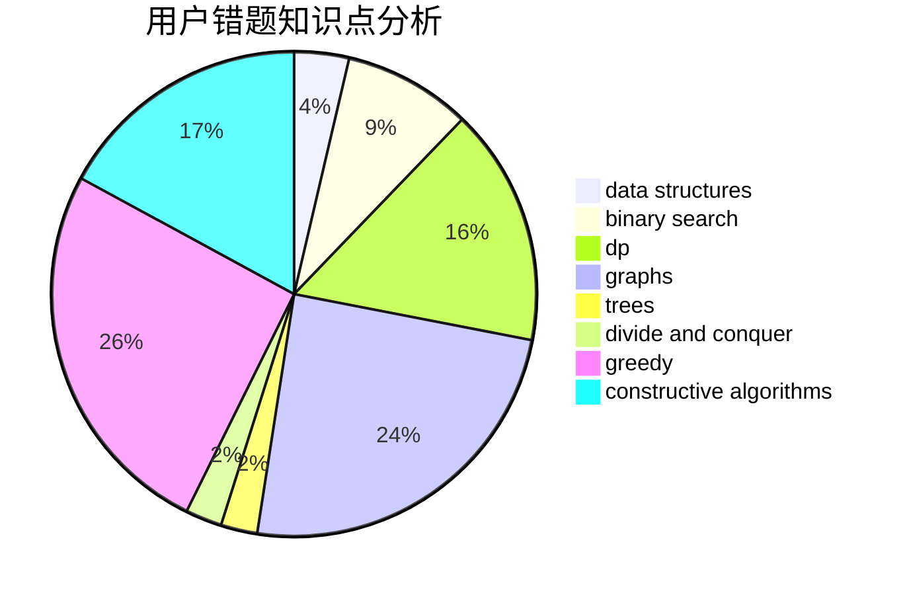

# swift-zym

<!-- tabs:start -->

#### **用户提交结果分析**

#### **用户做题类型偏好分析**

#### **用户错题知识点分析**

<!-- tabs:end -->
# 推荐题目
[1019A](https://codeforces.com/contest/1019/problem/A)		brute force,
                        greedy		  
[1482B](https://codeforces.com/contest/1482/problem/B)		implementation,
                        math		  
[1487G](https://codeforces.com/contest/1487/problem/G)		combinatorics,
                        dp,
                        fft,
                        math		  
[702C](https://codeforces.com/contest/702/problem/C)		binary search,
                        implementation,
                        two pointers		  
[696D](https://codeforces.com/contest/696/problem/D)		data structures,
                        dp,
                        matrices,
                        strings		  
[666C](https://codeforces.com/contest/666/problem/C)		combinatorics,
                        strings		  
[472F](https://codeforces.com/contest/472/problem/F)		constructive algorithms,
                        math,
                        matrices		  
[895D](https://codeforces.com/contest/895/problem/D)		combinatorics,
                        math,
                        strings		  
[765F](https://codeforces.com/contest/765/problem/F)		data structures		  
[1B](https://codeforces.com/contest/1/problem/B)		implementation,
                        math		  
