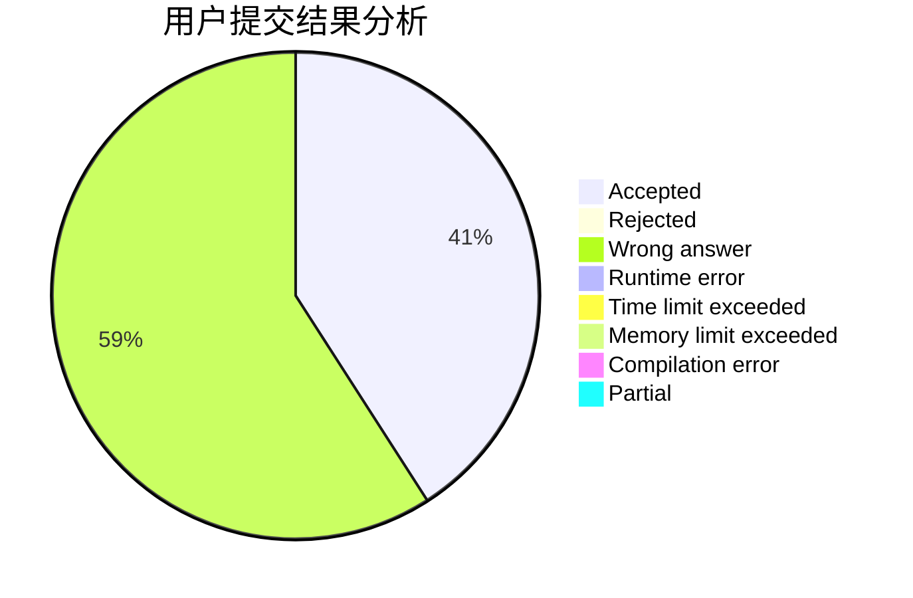
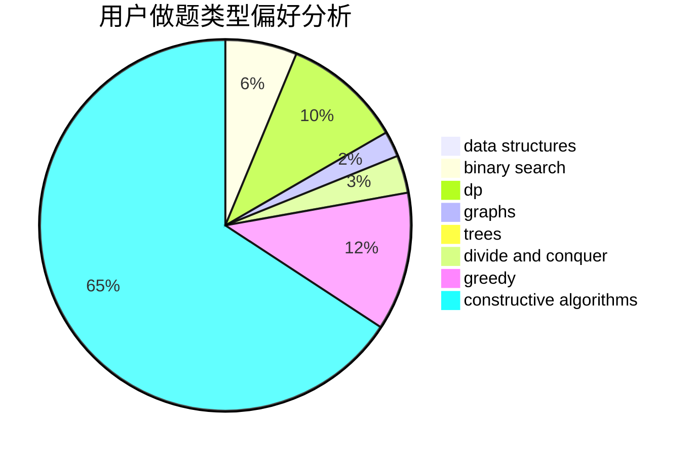

# sxtc

<!-- tabs:start -->

#### **用户提交结果分析**

#### **用户做题类型偏好分析**

#### **用户错题知识点分析**

<!-- tabs:end -->
# 推荐题目
[1089A](https://codeforces.com/contest/1089/problem/A)		dp		  
[777A](https://codeforces.com/contest/777/problem/A)		constructive algorithms,
                        implementation,
                        math		  
[1213C](https://codeforces.com/contest/1213/problem/C)		math		  
[1304D](https://codeforces.com/contest/1304/problem/D)		constructive algorithms,
                        graphs,
                        greedy,
                        two pointers		  
[180C](https://codeforces.com/contest/180/problem/C)		dp		  
[900C](https://codeforces.com/contest/900/problem/C)		brute force,
                        data structures,
                        math		  
[231A](https://codeforces.com/contest/231/problem/A)		brute force,
                        greedy		  
[1287A](https://codeforces.com/contest/1287/problem/A)		greedy,
                        implementation		  
[616D](https://codeforces.com/contest/616/problem/D)		binary search,
                        data structures,
                        two pointers		  
[1167C](https://codeforces.com/contest/1167/problem/C)		dfs and similar,
                        dsu,
                        graphs		  
