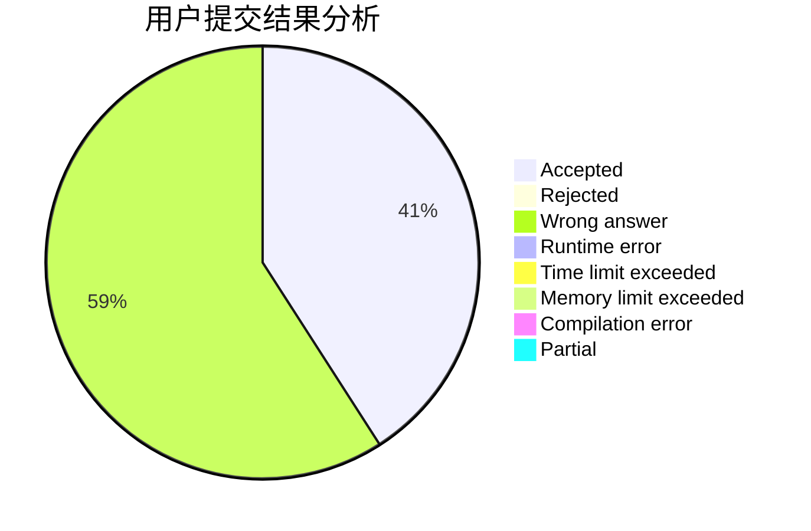
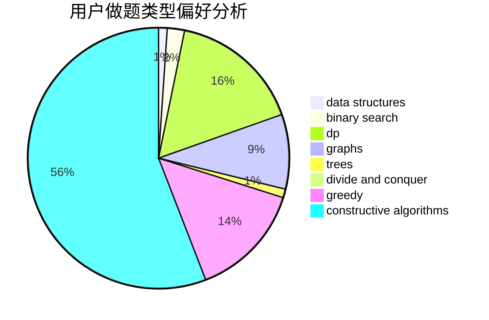

# sxtc

<!-- tabs:start -->

#### **用户提交结果分析**

#### **用户做题类型偏好分析**

#### **用户错题知识点分析**

<!-- tabs:end -->
# 推荐题目
[1089F](https://codeforces.com/contest/1089/problem/F)		math		  
[794G](https://codeforces.com/contest/794/problem/G)		combinatorics,
                        dp,
                        math		  
[1217E](https://codeforces.com/contest/1217/problem/E)		data structures,
                        greedy,
                        implementation,
                        math		  
[13132](https://codeforces.com/contest/1313/problem/2)		dsu,graphs,sortings,trees		  
[205D](https://codeforces.com/contest/205/problem/D)		dsu,graphs,sortings,trees		  
[917A](https://codeforces.com/contest/917/problem/A)		dp,
                        greedy,
                        implementation,
                        math		  
[251D](https://codeforces.com/contest/251/problem/D)		bitmasks,
                        math		  
[1294D](https://codeforces.com/contest/1294/problem/D)		data structures,
                        greedy,
                        implementation,
                        math		  
[634A](https://codeforces.com/contest/634/problem/A)		constructive algorithms,
                        implementation		  
[11722](https://codeforces.com/contest/1172/problem/2)		dsu,graphs,sortings,trees		  
