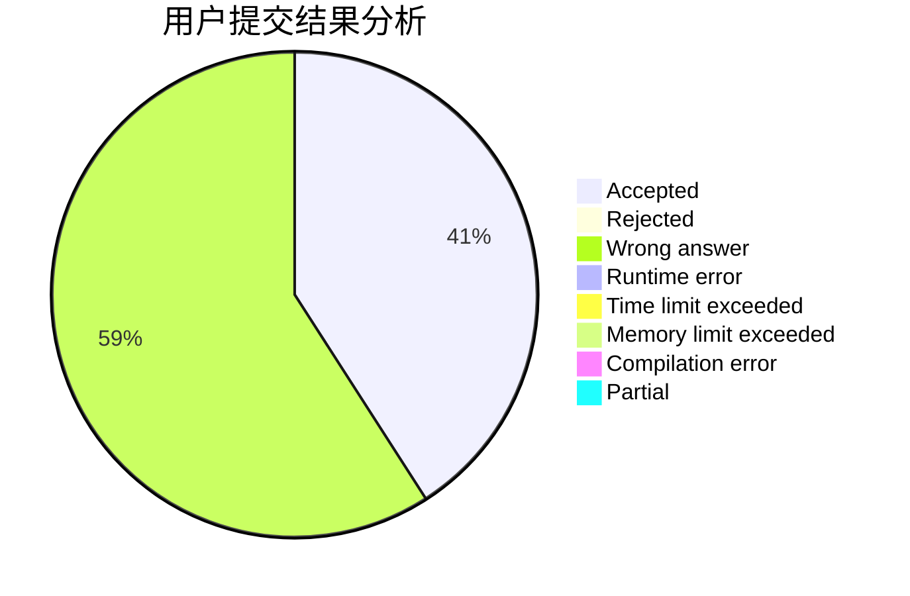
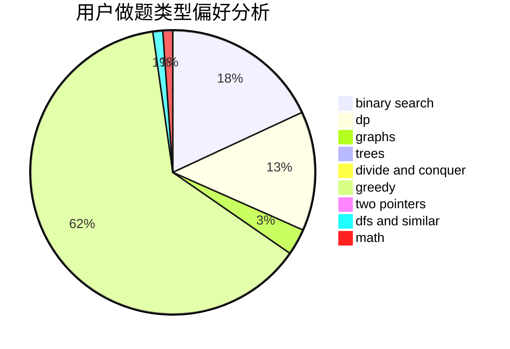

# sxtc

<!-- tabs:start -->

#### **用户提交结果分析**

#### **用户做题类型偏好分析**

<!-- tabs:end -->
# 推荐题目
[1089F](https://codeforces.com/contest/1089/problem/F)
[794G](https://codeforces.com/contest/794/problem/G)
[1217E](https://codeforces.com/contest/1217/problem/E)
[13132](https://codeforces.com/contest/1313/problem/2)
[205D](https://codeforces.com/contest/205/problem/D)
[917A](https://codeforces.com/contest/917/problem/A)
[251D](https://codeforces.com/contest/251/problem/D)
[1294D](https://codeforces.com/contest/1294/problem/D)
[634A](https://codeforces.com/contest/634/problem/A)
[11722](https://codeforces.com/contest/1172/problem/2)
