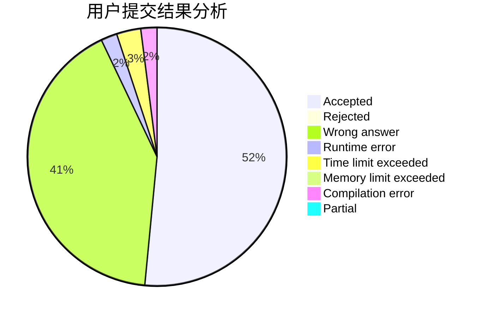
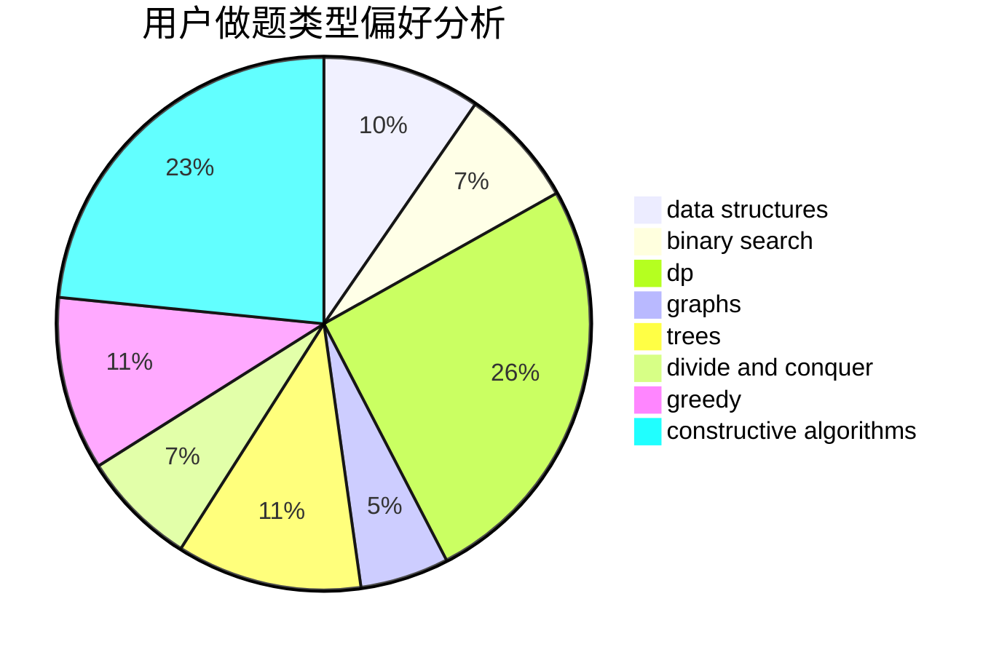
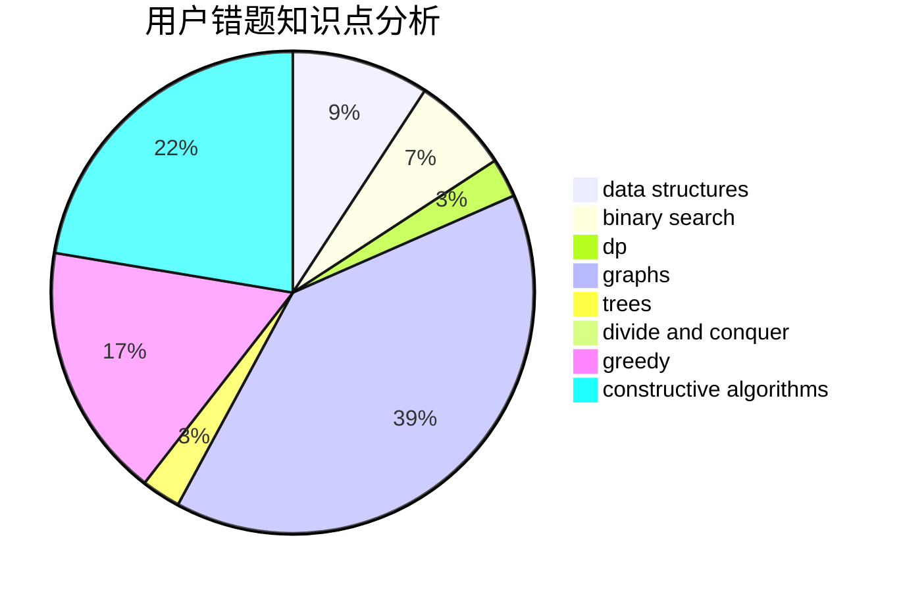

# sxy_to_the_end

<!-- tabs:start -->

#### **用户提交结果分析**

#### **用户做题类型偏好分析**

#### **用户错题知识点分析**

<!-- tabs:end -->
# 推荐题目
[1321B](https://codeforces.com/contest/1321/problem/B)		dsu,graphs,sortings,trees		  
[909A](https://codeforces.com/contest/909/problem/A)		brute force,
                        greedy,
                        sortings		  
[592A](https://codeforces.com/contest/592/problem/A)		implementation		  
[1325B](https://codeforces.com/contest/1325/problem/B)		greedy,
                        implementation		  
[1509F](https://codeforces.com/contest/1509/problem/F)		dsu,graphs,sortings,trees		  
[295B](https://codeforces.com/contest/295/problem/B)		dp,
                        graphs,
                        shortest paths		  
[528A](https://codeforces.com/contest/528/problem/A)		dsu,graphs,sortings,trees		  
[540C](https://codeforces.com/contest/540/problem/C)		dfs and similar		  
[1455G](https://codeforces.com/contest/1455/problem/G)		data structures,
                        dp		  
[617E](https://codeforces.com/contest/617/problem/E)		data structures		  
