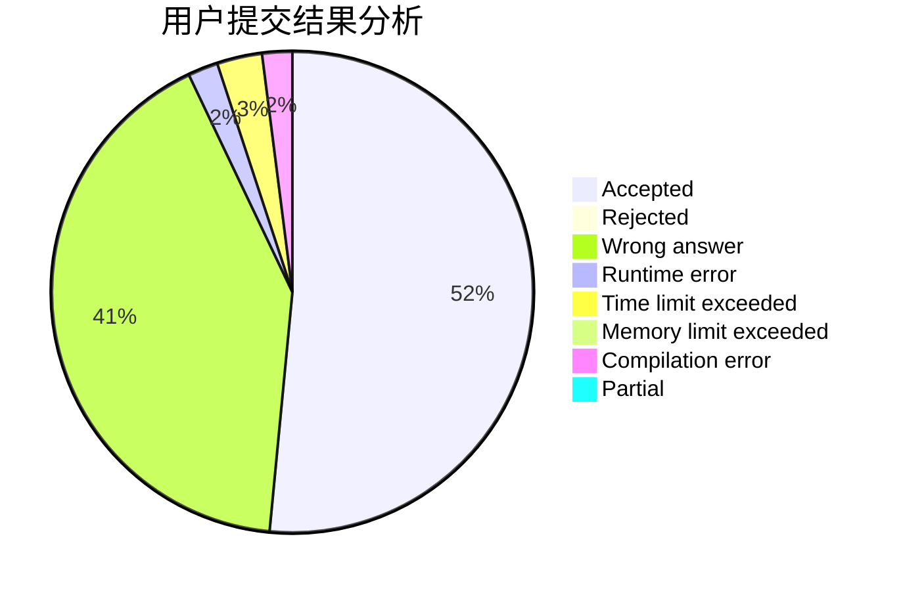
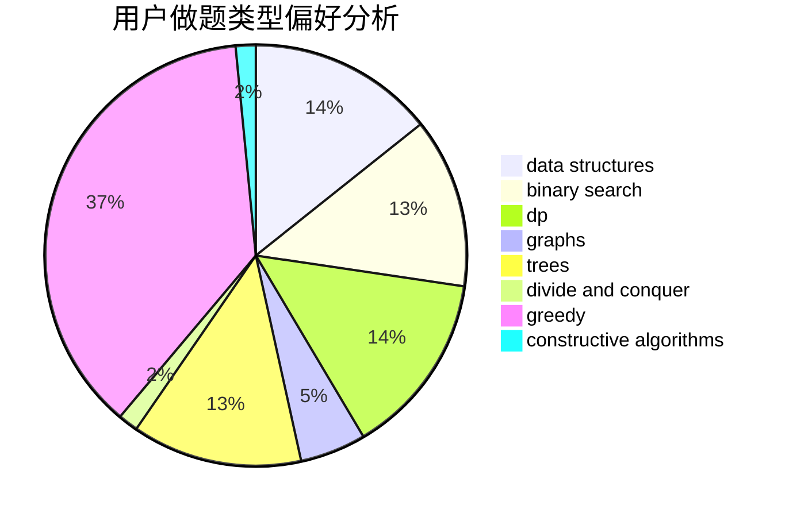
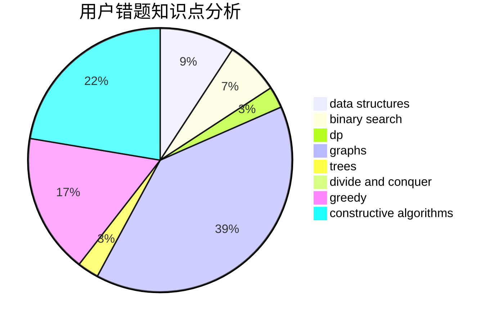

# sxy_to_the_end

<!-- tabs:start -->

#### **用户提交结果分析**

#### **用户做题类型偏好分析**

#### **用户错题知识点分析**

<!-- tabs:end -->
# 推荐题目
[1311F](https://codeforces.com/contest/1311/problem/F)		data structures,
                        divide and conquer,
                        implementation,
                        sortings		  
[88A](https://codeforces.com/contest/88/problem/A)		brute force,
                        implementation		  
[571D](https://codeforces.com/contest/571/problem/D)		binary search,
                        data structures,
                        dsu,
                        trees		  
[1315C](https://codeforces.com/contest/1315/problem/C)		greedy		  
[1499F](https://codeforces.com/contest/1499/problem/F)		combinatorics,
                        dfs and similar,
                        dp,
                        trees		  
[27C](https://codeforces.com/contest/27/problem/C)		constructive algorithms,
                        greedy		  
[508A](https://codeforces.com/contest/508/problem/A)		brute force		  
[514E](https://codeforces.com/contest/514/problem/E)		dp,
                        matrices		  
[1446D2](https://codeforces.com/contest/1446D/problem/2)		data structures,
                        greedy,
                        two pointers		  
[599D](https://codeforces.com/contest/599/problem/D)		brute force,
                        math		  
