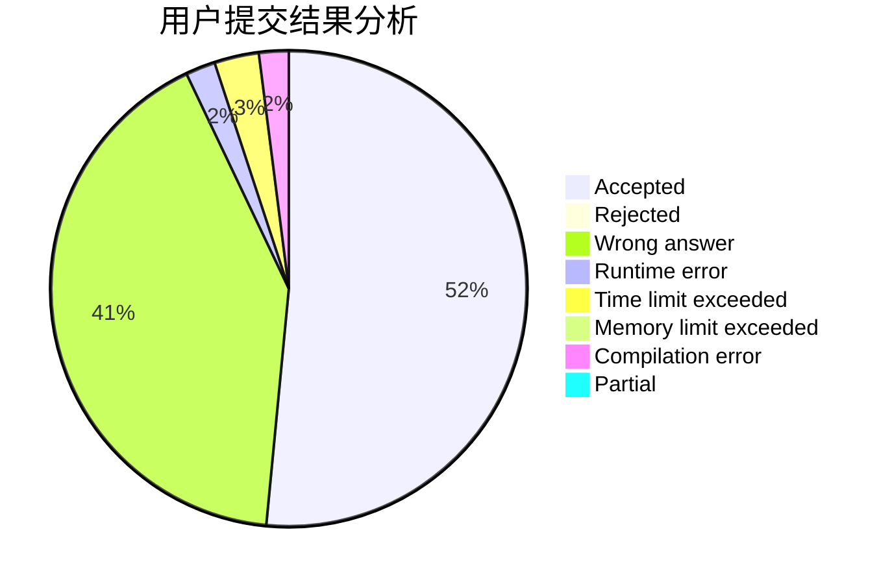
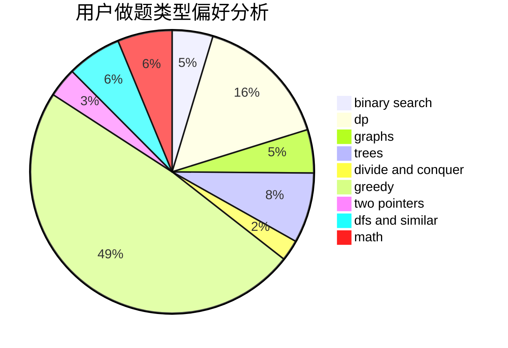

# sxy_to_the_end

<!-- tabs:start -->

#### **用户提交结果分析**

#### **用户做题类型偏好分析**

<!-- tabs:end -->
# 推荐题目
[1321B](https://codeforces.com/contest/1321/problem/B)
[909A](https://codeforces.com/contest/909/problem/A)
[592A](https://codeforces.com/contest/592/problem/A)
[1325B](https://codeforces.com/contest/1325/problem/B)
[1509F](https://codeforces.com/contest/1509/problem/F)
[295B](https://codeforces.com/contest/295/problem/B)
[528A](https://codeforces.com/contest/528/problem/A)
[540C](https://codeforces.com/contest/540/problem/C)
[1455G](https://codeforces.com/contest/1455/problem/G)
[617E](https://codeforces.com/contest/617/problem/E)
