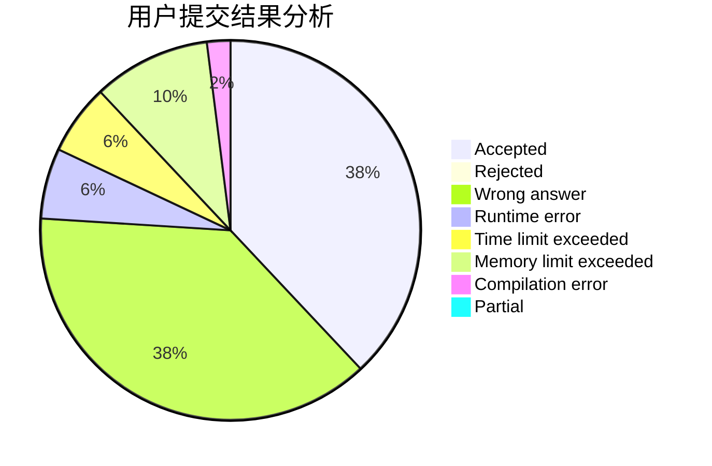
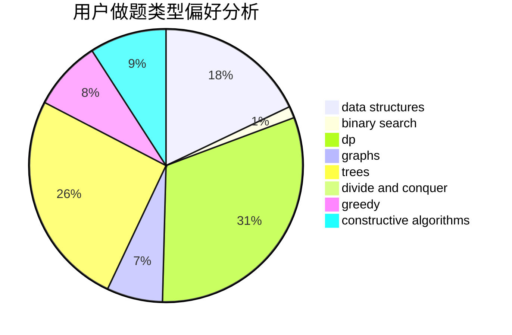
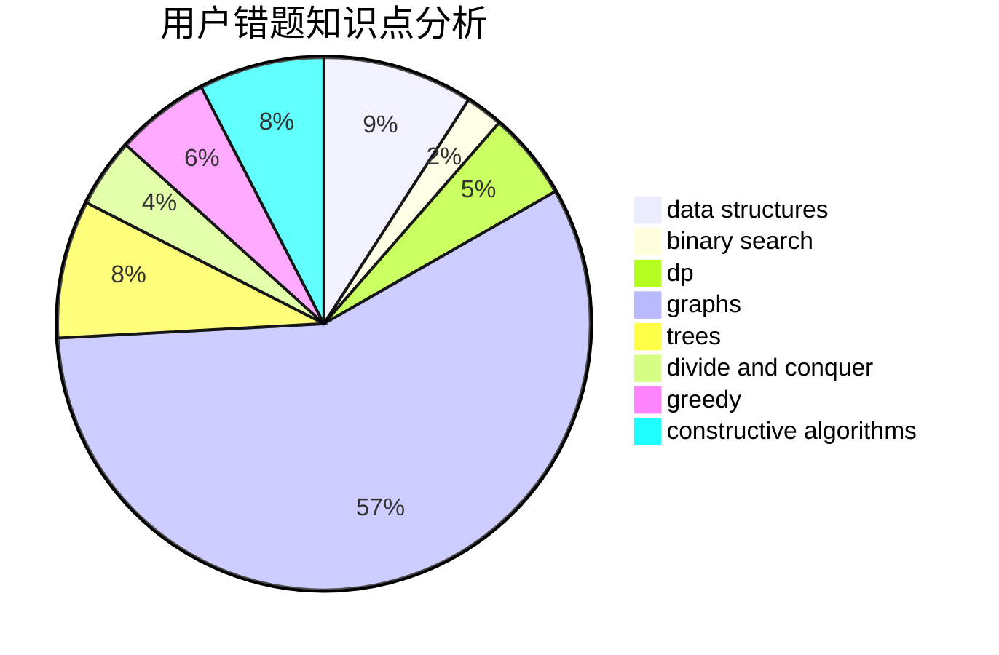

# synchrohyugo

<!-- tabs:start -->

#### **用户提交结果分析**

#### **用户做题类型偏好分析**

#### **用户错题知识点分析**

<!-- tabs:end -->
# 推荐题目
[1451F](https://codeforces.com/contest/1451/problem/F)		constructive algorithms,
                        games		  
[1223D](https://codeforces.com/contest/1223/problem/D)		dp,
                        greedy,
                        two pointers		  
[1020A](https://codeforces.com/contest/1020/problem/A)		math		  
[736E](https://codeforces.com/contest/736/problem/E)		constructive algorithms,
                        flows,
                        greedy,
                        math		  
[166E](https://codeforces.com/contest/166/problem/E)		dp,
                        math,
                        matrices		  
[309B](https://codeforces.com/contest/309/problem/B)		dp,
                        two pointers		  
[259D](https://codeforces.com/contest/259/problem/D)		dsu,graphs,sortings,trees		  
[369B](https://codeforces.com/contest/369/problem/B)		constructive algorithms,
                        implementation,
                        math		  
[294D](https://codeforces.com/contest/294/problem/D)		brute force,
                        implementation,
                        number theory		  
[1255A](https://codeforces.com/contest/1255/problem/A)		math		  
