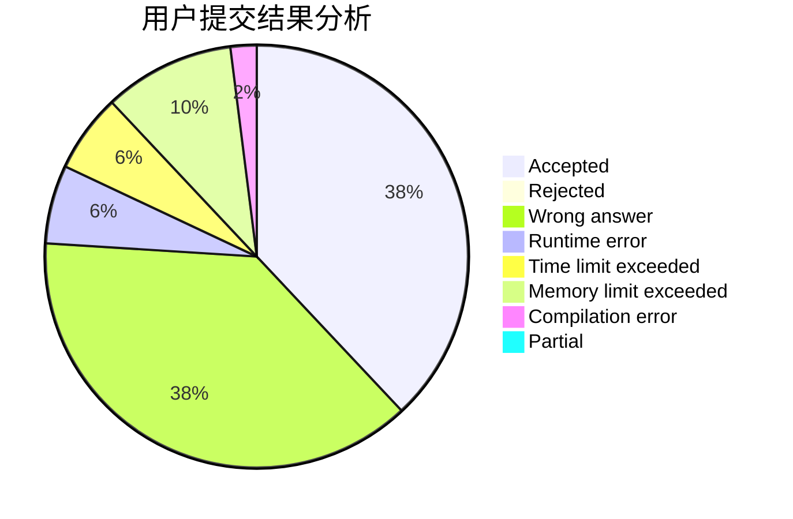
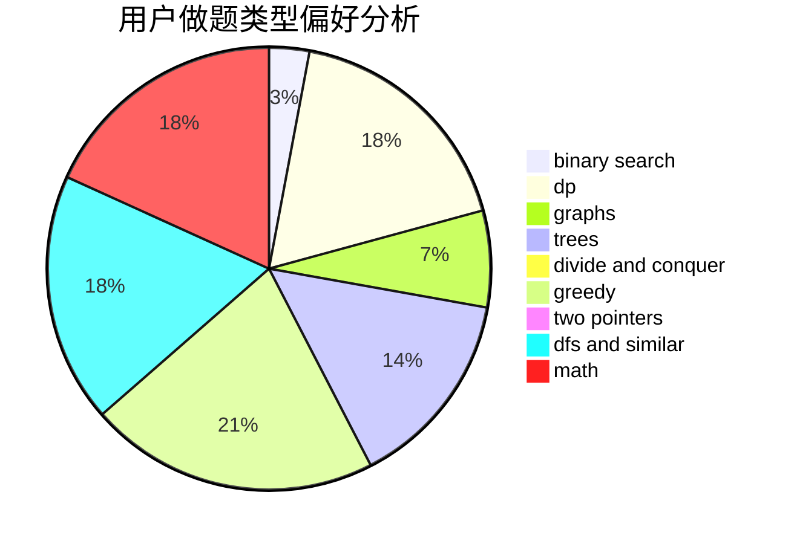

# synchrohyugo

<!-- tabs:start -->

#### **用户提交结果分析**

#### **用户做题类型偏好分析**

<!-- tabs:end -->
# 推荐题目
[1451F](https://codeforces.com/contest/1451/problem/F)
[1223D](https://codeforces.com/contest/1223/problem/D)
[1020A](https://codeforces.com/contest/1020/problem/A)
[736E](https://codeforces.com/contest/736/problem/E)
[166E](https://codeforces.com/contest/166/problem/E)
[309B](https://codeforces.com/contest/309/problem/B)
[259D](https://codeforces.com/contest/259/problem/D)
[369B](https://codeforces.com/contest/369/problem/B)
[294D](https://codeforces.com/contest/294/problem/D)
[1255A](https://codeforces.com/contest/1255/problem/A)
