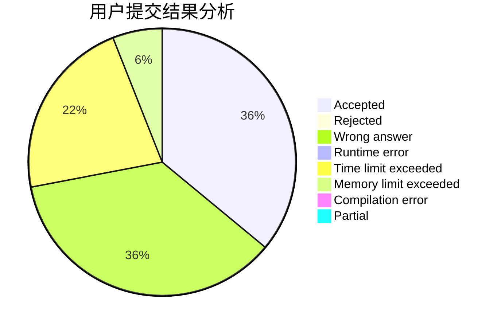
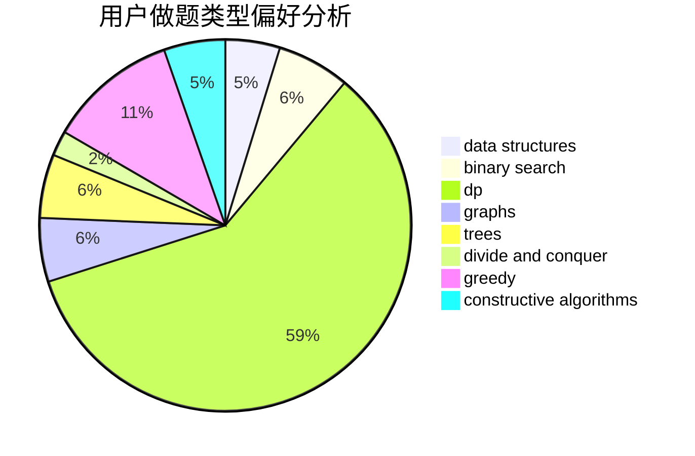

# syndy1314

<!-- tabs:start -->

#### **用户提交结果分析**

#### **用户做题类型偏好分析**

#### **用户错题知识点分析**

<!-- tabs:end -->
# 推荐题目
[12861](https://codeforces.com/contest/1286/problem/1)		dsu,graphs,sortings,trees		  
[706C](https://codeforces.com/contest/706/problem/C)		dp,
                        strings		  
[928B](https://codeforces.com/contest/928/problem/B)		*special problem,
                        dp		  
[1136E](https://codeforces.com/contest/1136/problem/E)		binary search,
                        data structures		  
[979A](https://codeforces.com/contest/979/problem/A)		math		  
[1023C](https://codeforces.com/contest/1023/problem/C)		greedy		  
[1225F](https://codeforces.com/contest/1225/problem/F)		constructive algorithms,
                        greedy,
                        trees		  
[1251C](https://codeforces.com/contest/1251/problem/C)		greedy,
                        two pointers		  
[1302F](https://codeforces.com/contest/1302/problem/F)		bitmasks,
                        brute force,
                        expression parsing		  
[102A](https://codeforces.com/contest/102/problem/A)		brute force		  
