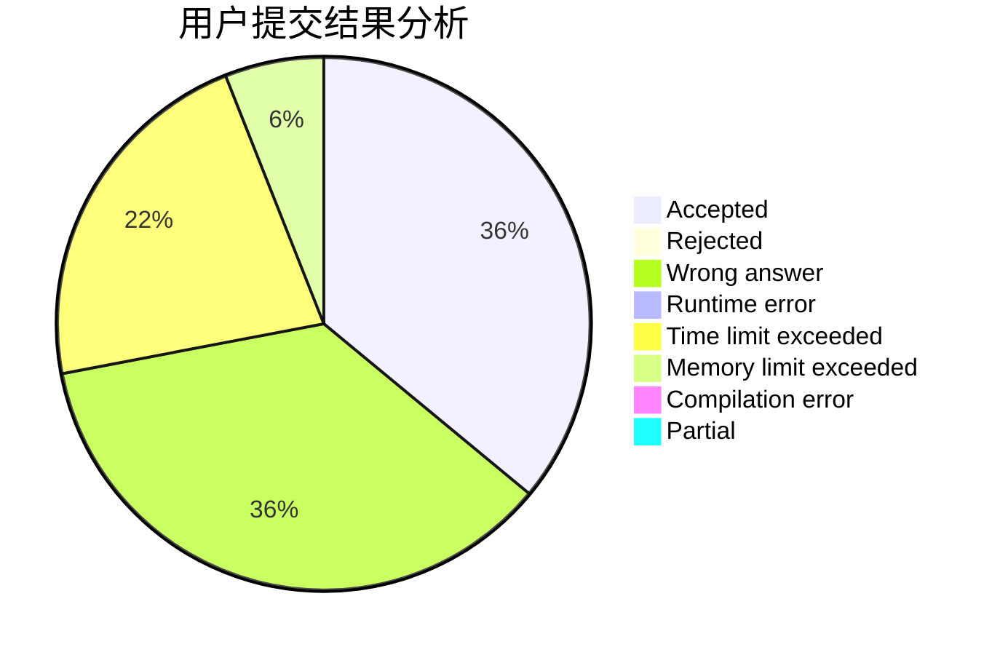
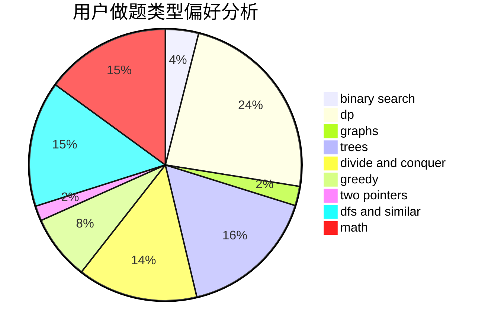

# syndy1314

<!-- tabs:start -->

#### **用户提交结果分析**

#### **用户做题类型偏好分析**

<!-- tabs:end -->
# 推荐题目
[12861](https://codeforces.com/contest/1286/problem/1)
[706C](https://codeforces.com/contest/706/problem/C)
[928B](https://codeforces.com/contest/928/problem/B)
[1136E](https://codeforces.com/contest/1136/problem/E)
[979A](https://codeforces.com/contest/979/problem/A)
[1023C](https://codeforces.com/contest/1023/problem/C)
[1225F](https://codeforces.com/contest/1225/problem/F)
[1251C](https://codeforces.com/contest/1251/problem/C)
[1302F](https://codeforces.com/contest/1302/problem/F)
[102A](https://codeforces.com/contest/102/problem/A)
