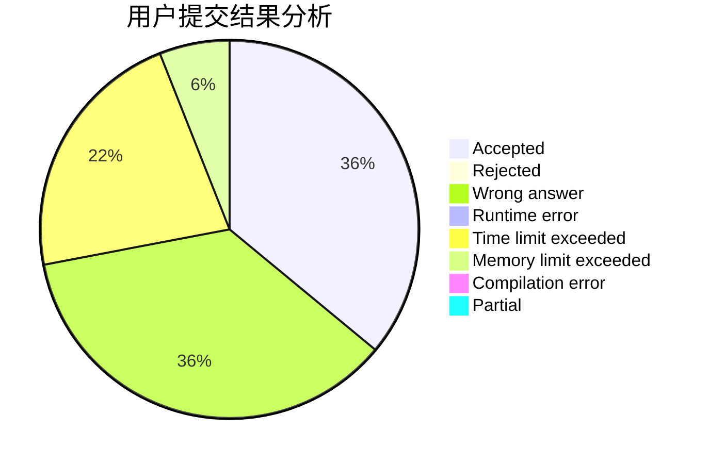
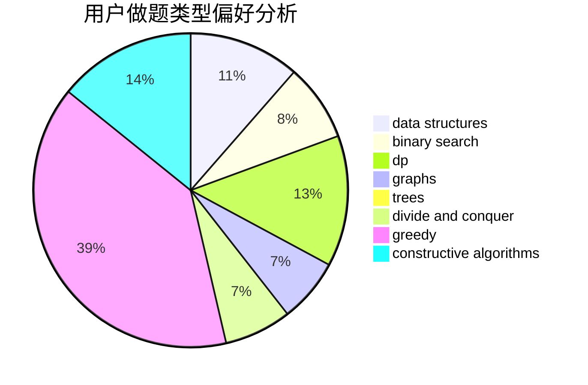

# syndy1314

<!-- tabs:start -->

#### **用户提交结果分析**

#### **用户做题类型偏好分析**

#### **用户错题知识点分析**

<!-- tabs:end -->
# 推荐题目
[1279F](https://codeforces.com/contest/1279/problem/F)		binary search,
                        dp		  
[682B](https://codeforces.com/contest/682/problem/B)		sortings		  
[911C](https://codeforces.com/contest/911/problem/C)		brute force,
                        constructive algorithms		  
[1132F](https://codeforces.com/contest/1132/problem/F)		dp		  
[957E](https://codeforces.com/contest/957/problem/E)		dsu,graphs,sortings,trees		  
[1020E](https://codeforces.com/contest/1020/problem/E)		dsu,graphs,sortings,trees		  
[1218H](https://codeforces.com/contest/1218/problem/H)		dfs and similar		  
[1247D](https://codeforces.com/contest/1247/problem/D)		dsu,graphs,sortings,trees		  
[1295D](https://codeforces.com/contest/1295/problem/D)		math,
                        number theory		  
[1029D](https://codeforces.com/contest/1029/problem/D)		implementation,
                        math		  
