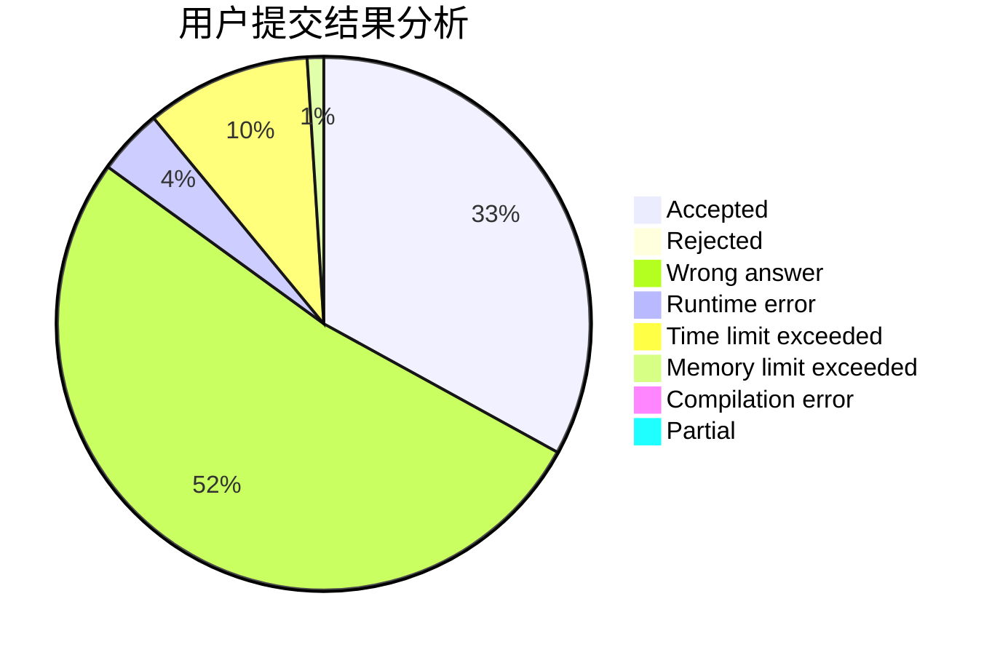
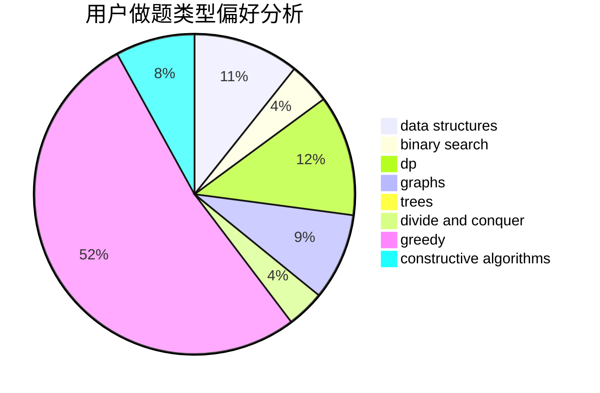
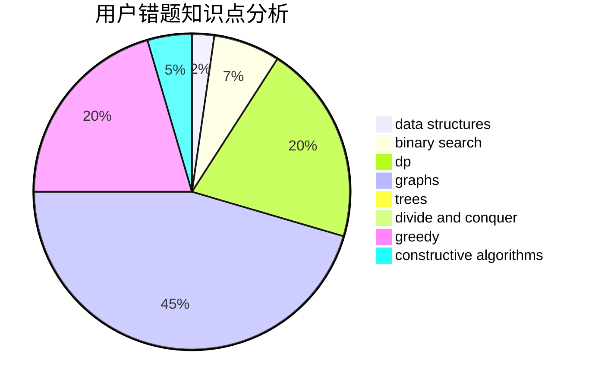

# sys.

<!-- tabs:start -->

#### **用户提交结果分析**

#### **用户做题类型偏好分析**

#### **用户错题知识点分析**

<!-- tabs:end -->
# 推荐题目
[895C](https://codeforces.com/contest/895/problem/C)		bitmasks,
                        combinatorics,
                        dp,
                        math		  
[673B](https://codeforces.com/contest/673/problem/B)		greedy,
                        implementation		  
[1065C](https://codeforces.com/contest/1065/problem/C)		greedy		  
[909F](https://codeforces.com/contest/909/problem/F)		constructive algorithms		  
[356C](https://codeforces.com/contest/356/problem/C)		combinatorics,
                        constructive algorithms,
                        greedy,
                        implementation		  
[609A](https://codeforces.com/contest/609/problem/A)		greedy,
                        implementation,
                        sortings		  
[1354A](https://codeforces.com/contest/1354/problem/A)		math		  
[1219C](https://codeforces.com/contest/1219/problem/C)		implementation,
                        strings		  
[1499F](https://codeforces.com/contest/1499/problem/F)		combinatorics,
                        dfs and similar,
                        dp,
                        trees		  
[189B](https://codeforces.com/contest/189/problem/B)		brute force,
                        math		  
