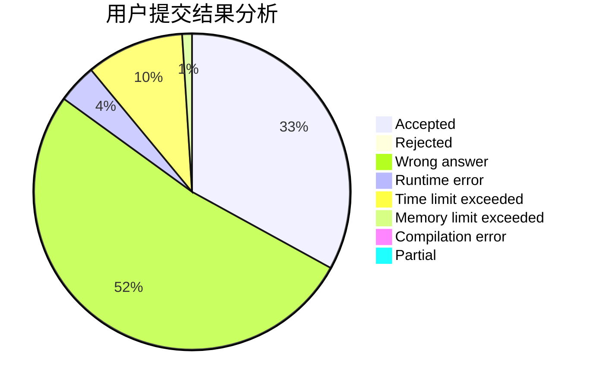
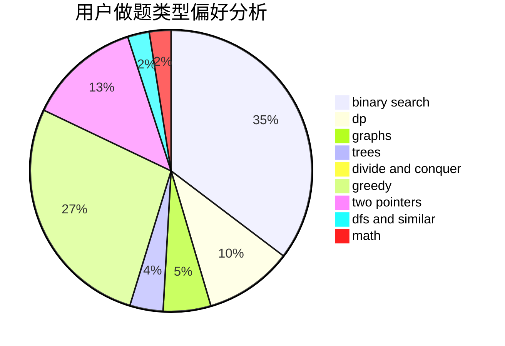

# sys.

<!-- tabs:start -->

#### **用户提交结果分析**

#### **用户做题类型偏好分析**

<!-- tabs:end -->
# 推荐题目
[913A](https://codeforces.com/contest/913/problem/A)
[699A](https://codeforces.com/contest/699/problem/A)
[1065G](https://codeforces.com/contest/1065/problem/G)
[924D](https://codeforces.com/contest/924/problem/D)
[381B](https://codeforces.com/contest/381/problem/B)
[627F](https://codeforces.com/contest/627/problem/F)
[1360E](https://codeforces.com/contest/1360/problem/E)
[12272](https://codeforces.com/contest/1227/problem/2)
[1509F](https://codeforces.com/contest/1509/problem/F)
[213C](https://codeforces.com/contest/213/problem/C)
