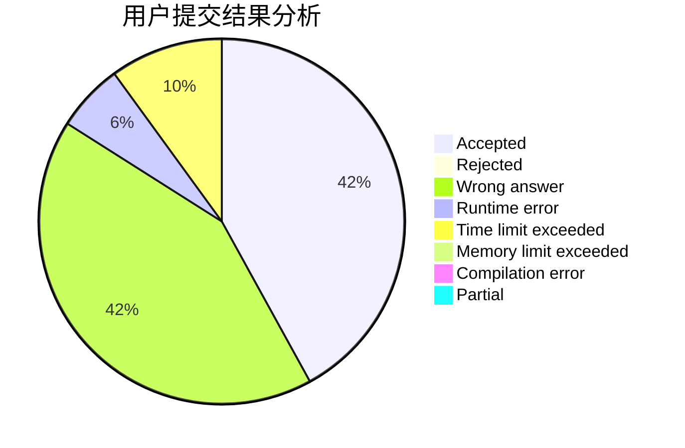
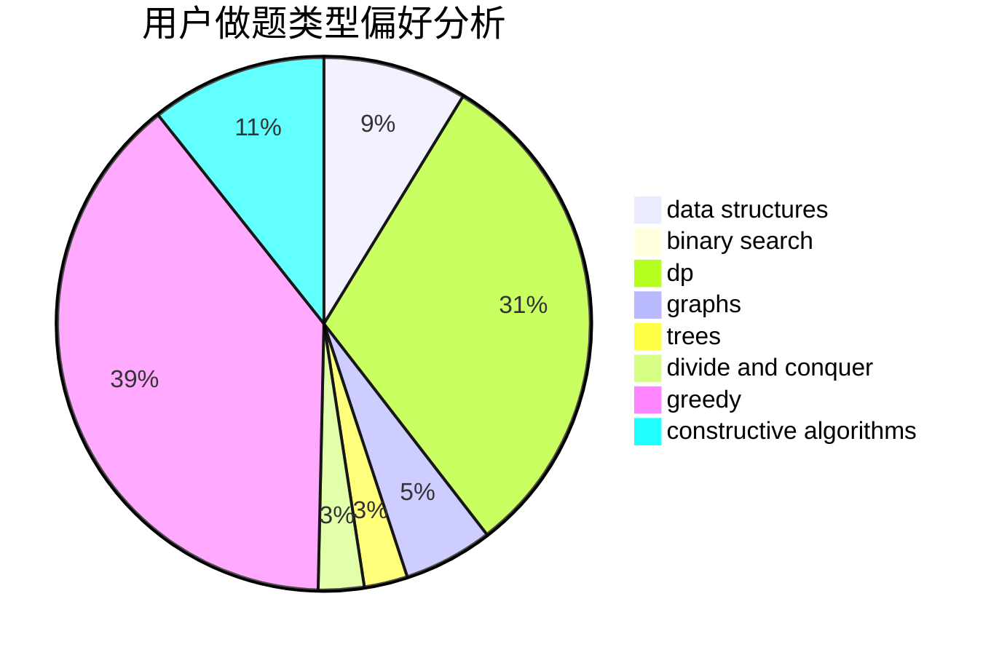
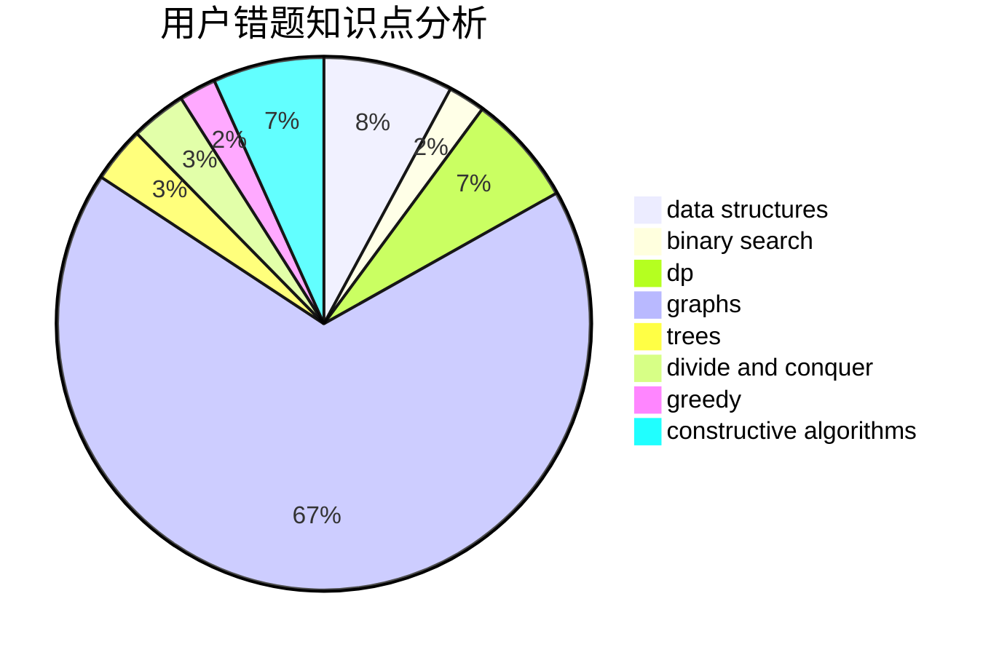

# sys16384

<!-- tabs:start -->

#### **用户提交结果分析**

#### **用户做题类型偏好分析**

#### **用户错题知识点分析**

<!-- tabs:end -->
# 推荐题目
[521E](https://codeforces.com/contest/521/problem/E)		dfs and similar,
                        graphs		  
[592B](https://codeforces.com/contest/592/problem/B)		math		  
[872B](https://codeforces.com/contest/872/problem/B)		dsu,graphs,sortings,trees		  
[77E](https://codeforces.com/contest/77/problem/E)		geometry		  
[295C](https://codeforces.com/contest/295/problem/C)		combinatorics,
                        dp,
                        graphs,
                        shortest paths		  
[708D](https://codeforces.com/contest/708/problem/D)		flows		  
[1105B](https://codeforces.com/contest/1105/problem/B)		brute force,
                        implementation,
                        strings		  
[916A](https://codeforces.com/contest/916/problem/A)		brute force,
                        implementation,
                        math		  
[121C](https://codeforces.com/contest/121/problem/C)		brute force,
                        combinatorics,
                        number theory		  
[240F](https://codeforces.com/contest/240/problem/F)		data structures		  
