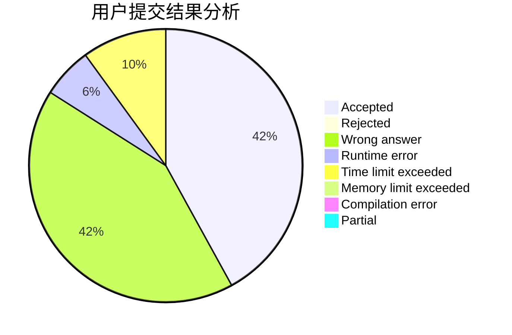
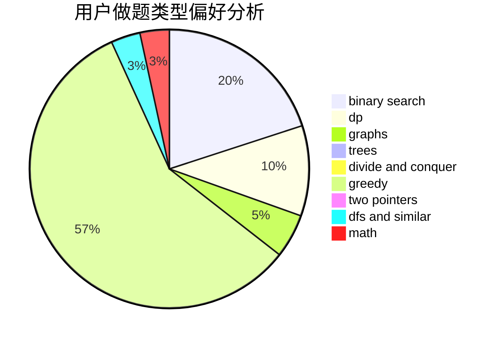

# sys16384

<!-- tabs:start -->

#### **用户提交结果分析**

#### **用户做题类型偏好分析**

<!-- tabs:end -->
# 推荐题目
[547D](https://codeforces.com/contest/547/problem/D)
[611D](https://codeforces.com/contest/611/problem/D)
[893D](https://codeforces.com/contest/893/problem/D)
[798C](https://codeforces.com/contest/798/problem/C)
[312A](https://codeforces.com/contest/312/problem/A)
[727F](https://codeforces.com/contest/727/problem/F)
[1105E](https://codeforces.com/contest/1105/problem/E)
[936A](https://codeforces.com/contest/936/problem/A)
[1227A](https://codeforces.com/contest/1227/problem/A)
[261D](https://codeforces.com/contest/261/problem/D)
