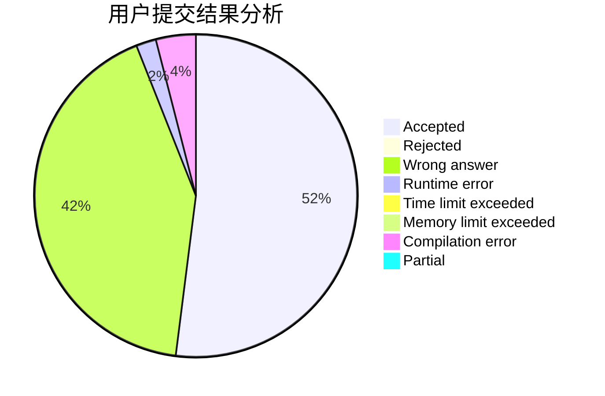
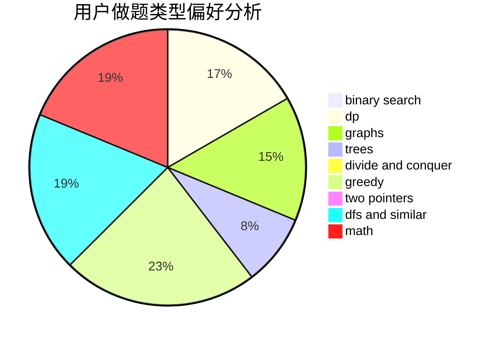

# system_1

<!-- tabs:start -->

#### **用户提交结果分析**

#### **用户做题类型偏好分析**

<!-- tabs:end -->
# 推荐题目
[443D](https://codeforces.com/contest/443/problem/D)
[822F](https://codeforces.com/contest/822/problem/F)
[765D](https://codeforces.com/contest/765/problem/D)
[1156F](https://codeforces.com/contest/1156/problem/F)
[57C](https://codeforces.com/contest/57/problem/C)
[818B](https://codeforces.com/contest/818/problem/B)
[729F](https://codeforces.com/contest/729/problem/F)
[1490C](https://codeforces.com/contest/1490/problem/C)
[1497B](https://codeforces.com/contest/1497/problem/B)
[1491C](https://codeforces.com/contest/1491/problem/C)
