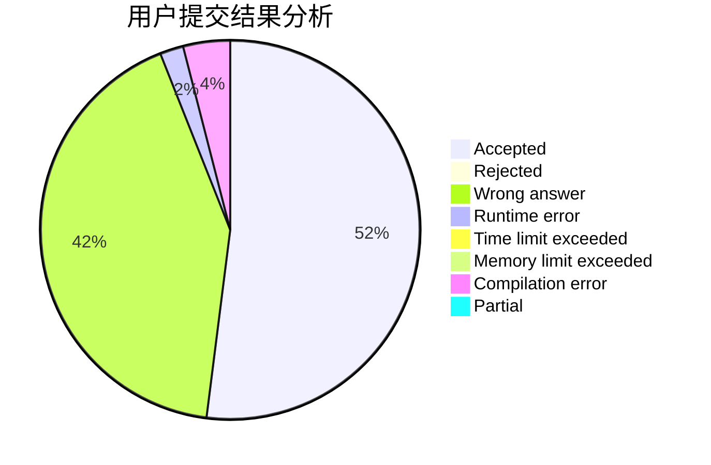
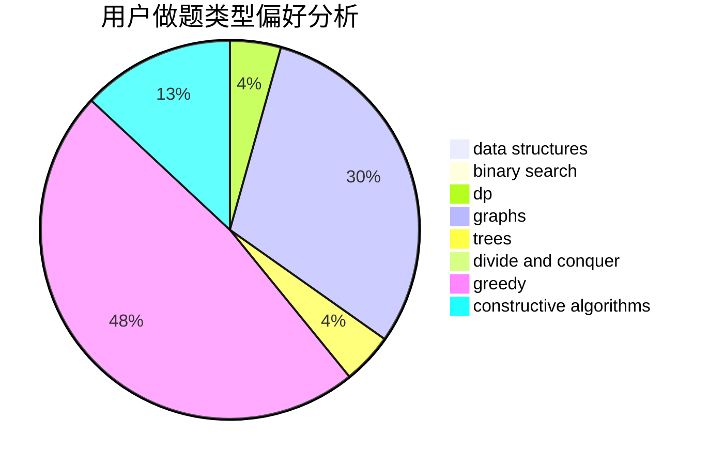

# system_1

<!-- tabs:start -->

#### **用户提交结果分析**

#### **用户做题类型偏好分析**

#### **用户错题知识点分析**

<!-- tabs:end -->
# 推荐题目
[443D](https://codeforces.com/contest/443/problem/D)		dsu,graphs,sortings,trees		  
[822F](https://codeforces.com/contest/822/problem/F)		constructive algorithms,
                        dfs and similar,
                        trees		  
[765D](https://codeforces.com/contest/765/problem/D)		constructive algorithms,
                        dsu,
                        math		  
[1156F](https://codeforces.com/contest/1156/problem/F)		dp,
                        math,
                        probabilities		  
[57C](https://codeforces.com/contest/57/problem/C)		combinatorics,
                        math		  
[818B](https://codeforces.com/contest/818/problem/B)		implementation		  
[729F](https://codeforces.com/contest/729/problem/F)		dp		  
[1490C](https://codeforces.com/contest/1490/problem/C)		binary search,
                        brute force,
                        brute force,
                        math		  
[1497B](https://codeforces.com/contest/1497/problem/B)		constructive algorithms,
                        greedy,
                        math		  
[1491C](https://codeforces.com/contest/1491/problem/C)		brute force,
                        data structures,
                        dp,
                        greedy,
                        implementation		  
