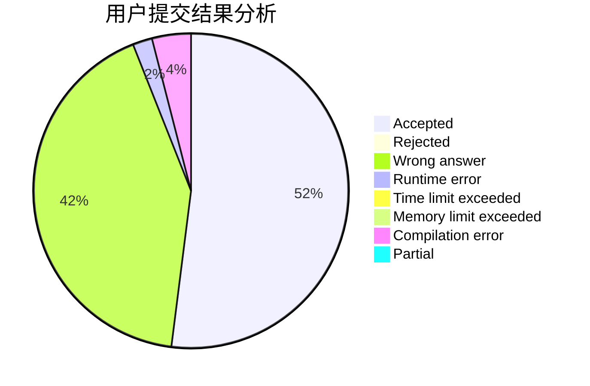
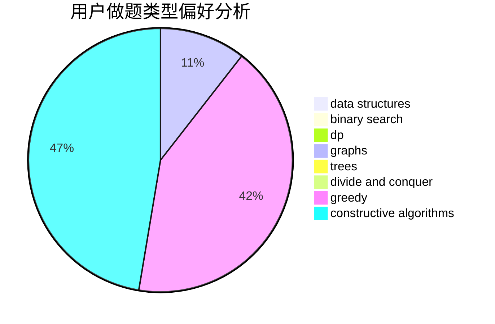

# system_1

<!-- tabs:start -->

#### **用户提交结果分析**

#### **用户做题类型偏好分析**

#### **用户错题知识点分析**

<!-- tabs:end -->
# 推荐题目
[418C](https://codeforces.com/contest/418/problem/C)		dsu,graphs,sortings,trees		  
[808A](https://codeforces.com/contest/808/problem/A)		implementation		  
[746B](https://codeforces.com/contest/746/problem/B)		implementation,
                        strings		  
[1154F](https://codeforces.com/contest/1154/problem/F)		dp,
                        greedy,
                        sortings		  
[555B](https://codeforces.com/contest/555/problem/B)		data structures,
                        greedy,
                        sortings		  
[802K](https://codeforces.com/contest/802/problem/K)		dp,
                        trees		  
[709E](https://codeforces.com/contest/709/problem/E)		dsu,graphs,sortings,trees		  
[1482E](https://codeforces.com/contest/1482/problem/E)		data structures,
                        divide and conquer,
                        dp		  
[1489D](https://codeforces.com/contest/1489/problem/D)		dsu,graphs,sortings,trees		  
[1483E](https://codeforces.com/contest/1483/problem/E)		dsu,graphs,sortings,trees		  
