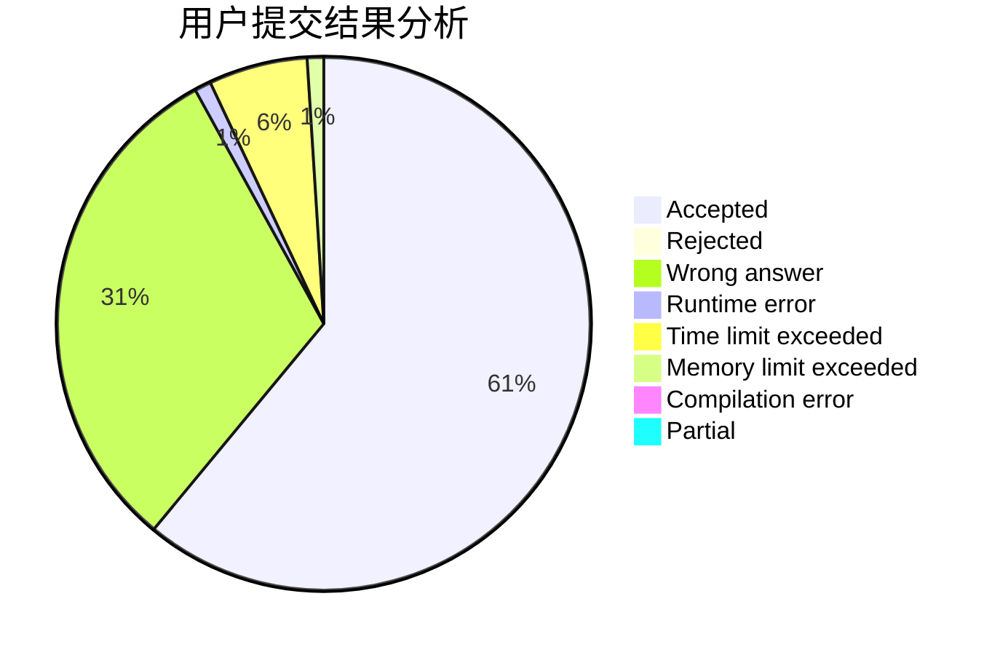
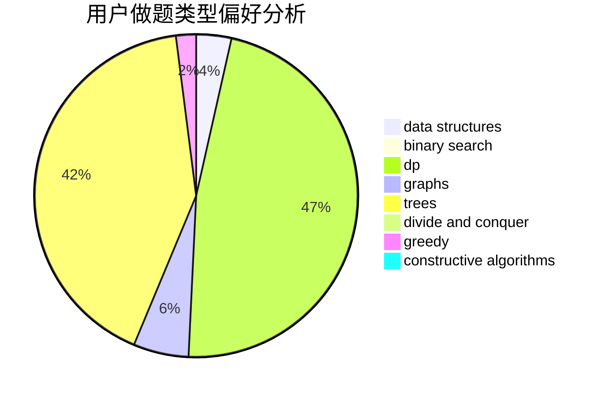
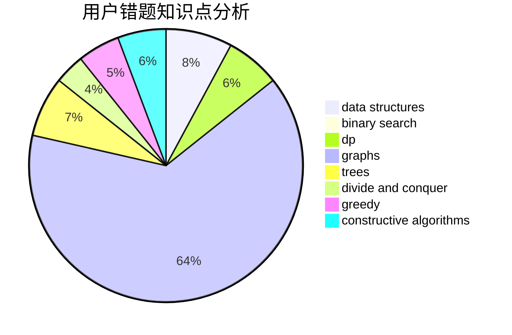

# syzf2222

<!-- tabs:start -->

#### **用户提交结果分析**

#### **用户做题类型偏好分析**

#### **用户错题知识点分析**

<!-- tabs:end -->
# 推荐题目
[603E](https://codeforces.com/contest/603/problem/E)		data structures,
                        divide and conquer,
                        dsu,
                        math,
                        trees		  
[1347E](https://codeforces.com/contest/1347/problem/E)		dsu,graphs,sortings,trees		  
[1142D](https://codeforces.com/contest/1142/problem/D)		dp		  
[1178B](https://codeforces.com/contest/1178/problem/B)		dp,
                        strings		  
[9581](https://codeforces.com/contest/958/problem/1)		dsu,graphs,sortings,trees		  
[281D](https://codeforces.com/contest/281/problem/D)		dsu,graphs,sortings,trees		  
[1241E](https://codeforces.com/contest/1241/problem/E)		dsu,graphs,sortings,trees		  
[1060D](https://codeforces.com/contest/1060/problem/D)		greedy,
                        math		  
[878D](https://codeforces.com/contest/878/problem/D)		bitmasks		  
[1060F](https://codeforces.com/contest/1060/problem/F)		combinatorics,
                        dp		  
