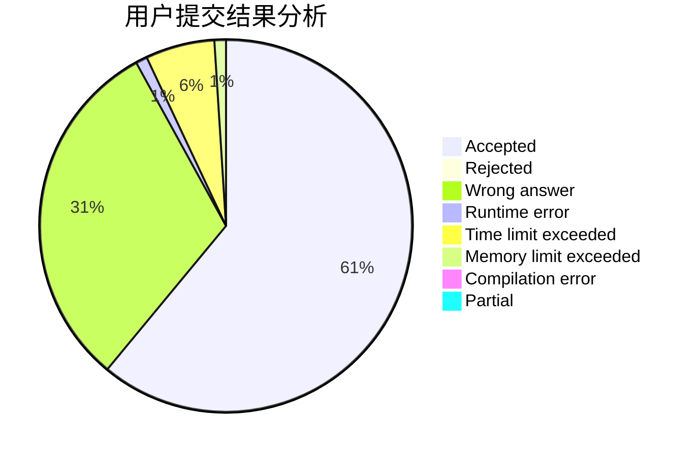
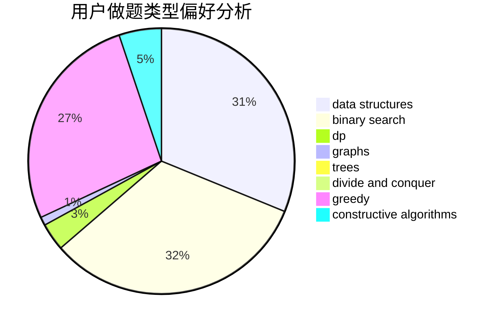
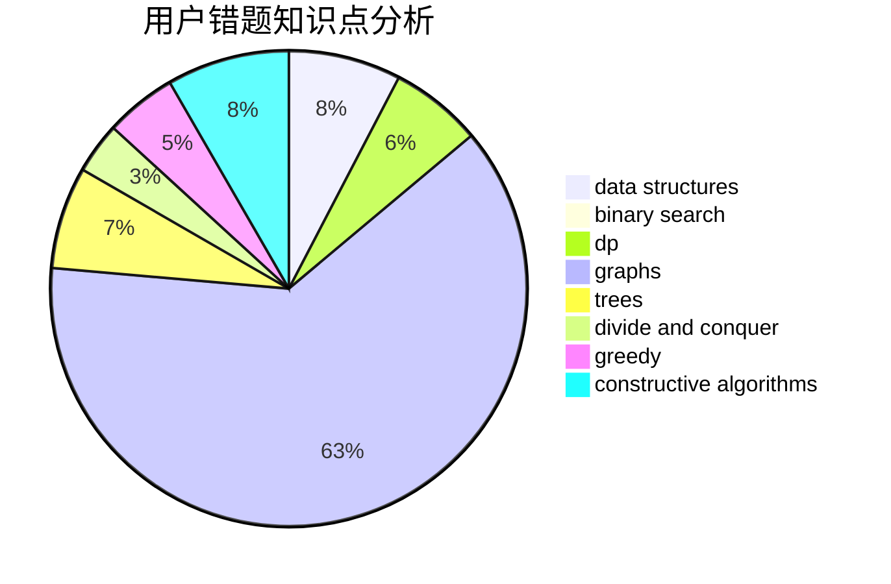

# syzf2222

<!-- tabs:start -->

#### **用户提交结果分析**

#### **用户做题类型偏好分析**

#### **用户错题知识点分析**

<!-- tabs:end -->
# 推荐题目
[582D](https://codeforces.com/contest/582/problem/D)		dp,
                        math,
                        number theory		  
[1340F](https://codeforces.com/contest/1340/problem/F)		brute force,
                        data structures,
                        hashing		  
[1140F](https://codeforces.com/contest/1140/problem/F)		data structures,
                        divide and conquer,
                        dsu		  
[1175B](https://codeforces.com/contest/1175/problem/B)		data structures,
                        expression parsing,
                        implementation		  
[936A](https://codeforces.com/contest/936/problem/A)		binary search,
                        implementation,
                        math		  
[266A](https://codeforces.com/contest/266/problem/A)		implementation		  
[1237C1](https://codeforces.com/contest/1237C/problem/1)		constructive algorithms,
                        geometry,
                        greedy		  
[1060A](https://codeforces.com/contest/1060/problem/A)		brute force		  
[860D](https://codeforces.com/contest/860/problem/D)		dsu,graphs,sortings,trees		  
[1060C](https://codeforces.com/contest/1060/problem/C)		binary search,
                        implementation,
                        two pointers		  
