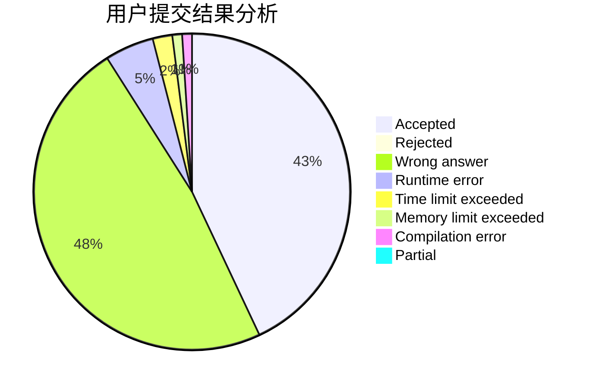
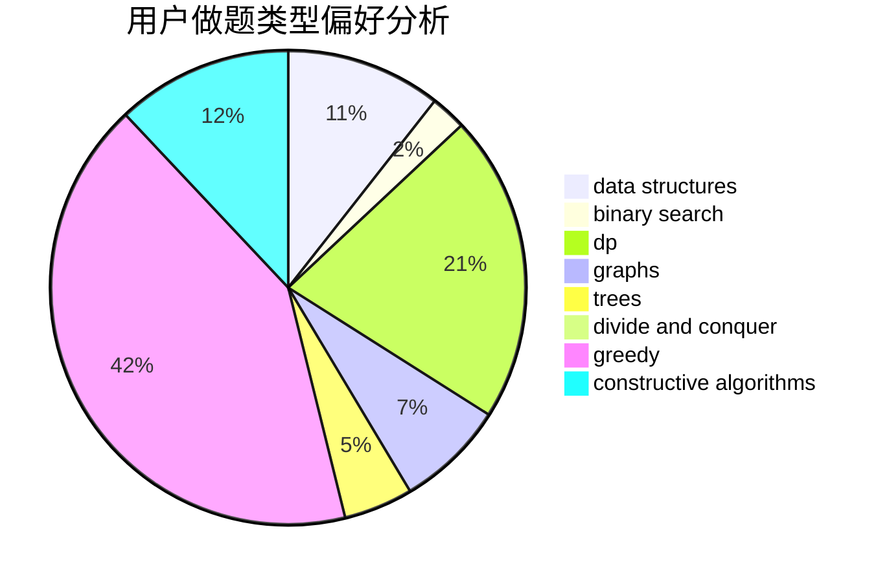
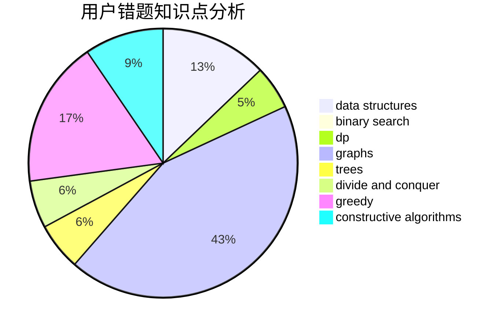

# CSHwang
<!-- tabs:start -->
#### **用户提交结果分析**

#### **用户做题类型偏好分析**

#### **用户错题知识点分析**

<!-- tabs:end -->
# 推荐题目
[Basketball Exercise](http://codeforces.com/problemset/problem/1195/C)		dp		  
[Jordan Smiley](http://codeforces.com/problemset/problem/1331/E)		dfs and similar,
                        geometry,
                        implementation		  
[Dreamoon and Binary](http://codeforces.com/problemset/problem/477/D)		dp,
                        strings		  
[The Text Splitting](http://codeforces.com/problemset/problem/612/A)		brute force,
                        implementation,
                        strings		  
[Thanos Nim](https://codeforces.com/contest/1162/problem/E)		games		  
[Cookie Clicker](http://codeforces.com/problemset/problem/377/E)		dp,
                        geometry		  
[Aerodynamic](https://codeforces.com/contest/1300/problem/D)		geometry		  
[Replace To Make Regular Bracket Sequence](http://codeforces.com/problemset/problem/612/C)		data structures,
                        expression parsing,
                        math		  
[New Year and Days](http://codeforces.com/problemset/problem/611/A)		implementation		  
[Privatization of Roads in Treeland](http://codeforces.com/problemset/problem/1141/G)		binary search,
                        constructive algorithms,
                        dfs and similar,
                        graphs,
                        greedy,
                        trees		  
<!-- tabs:start -->
#### **data structures**
[Basketball Exercise](http://codeforces.com/problemset/problem/612/C)		data structures,
                        expression parsing,
                        math		  
[Jordan Smiley](http://codeforces.com/problemset/problem/1182/F)		binary search,
                        data structures,
                        number theory		  
[Dreamoon and Binary](https://codeforces.com/contest/1459/problem/F)		data structures,
                        graphs,
                        greedy		  
[The Text Splitting](http://codeforces.com/problemset/problem/482/B)		constructive algorithms,
                        data structures,
                        trees		  
[Thanos Nim](http://codeforces.com/problemset/problem/611/E)		data structures,
                        greedy,
                        sortings		  
[Cookie Clicker](http://codeforces.com/problemset/problem/242/E)		bitmasks,
                        data structures		  
[Aerodynamic](http://codeforces.com/problemset/problem/1004/E)		binary search,
                        data structures,
                        dp,
                        greedy,
                        shortest paths,
                        trees		  
[Replace To Make Regular Bracket Sequence](http://codeforces.com/problemset/problem/607/D)		data structures,
                        trees		  
[New Year and Days](http://codeforces.com/problemset/problem/1276/C)		brute force,
                        combinatorics,
                        constructive algorithms,
                        data structures,
                        greedy,
                        math		  
[Privatization of Roads in Treeland](http://codeforces.com/problemset/problem/1388/D)		data structures,
                        dfs and similar,
                        graphs,
                        greedy,
                        implementation,
                        trees		  
#### **binary search**
[Basketball Exercise](http://codeforces.com/problemset/problem/1141/G)		binary search,
                        constructive algorithms,
                        dfs and similar,
                        graphs,
                        greedy,
                        trees		  
[Jordan Smiley](http://codeforces.com/problemset/problem/1182/F)		binary search,
                        data structures,
                        number theory		  
[Dreamoon and Binary](http://codeforces.com/problemset/problem/551/C)		binary search,
                        greedy		  
[The Text Splitting](http://codeforces.com/problemset/problem/611/F)		binary search,
                        implementation		  
[Thanos Nim](http://codeforces.com/problemset/problem/11/E)		binary search,
                        dp,
                        greedy		  
[Cookie Clicker](http://codeforces.com/problemset/problem/613/A)		binary search,
                        geometry,
                        ternary search		  
[Aerodynamic](http://codeforces.com/problemset/problem/444/E)		binary search,
                        dsu,
                        trees		  
[Replace To Make Regular Bracket Sequence](http://codeforces.com/problemset/problem/1004/E)		binary search,
                        data structures,
                        dp,
                        greedy,
                        shortest paths,
                        trees		  
[New Year and Days](https://codeforces.com/contest/1483/problem/E)		binary search,
                        interactive		  
[Privatization of Roads in Treeland](http://codeforces.com/problemset/problem/1428/F)		binary search,
                        data structures,
                        divide and conquer,
                        dp,
                        two pointers		  
#### **dp**
[Basketball Exercise](http://codeforces.com/problemset/problem/1195/C)		dp		  
[Jordan Smiley](http://codeforces.com/problemset/problem/477/D)		dp,
                        strings		  
[Dreamoon and Binary](http://codeforces.com/problemset/problem/377/E)		dp,
                        geometry		  
[The Text Splitting](http://codeforces.com/problemset/problem/611/C)		dp,
                        implementation		  
[Thanos Nim](http://codeforces.com/problemset/problem/1187/F)		dp,
                        math,
                        probabilities		  
[Cookie Clicker](http://codeforces.com/problemset/problem/612/F)		dp		  
[Aerodynamic](http://codeforces.com/problemset/problem/611/D)		dp,
                        hashing,
                        strings		  
[Replace To Make Regular Bracket Sequence](http://codeforces.com/problemset/problem/11/E)		binary search,
                        dp,
                        greedy		  
[New Year and Days](http://codeforces.com/problemset/problem/1253/C)		dp,
                        greedy,
                        math,
                        sortings		  
[Privatization of Roads in Treeland](http://codeforces.com/problemset/problem/1272/D)		brute force,
                        dp		  
#### **graph**
[Basketball Exercise](http://codeforces.com/problemset/problem/1141/G)		binary search,
                        constructive algorithms,
                        dfs and similar,
                        graphs,
                        greedy,
                        trees		  
[Jordan Smiley](https://codeforces.com/contest/1459/problem/F)		data structures,
                        graphs,
                        greedy		  
[Dreamoon and Binary](http://codeforces.com/problemset/problem/167/E)		dfs and similar,
                        graphs,
                        math,
                        matrices		  
[The Text Splitting](http://codeforces.com/problemset/problem/611/H)		constructive algorithms,
                        flows,
                        graphs		  
[Thanos Nim](http://codeforces.com/problemset/problem/575/B)		dfs and similar,
                        graphs,
                        trees		  
[Cookie Clicker](http://codeforces.com/problemset/problem/612/E)		combinatorics,
                        constructive algorithms,
                        dfs and similar,
                        graphs,
                        math		  
[Aerodynamic](http://codeforces.com/problemset/problem/1388/D)		data structures,
                        dfs and similar,
                        graphs,
                        greedy,
                        implementation,
                        trees		  
[Replace To Make Regular Bracket Sequence](http://codeforces.com/problemset/problem/613/D)		dfs and similar,
                        divide and conquer,
                        dp,
                        graphs,
                        sortings,
                        trees		  
[New Year and Days](http://codeforces.com/problemset/problem/1487/C)		brute force,
                        constructive algorithms,
                        dfs and similar,
                        graphs,
                        greedy,
                        implementation,
                        math		  
[Privatization of Roads in Treeland](http://codeforces.com/problemset/problem/1437/C)		dp,
                        flows,
                        graph matchings,
                        greedy,
                        math,
                        sortings		  
#### **trees**
[Basketball Exercise](http://codeforces.com/problemset/problem/1141/G)		binary search,
                        constructive algorithms,
                        dfs and similar,
                        graphs,
                        greedy,
                        trees		  
[Jordan Smiley](http://codeforces.com/problemset/problem/575/B)		dfs and similar,
                        graphs,
                        trees		  
[Dreamoon and Binary](http://codeforces.com/problemset/problem/482/B)		constructive algorithms,
                        data structures,
                        trees		  
[The Text Splitting](http://codeforces.com/problemset/problem/444/E)		binary search,
                        dsu,
                        trees		  
[Thanos Nim](http://codeforces.com/problemset/problem/1004/E)		binary search,
                        data structures,
                        dp,
                        greedy,
                        shortest paths,
                        trees		  
[Cookie Clicker](http://codeforces.com/problemset/problem/607/D)		data structures,
                        trees		  
[Aerodynamic](http://codeforces.com/problemset/problem/1388/D)		data structures,
                        dfs and similar,
                        graphs,
                        greedy,
                        implementation,
                        trees		  
[Replace To Make Regular Bracket Sequence](http://codeforces.com/problemset/problem/613/D)		dfs and similar,
                        divide and conquer,
                        dp,
                        graphs,
                        sortings,
                        trees		  
[New Year and Days](http://codeforces.com/problemset/problem/1479/D)		binary search,
                        bitmasks,
                        brute force,
                        data structures,
                        probabilities,
                        trees		  
[Privatization of Roads in Treeland](http://codeforces.com/problemset/problem/1511/C)		brute force,
                        data structures,
                        implementation,
                        trees		  
#### **divide and conquer**
[Basketball Exercise](http://codeforces.com/problemset/problem/613/D)		dfs and similar,
                        divide and conquer,
                        dp,
                        graphs,
                        sortings,
                        trees		  
[Jordan Smiley](http://codeforces.com/problemset/problem/1428/F)		binary search,
                        data structures,
                        divide and conquer,
                        dp,
                        two pointers		  
[Dreamoon and Binary](http://codeforces.com/problemset/problem/1461/D)		binary search,
                        brute force,
                        data structures,
                        divide and conquer,
                        implementation,
                        sortings		  
[The Text Splitting](http://codeforces.com/problemset/problem/1466/G)		combinatorics,
                        divide and conquer,
                        hashing,
                        math,
                        string suffix structures,
                        strings		  
[Thanos Nim](http://codeforces.com/problemset/problem/1490/D)		dfs and similar,
                        divide and conquer,
                        implementation		  
[Cookie Clicker](https://codeforces.com/contest/1483/problem/C)		data structures,
                        divide and conquer,
                        dp		  
[Aerodynamic](http://codeforces.com/problemset/problem/1491/E)		brute force,
                        dfs and similar,
                        divide and conquer,
                        number theory,
                        trees		  
[Replace To Make Regular Bracket Sequence](http://codeforces.com/problemset/problem/1303/G)		data structures,
                        divide and conquer,
                        geometry,
                        trees		  
[New Year and Days](http://codeforces.com/problemset/problem/1494/D)		constructive algorithms,
                        data structures,
                        dfs and similar,
                        divide and conquer,
                        dsu,
                        greedy,
                        sortings,
                        trees		  
[Privatization of Roads in Treeland](http://codeforces.com/problemset/problem/1482/E)		data structures,
                        divide and conquer,
                        dp		  
#### **greedy**
[Basketball Exercise](http://codeforces.com/problemset/problem/1141/G)		binary search,
                        constructive algorithms,
                        dfs and similar,
                        graphs,
                        greedy,
                        trees		  
[Jordan Smiley](http://codeforces.com/problemset/problem/551/C)		binary search,
                        greedy		  
[Dreamoon and Binary](http://codeforces.com/problemset/problem/1250/B)		brute force,
                        constructive algorithms,
                        greedy,
                        math		  
[The Text Splitting](https://codeforces.com/contest/1459/problem/F)		data structures,
                        graphs,
                        greedy		  
[Thanos Nim](http://codeforces.com/problemset/problem/11/E)		binary search,
                        dp,
                        greedy		  
[Cookie Clicker](http://codeforces.com/problemset/problem/16/B)		greedy,
                        implementation,
                        sortings		  
[Aerodynamic](http://codeforces.com/problemset/problem/1151/D)		greedy,
                        math,
                        sortings		  
[Replace To Make Regular Bracket Sequence](http://codeforces.com/problemset/problem/1253/C)		dp,
                        greedy,
                        math,
                        sortings		  
[New Year and Days](http://codeforces.com/problemset/problem/611/E)		data structures,
                        greedy,
                        sortings		  
[Privatization of Roads in Treeland](http://codeforces.com/problemset/problem/1004/E)		binary search,
                        data structures,
                        dp,
                        greedy,
                        shortest paths,
                        trees		  
#### **constructive algorithms**
[Basketball Exercise](http://codeforces.com/problemset/problem/1141/G)		binary search,
                        constructive algorithms,
                        dfs and similar,
                        graphs,
                        greedy,
                        trees		  
[Jordan Smiley](http://codeforces.com/problemset/problem/1250/B)		brute force,
                        constructive algorithms,
                        greedy,
                        math		  
[Dreamoon and Binary](http://codeforces.com/problemset/problem/611/H)		constructive algorithms,
                        flows,
                        graphs		  
[The Text Splitting](http://codeforces.com/problemset/problem/275/B)		constructive algorithms,
                        implementation		  
[Thanos Nim](http://codeforces.com/problemset/problem/482/B)		constructive algorithms,
                        data structures,
                        trees		  
[Cookie Clicker](http://codeforces.com/problemset/problem/612/E)		combinatorics,
                        constructive algorithms,
                        dfs and similar,
                        graphs,
                        math		  
[Aerodynamic](http://codeforces.com/problemset/problem/1497/C1)		constructive algorithms,
                        math		  
[Replace To Make Regular Bracket Sequence](http://codeforces.com/problemset/problem/613/C)		constructive algorithms,
                        math		  
[New Year and Days](http://codeforces.com/problemset/problem/1270/D)		constructive algorithms,
                        interactive,
                        math,
                        sortings		  
[Privatization of Roads in Treeland](http://codeforces.com/problemset/problem/1276/C)		brute force,
                        combinatorics,
                        constructive algorithms,
                        data structures,
                        greedy,
                        math		  
#### **sortings**
[Basketball Exercise](http://codeforces.com/problemset/problem/16/B)		greedy,
                        implementation,
                        sortings		  
[Jordan Smiley](http://codeforces.com/problemset/problem/1151/D)		greedy,
                        math,
                        sortings		  
[Dreamoon and Binary](http://codeforces.com/problemset/problem/1253/C)		dp,
                        greedy,
                        math,
                        sortings		  
[The Text Splitting](http://codeforces.com/problemset/problem/611/E)		data structures,
                        greedy,
                        sortings		  
[Thanos Nim](http://codeforces.com/problemset/problem/1270/D)		constructive algorithms,
                        interactive,
                        math,
                        sortings		  
[Cookie Clicker](http://codeforces.com/problemset/problem/613/D)		dfs and similar,
                        divide and conquer,
                        dp,
                        graphs,
                        sortings,
                        trees		  
[Aerodynamic](http://codeforces.com/problemset/problem/1284/D)		binary search,
                        data structures,
                        hashing,
                        sortings		  
[Replace To Make Regular Bracket Sequence](https://codeforces.com/contest/1496/problem/C)		geometry,
                        greedy,
                        math,
                        sortings		  
[New Year and Days](http://codeforces.com/problemset/problem/1495/A)		geometry,
                        greedy,
                        math,
                        sortings		  
[Privatization of Roads in Treeland](http://codeforces.com/problemset/problem/1497/A)		brute force,
                        data structures,
                        greedy,
                        sortings		  
<!-- tabs:end -->
