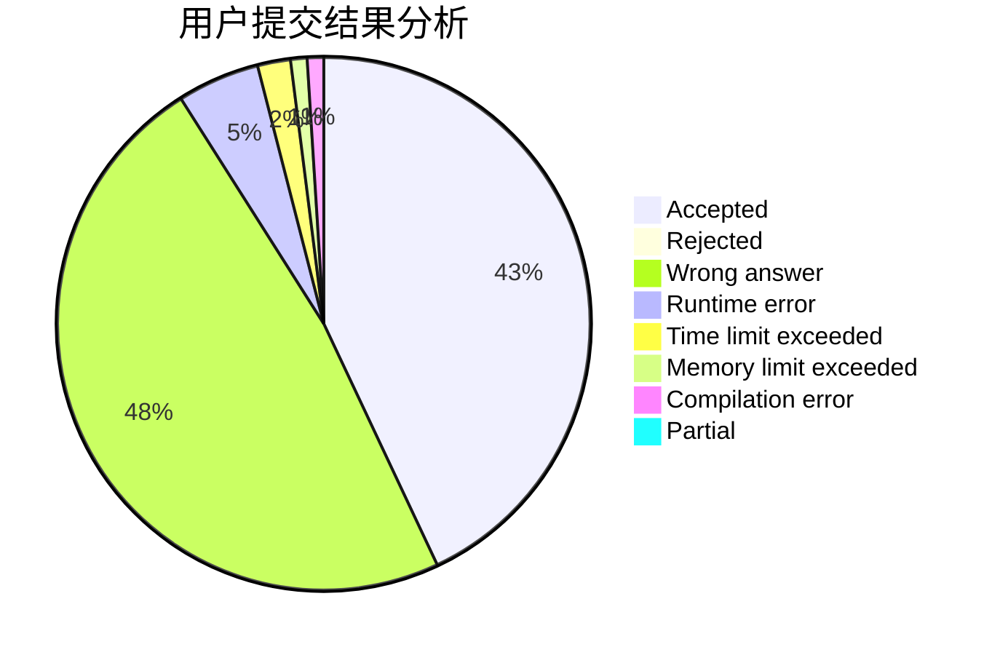
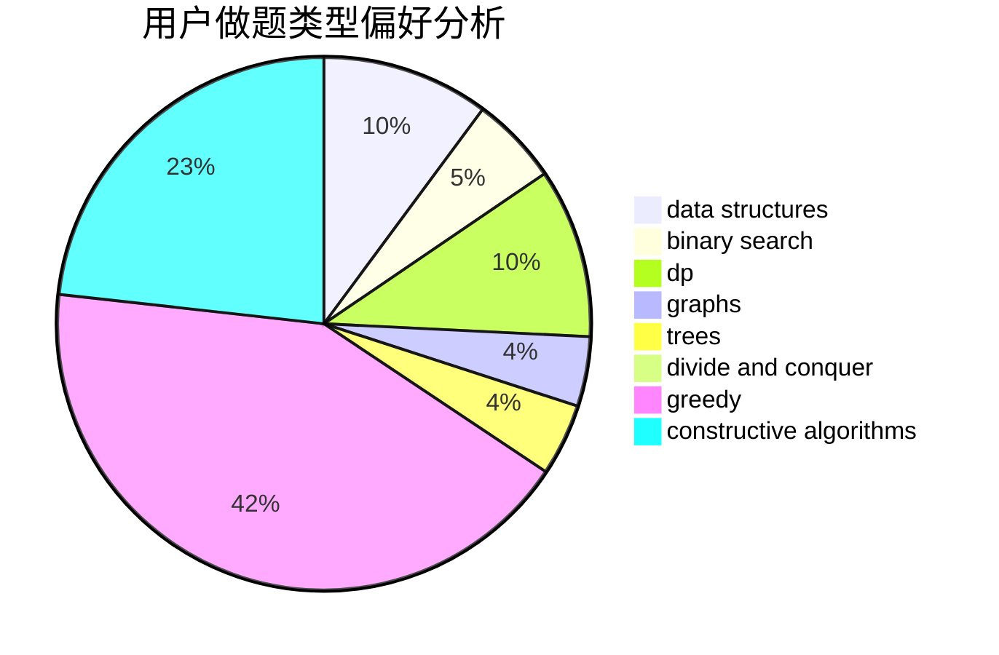
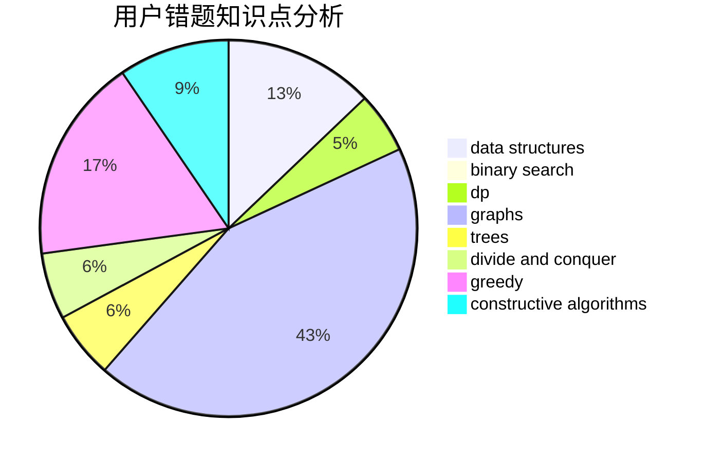

# CSHwang

<!-- tabs:start -->

#### **用户提交结果分析**

#### **用户做题类型偏好分析**

#### **用户错题知识点分析**

<!-- tabs:end -->
# 推荐题目
[1505I](https://codeforces.com/contest/1505/problem/I)		nan		  
[1398B](https://codeforces.com/contest/1398/problem/B)		games,
                        greedy,
                        sortings		  
[1185B](https://codeforces.com/contest/1185/problem/B)		implementation,
                        strings		  
[632D](https://codeforces.com/contest/632/problem/D)		brute force,
                        math,
                        number theory		  
[1164M](https://codeforces.com/contest/1164/problem/M)		dsu,graphs,sortings,trees		  
[1337D](https://codeforces.com/contest/1337/problem/D)		dsu,graphs,sortings,trees		  
[1336B](https://codeforces.com/contest/1336/problem/B)		binary search,
                        greedy,
                        math,
                        sortings,
                        two pointers		  
[631B](https://codeforces.com/contest/631/problem/B)		constructive algorithms,
                        implementation		  
[497D](https://codeforces.com/contest/497/problem/D)		brute force,
                        geometry,
                        math		  
[630A](https://codeforces.com/contest/630/problem/A)		number theory		  
