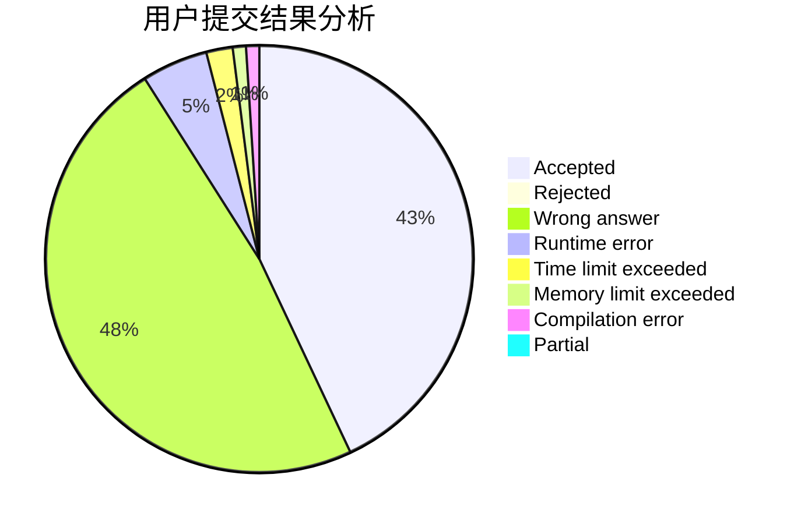
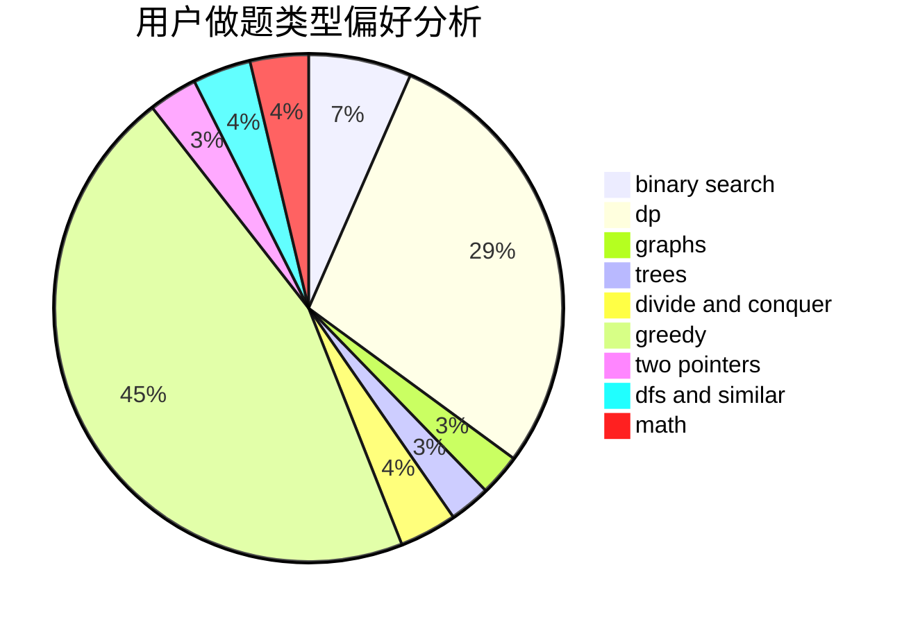

# CSHwang

<!-- tabs:start -->

#### **用户提交结果分析**

#### **用户做题类型偏好分析**

<!-- tabs:end -->
# 推荐题目
[1505I](https://codeforces.com/contest/1505/problem/I)
[1398B](https://codeforces.com/contest/1398/problem/B)
[1185B](https://codeforces.com/contest/1185/problem/B)
[632D](https://codeforces.com/contest/632/problem/D)
[1164M](https://codeforces.com/contest/1164/problem/M)
[1337D](https://codeforces.com/contest/1337/problem/D)
[1336B](https://codeforces.com/contest/1336/problem/B)
[631B](https://codeforces.com/contest/631/problem/B)
[497D](https://codeforces.com/contest/497/problem/D)
[630A](https://codeforces.com/contest/630/problem/A)
