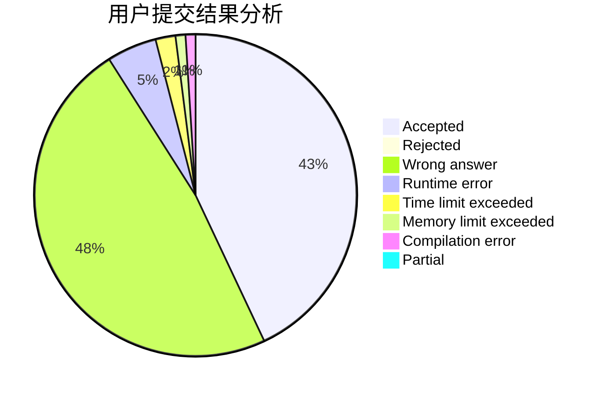
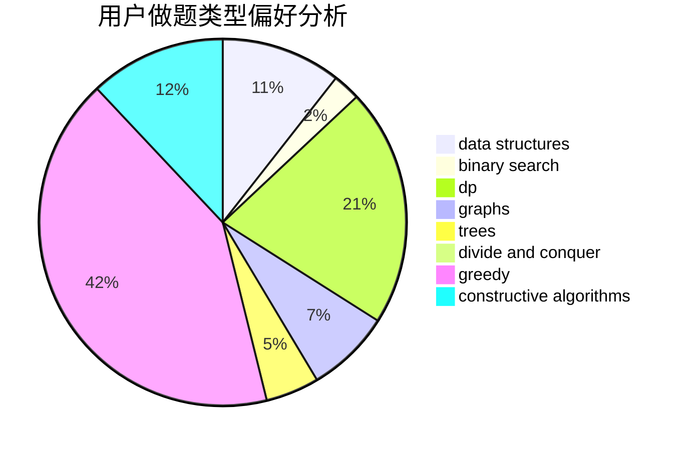
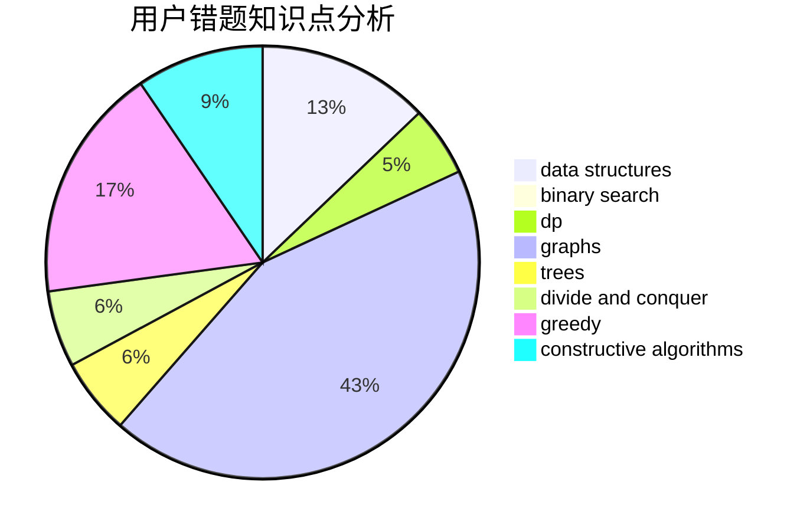

# CSHwang

<!-- tabs:start -->

#### **用户提交结果分析**

#### **用户做题类型偏好分析**

#### **用户错题知识点分析**

<!-- tabs:end -->
# 推荐题目
[1497C1](https://codeforces.com/contest/1497C/problem/1)		constructive algorithms,
                        math		  
[1388D](https://codeforces.com/contest/1388/problem/D)		data structures,
                        dfs and similar,
                        graphs,
                        greedy,
                        implementation,
                        trees		  
[1182F](https://codeforces.com/contest/1182/problem/F)		binary search,
                        data structures,
                        number theory		  
[613A](https://codeforces.com/contest/613/problem/A)		binary search,
                        geometry,
                        ternary search		  
[1162E](https://codeforces.com/contest/1162/problem/E)		dsu,graphs,sortings,trees		  
[1331E](https://codeforces.com/contest/1331/problem/E)		dfs and similar,
                        geometry,
                        implementation		  
[1330B](https://codeforces.com/contest/1330/problem/B)		implementation,
                        math		  
[612A](https://codeforces.com/contest/612/problem/A)		brute force,
                        implementation,
                        strings		  
[477D](https://codeforces.com/contest/477/problem/D)		dp,
                        strings		  
[611A](https://codeforces.com/contest/611/problem/A)		implementation		  
