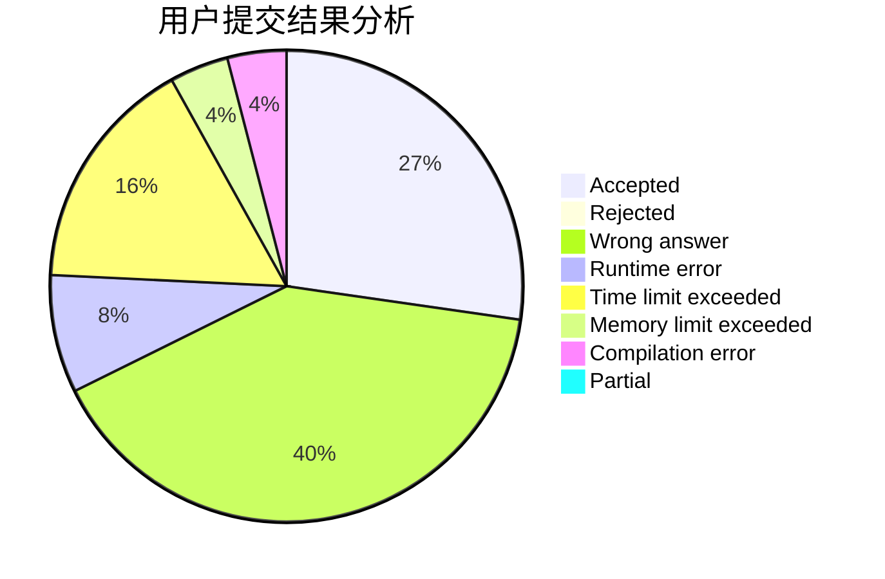
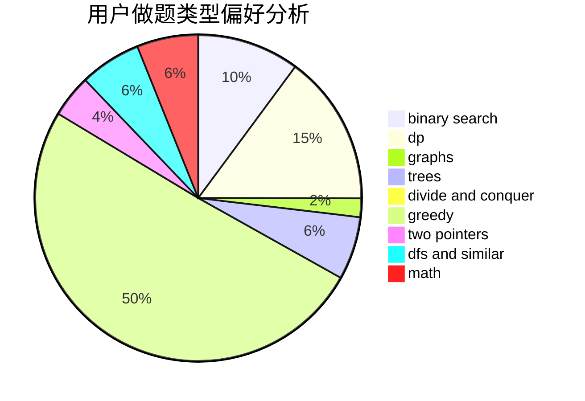

# szb

<!-- tabs:start -->

#### **用户提交结果分析**

#### **用户做题类型偏好分析**

<!-- tabs:end -->
# 推荐题目
[1287C](https://codeforces.com/contest/1287/problem/C)
[277E](https://codeforces.com/contest/277/problem/E)
[337D](https://codeforces.com/contest/337/problem/D)
[36C](https://codeforces.com/contest/36/problem/C)
[1162E](https://codeforces.com/contest/1162/problem/E)
[637B](https://codeforces.com/contest/637/problem/B)
[660B](https://codeforces.com/contest/660/problem/B)
[1148B](https://codeforces.com/contest/1148/problem/B)
[919D](https://codeforces.com/contest/919/problem/D)
[875A](https://codeforces.com/contest/875/problem/A)
