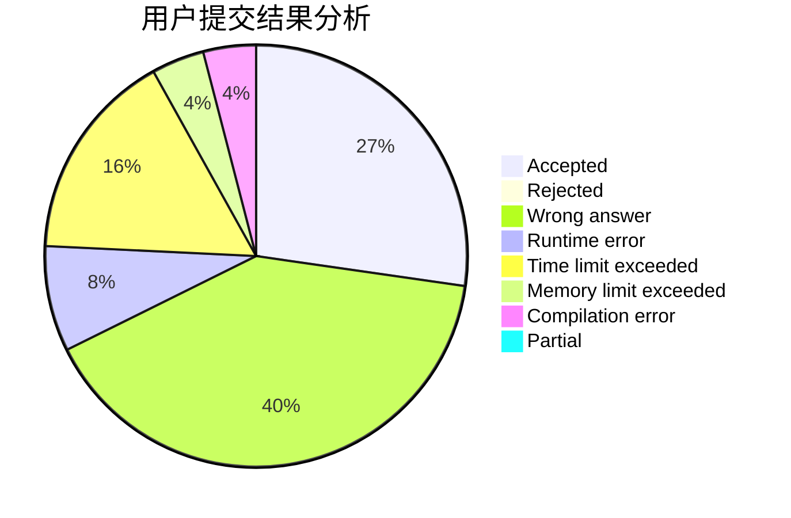
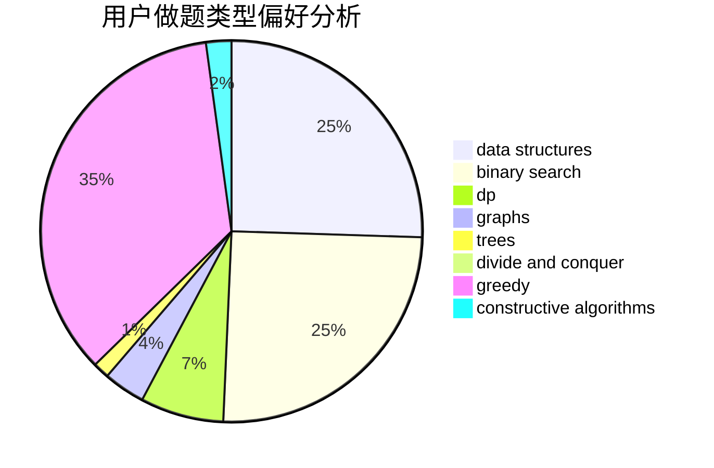
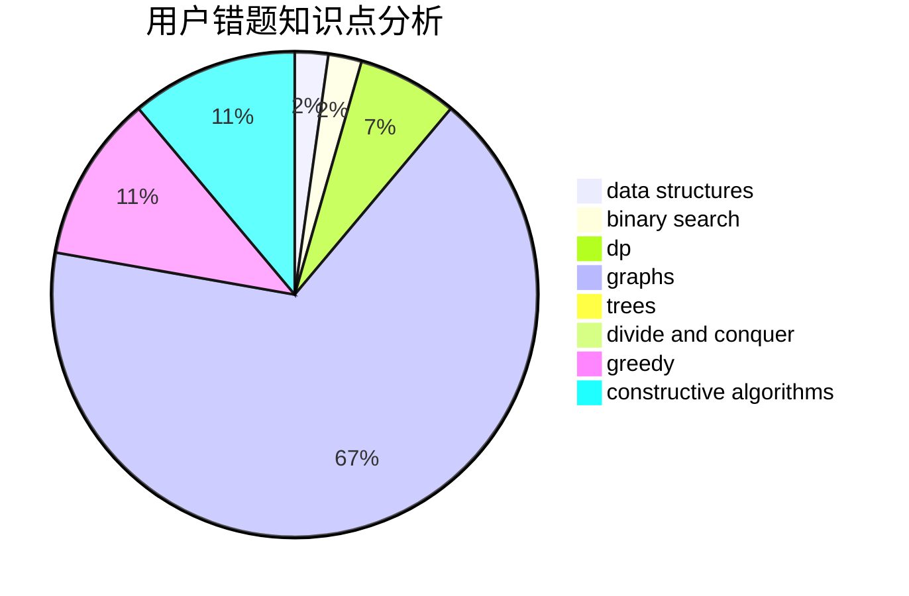

# szb

<!-- tabs:start -->

#### **用户提交结果分析**

#### **用户做题类型偏好分析**

#### **用户错题知识点分析**

<!-- tabs:end -->
# 推荐题目
[1287C](https://codeforces.com/contest/1287/problem/C)		dsu,graphs,sortings,trees		  
[277E](https://codeforces.com/contest/277/problem/E)		flows,
                        trees		  
[337D](https://codeforces.com/contest/337/problem/D)		dfs and similar,
                        divide and conquer,
                        dp,
                        trees		  
[36C](https://codeforces.com/contest/36/problem/C)		geometry,
                        implementation		  
[1162E](https://codeforces.com/contest/1162/problem/E)		dsu,graphs,sortings,trees		  
[637B](https://codeforces.com/contest/637/problem/B)		*special problem,
                        binary search,
                        constructive algorithms,
                        data structures,
                        sortings		  
[660B](https://codeforces.com/contest/660/problem/B)		implementation		  
[1148B](https://codeforces.com/contest/1148/problem/B)		binary search,
                        brute force,
                        two pointers		  
[919D](https://codeforces.com/contest/919/problem/D)		dfs and similar,
                        dp,
                        graphs		  
[875A](https://codeforces.com/contest/875/problem/A)		brute force,
                        math		  
