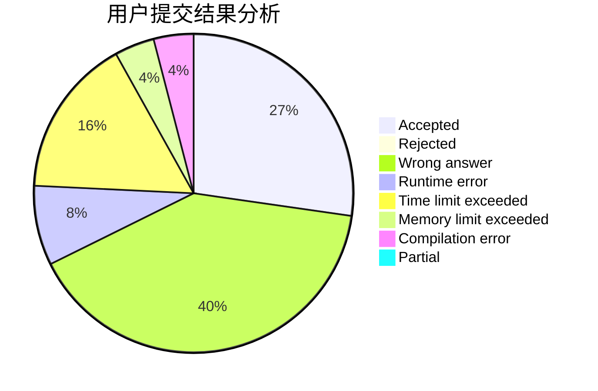
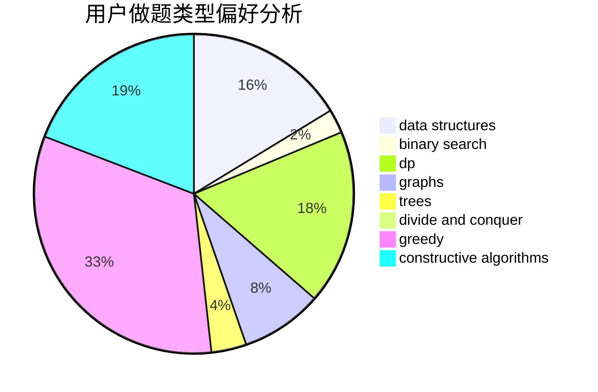
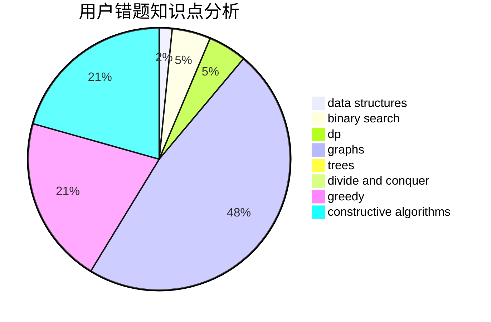

# szb

<!-- tabs:start -->

#### **用户提交结果分析**

#### **用户做题类型偏好分析**

#### **用户错题知识点分析**

<!-- tabs:end -->
# 推荐题目
[1281C](https://codeforces.com/contest/1281/problem/C)		dsu,graphs,sortings,trees		  
[25E](https://codeforces.com/contest/25/problem/E)		hashing,
                        strings		  
[313D](https://codeforces.com/contest/313/problem/D)		dp		  
[343B](https://codeforces.com/contest/343/problem/B)		data structures,
                        greedy,
                        implementation		  
[115A](https://codeforces.com/contest/115/problem/A)		dfs and similar,
                        graphs,
                        trees		  
[618A](https://codeforces.com/contest/618/problem/A)		implementation		  
[630F](https://codeforces.com/contest/630/problem/F)		combinatorics,
                        math		  
[1146B](https://codeforces.com/contest/1146/problem/B)		implementation,
                        strings		  
[903D](https://codeforces.com/contest/903/problem/D)		data structures,
                        math		  
[855F](https://codeforces.com/contest/855/problem/F)		binary search,
                        data structures		  
