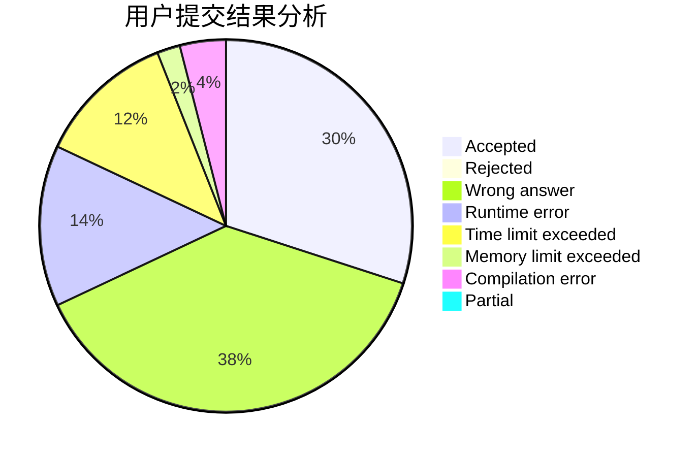
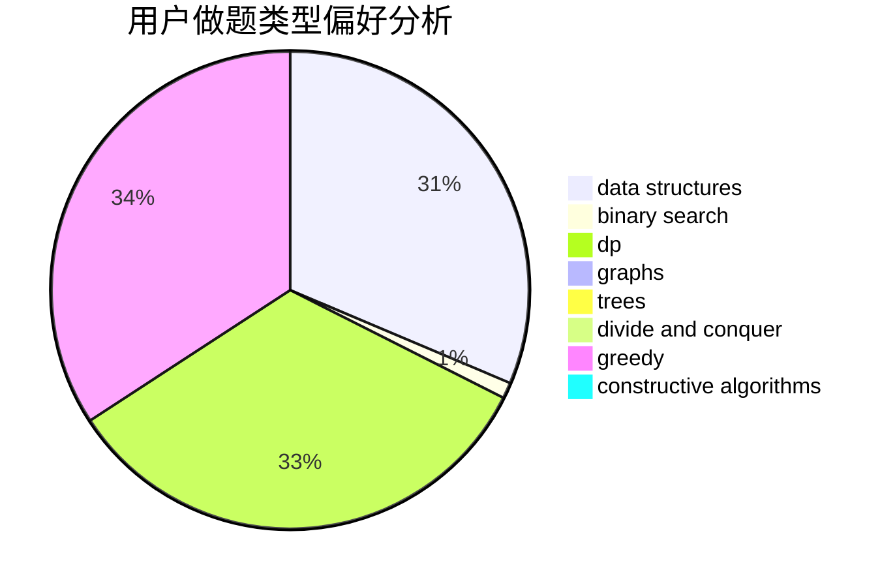
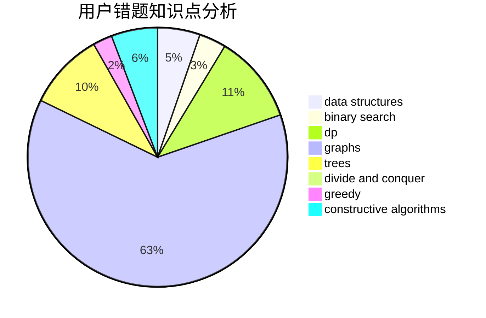

# szbszbszb

<!-- tabs:start -->

#### **用户提交结果分析**

#### **用户做题类型偏好分析**

#### **用户错题知识点分析**

<!-- tabs:end -->
# 推荐题目
[831F](https://codeforces.com/contest/831/problem/F)		dsu,graphs,sortings,trees		  
[1250I](https://codeforces.com/contest/1250/problem/I)		binary search,
                        brute force,
                        greedy,
                        shortest paths		  
[1061F](https://codeforces.com/contest/1061/problem/F)		interactive,
                        probabilities		  
[1322E](https://codeforces.com/contest/1322/problem/E)		data structures		  
[1428D](https://codeforces.com/contest/1428/problem/D)		constructive algorithms,
                        greedy,
                        implementation		  
[940D](https://codeforces.com/contest/940/problem/D)		binary search,
                        implementation		  
[1199C](https://codeforces.com/contest/1199/problem/C)		dsu,graphs,sortings,trees		  
[80B](https://codeforces.com/contest/80/problem/B)		geometry,
                        math		  
[1361E](https://codeforces.com/contest/1361/problem/E)		dfs and similar,
                        graphs,
                        probabilities,
                        trees		  
[862E](https://codeforces.com/contest/862/problem/E)		binary search,
                        data structures,
                        sortings		  
