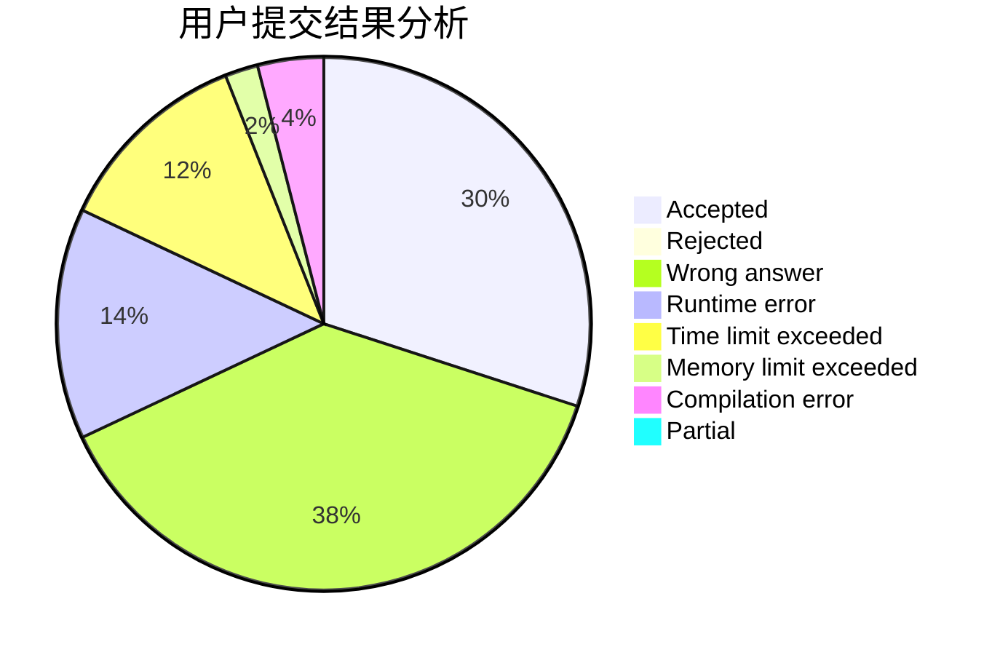
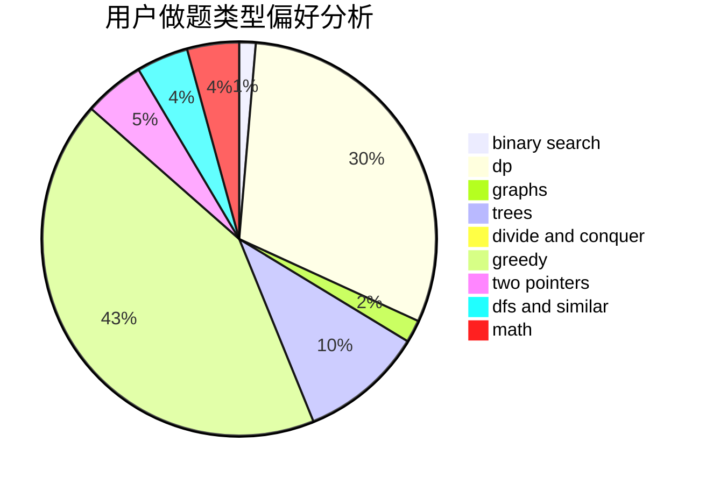

# szbszbszb

<!-- tabs:start -->

#### **用户提交结果分析**

#### **用户做题类型偏好分析**

<!-- tabs:end -->
# 推荐题目
[831F](https://codeforces.com/contest/831/problem/F)
[1250I](https://codeforces.com/contest/1250/problem/I)
[1061F](https://codeforces.com/contest/1061/problem/F)
[1322E](https://codeforces.com/contest/1322/problem/E)
[1428D](https://codeforces.com/contest/1428/problem/D)
[940D](https://codeforces.com/contest/940/problem/D)
[1199C](https://codeforces.com/contest/1199/problem/C)
[80B](https://codeforces.com/contest/80/problem/B)
[1361E](https://codeforces.com/contest/1361/problem/E)
[862E](https://codeforces.com/contest/862/problem/E)
