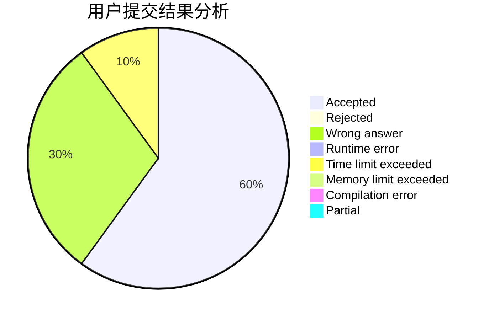
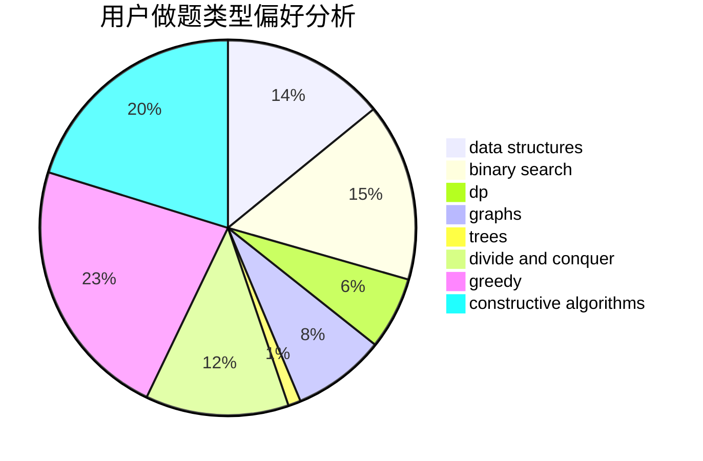

# szdytom

<!-- tabs:start -->

#### **用户提交结果分析**

#### **用户做题类型偏好分析**

#### **用户错题知识点分析**

<!-- tabs:end -->
# 推荐题目
[544D](https://codeforces.com/contest/544/problem/D)		dsu,graphs,sortings,trees		  
[1262A](https://codeforces.com/contest/1262/problem/A)		dsu,graphs,sortings,trees		  
[683A](https://codeforces.com/contest/683/problem/A)		*special problem,
                        geometry		  
[840A](https://codeforces.com/contest/840/problem/A)		combinatorics,
                        greedy,
                        math,
                        number theory,
                        sortings		  
[279B](https://codeforces.com/contest/279/problem/B)		binary search,
                        brute force,
                        implementation,
                        two pointers		  
[611C](https://codeforces.com/contest/611/problem/C)		dp,
                        implementation		  
[1301D](https://codeforces.com/contest/1301/problem/D)		constructive algorithms,
                        graphs,
                        implementation		  
[1154D](https://codeforces.com/contest/1154/problem/D)		greedy		  
[82D](https://codeforces.com/contest/82/problem/D)		dp		  
[77B](https://codeforces.com/contest/77/problem/B)		math,
                        probabilities		  
