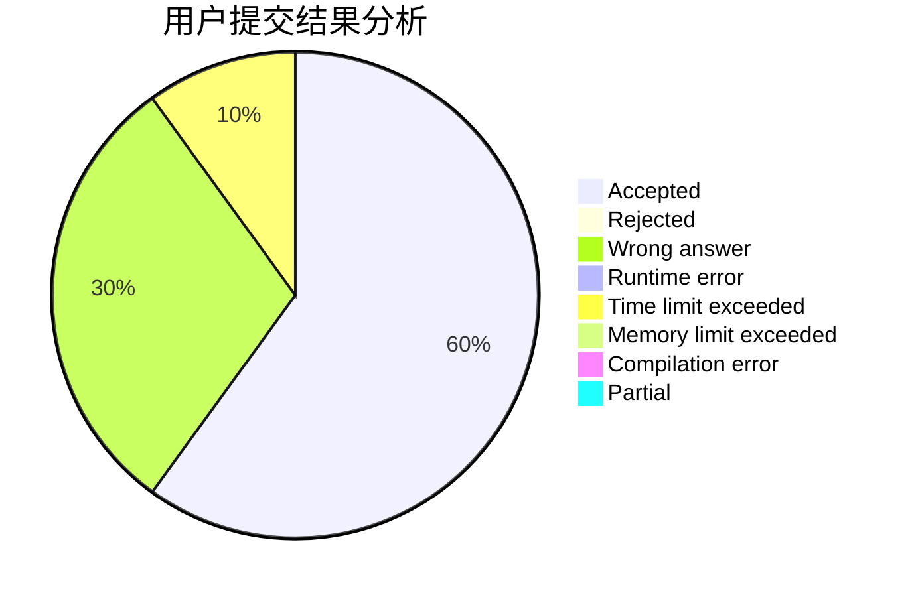
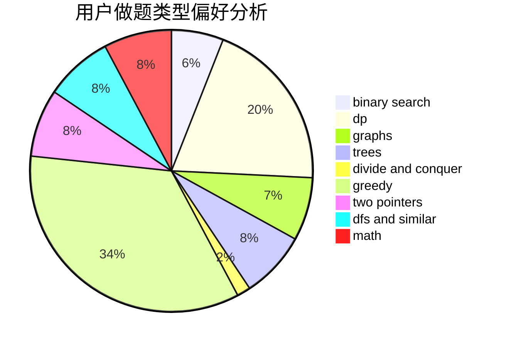

# szdytom

<!-- tabs:start -->

#### **用户提交结果分析**

#### **用户做题类型偏好分析**

<!-- tabs:end -->
# 推荐题目
[569A](https://codeforces.com/contest/569/problem/A)
[1267I](https://codeforces.com/contest/1267/problem/I)
[707B](https://codeforces.com/contest/707/problem/B)
[859E](https://codeforces.com/contest/859/problem/E)
[294B](https://codeforces.com/contest/294/problem/B)
[630F](https://codeforces.com/contest/630/problem/F)
[1311A](https://codeforces.com/contest/1311/problem/A)
[1156D](https://codeforces.com/contest/1156/problem/D)
[847K](https://codeforces.com/contest/847/problem/K)
[798B](https://codeforces.com/contest/798/problem/B)
