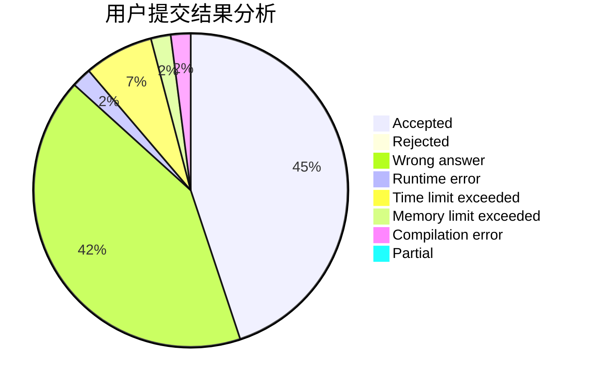
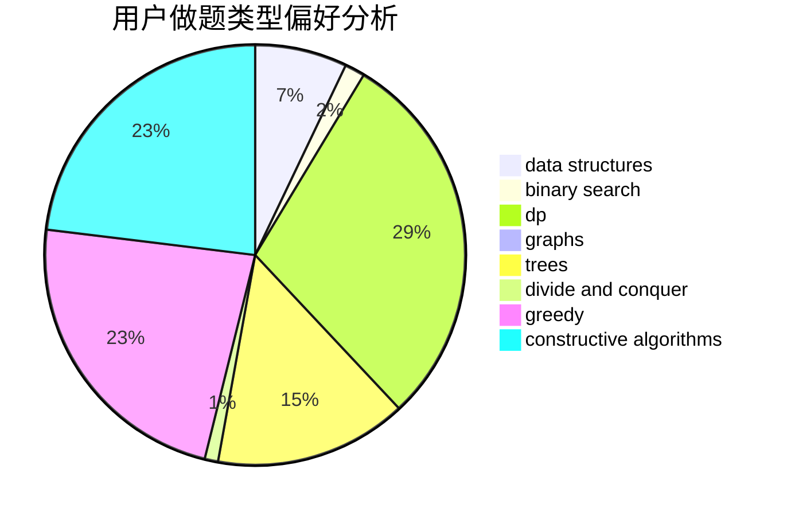
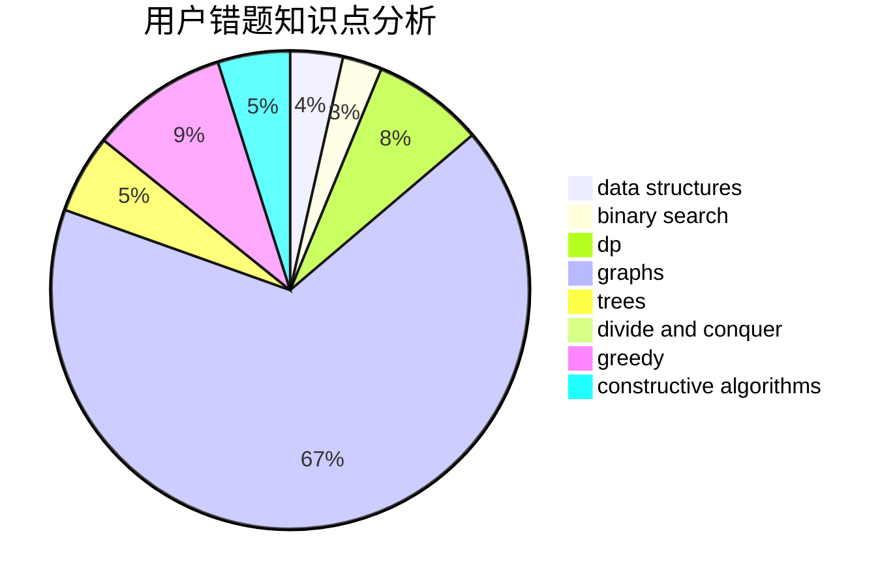

# t90tank

<!-- tabs:start -->

#### **用户提交结果分析**

#### **用户做题类型偏好分析**

#### **用户错题知识点分析**

<!-- tabs:end -->
# 推荐题目
[12961](https://codeforces.com/contest/1296/problem/1)		dsu,graphs,sortings,trees		  
[27D](https://codeforces.com/contest/27/problem/D)		2-sat,
                        dfs and similar,
                        dsu,
                        graphs		  
[701C](https://codeforces.com/contest/701/problem/C)		binary search,
                        strings,
                        two pointers		  
[1272E](https://codeforces.com/contest/1272/problem/E)		dfs and similar,
                        graphs,
                        shortest paths		  
[360E](https://codeforces.com/contest/360/problem/E)		graphs,
                        greedy,
                        shortest paths		  
[827D](https://codeforces.com/contest/827/problem/D)		data structures,
                        dfs and similar,
                        graphs,
                        trees		  
[883A](https://codeforces.com/contest/883/problem/A)		implementation		  
[74A](https://codeforces.com/contest/74/problem/A)		implementation		  
[1465E](https://codeforces.com/contest/1465/problem/E)		dsu,graphs,sortings,trees		  
[478D](https://codeforces.com/contest/478/problem/D)		dp		  
