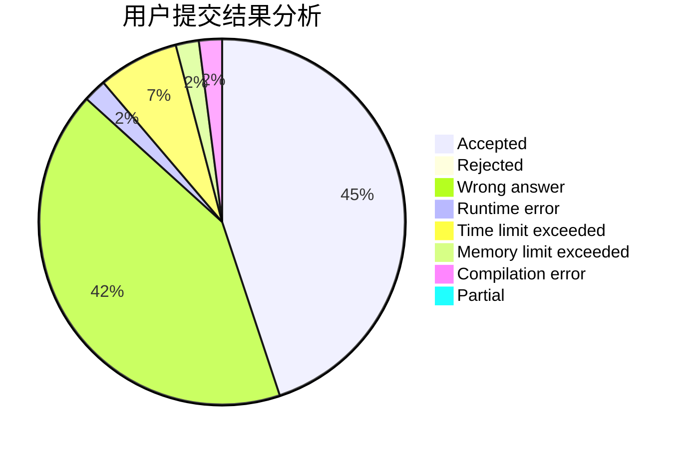
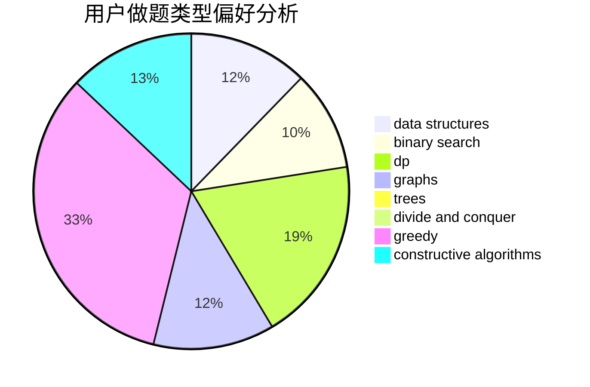

# t90tank

<!-- tabs:start -->

#### **用户提交结果分析**

#### **用户做题类型偏好分析**

#### **用户错题知识点分析**

<!-- tabs:end -->
# 推荐题目
[1288E](https://codeforces.com/contest/1288/problem/E)		data structures		  
[263A](https://codeforces.com/contest/263/problem/A)		implementation		  
[677C](https://codeforces.com/contest/677/problem/C)		bitmasks,
                        combinatorics,
                        implementation,
                        strings		  
[1267B](https://codeforces.com/contest/1267/problem/B)		nan		  
[335A](https://codeforces.com/contest/335/problem/A)		binary search,
                        constructive algorithms,
                        greedy		  
[809E](https://codeforces.com/contest/809/problem/E)		divide and conquer,
                        math,
                        number theory,
                        trees		  
[862D](https://codeforces.com/contest/862/problem/D)		binary search,
                        divide and conquer,
                        interactive		  
[731E](https://codeforces.com/contest/731/problem/E)		dp,
                        games		  
[1456A](https://codeforces.com/contest/1456/problem/A)		dsu,graphs,sortings,trees		  
[459E](https://codeforces.com/contest/459/problem/E)		dp,
                        sortings		  
