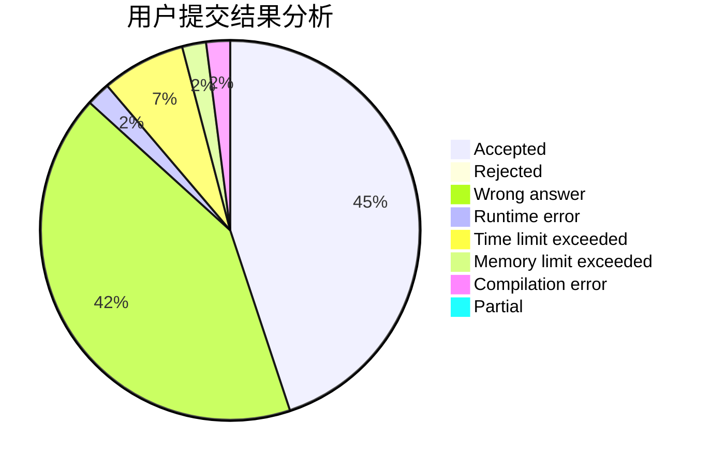
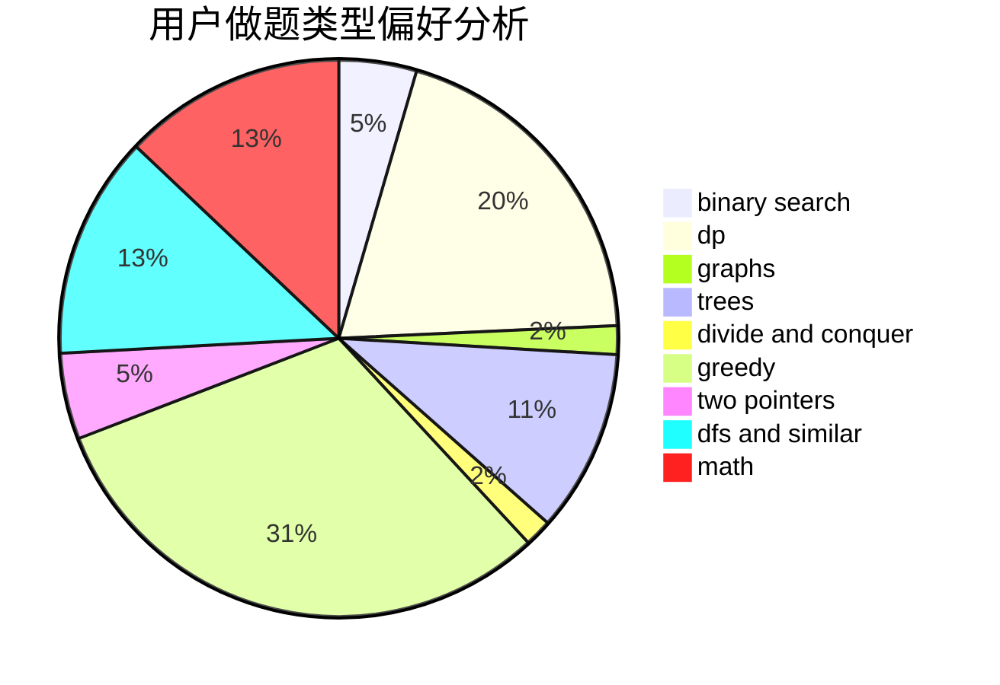

# t90tank

<!-- tabs:start -->

#### **用户提交结果分析**

#### **用户做题类型偏好分析**

<!-- tabs:end -->
# 推荐题目
[12961](https://codeforces.com/contest/1296/problem/1)
[27D](https://codeforces.com/contest/27/problem/D)
[701C](https://codeforces.com/contest/701/problem/C)
[1272E](https://codeforces.com/contest/1272/problem/E)
[360E](https://codeforces.com/contest/360/problem/E)
[827D](https://codeforces.com/contest/827/problem/D)
[883A](https://codeforces.com/contest/883/problem/A)
[74A](https://codeforces.com/contest/74/problem/A)
[1465E](https://codeforces.com/contest/1465/problem/E)
[478D](https://codeforces.com/contest/478/problem/D)
