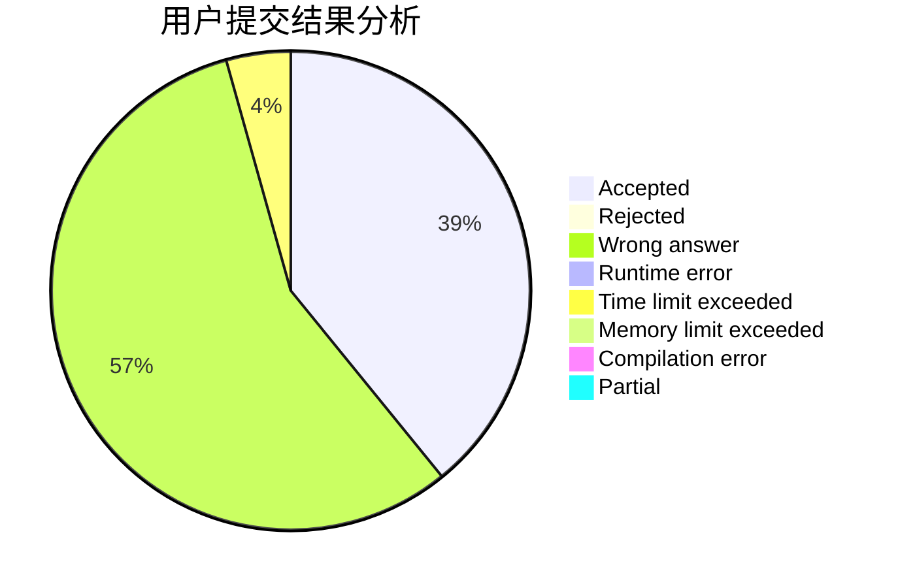
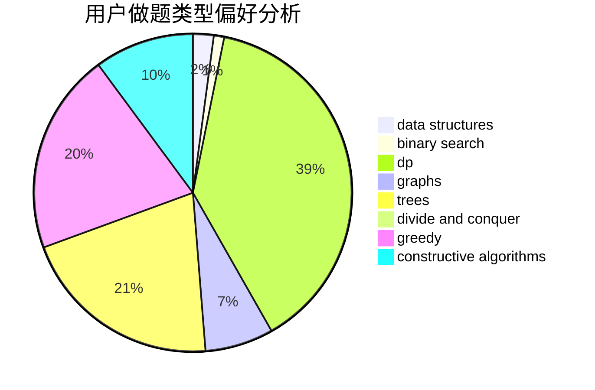

# tan900

<!-- tabs:start -->

#### **用户提交结果分析**

#### **用户做题类型偏好分析**

#### **用户错题知识点分析**

<!-- tabs:end -->
# 推荐题目
[559A](https://codeforces.com/contest/559/problem/A)		brute force,
                        geometry,
                        math		  
[911A](https://codeforces.com/contest/911/problem/A)		implementation		  
[763D](https://codeforces.com/contest/763/problem/D)		data structures,
                        graphs,
                        hashing,
                        shortest paths,
                        trees		  
[782A](https://codeforces.com/contest/782/problem/A)		dsu,graphs,sortings,trees		  
[691D](https://codeforces.com/contest/691/problem/D)		dfs and similar,
                        dsu,
                        math		  
[228B](https://codeforces.com/contest/228/problem/B)		brute force,
                        implementation		  
[840D](https://codeforces.com/contest/840/problem/D)		data structures,
                        probabilities		  
[273D](https://codeforces.com/contest/273/problem/D)		dp		  
[765C](https://codeforces.com/contest/765/problem/C)		math		  
[603B](https://codeforces.com/contest/603/problem/B)		combinatorics,
                        dfs and similar,
                        dsu,
                        math,
                        number theory		  
