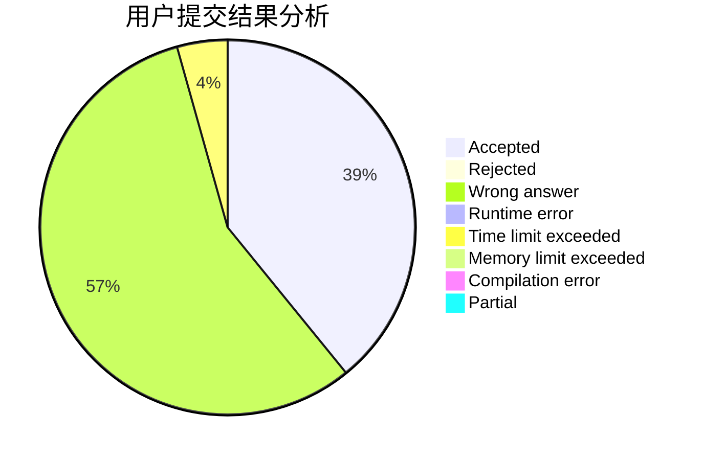
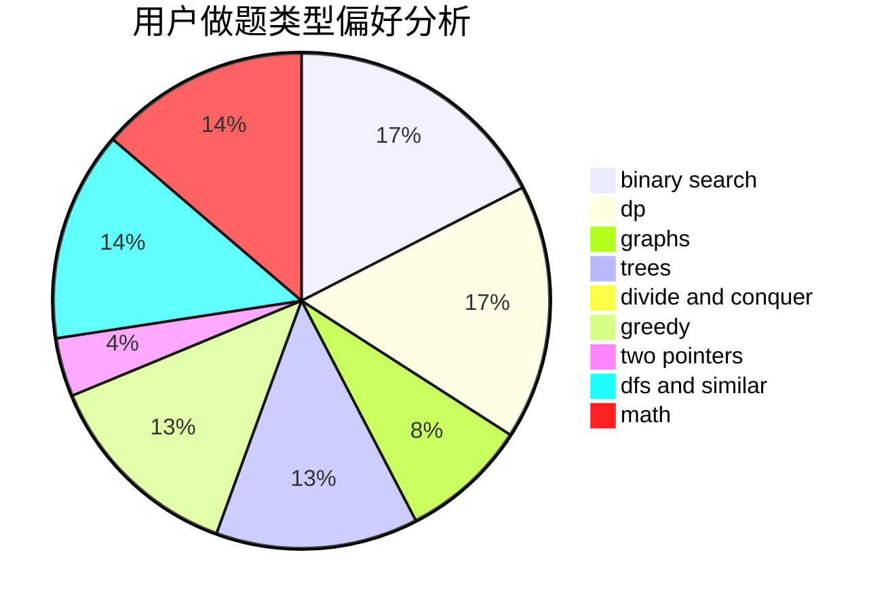

# tan900

<!-- tabs:start -->

#### **用户提交结果分析**

#### **用户做题类型偏好分析**

<!-- tabs:end -->
# 推荐题目
[559A](https://codeforces.com/contest/559/problem/A)
[911A](https://codeforces.com/contest/911/problem/A)
[763D](https://codeforces.com/contest/763/problem/D)
[782A](https://codeforces.com/contest/782/problem/A)
[691D](https://codeforces.com/contest/691/problem/D)
[228B](https://codeforces.com/contest/228/problem/B)
[840D](https://codeforces.com/contest/840/problem/D)
[273D](https://codeforces.com/contest/273/problem/D)
[765C](https://codeforces.com/contest/765/problem/C)
[603B](https://codeforces.com/contest/603/problem/B)
