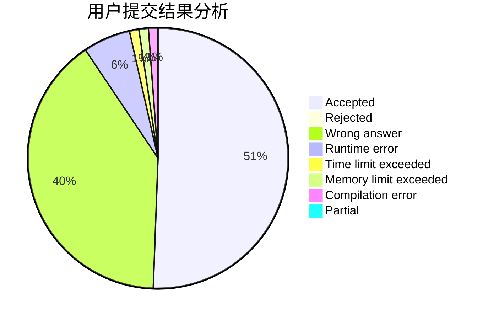
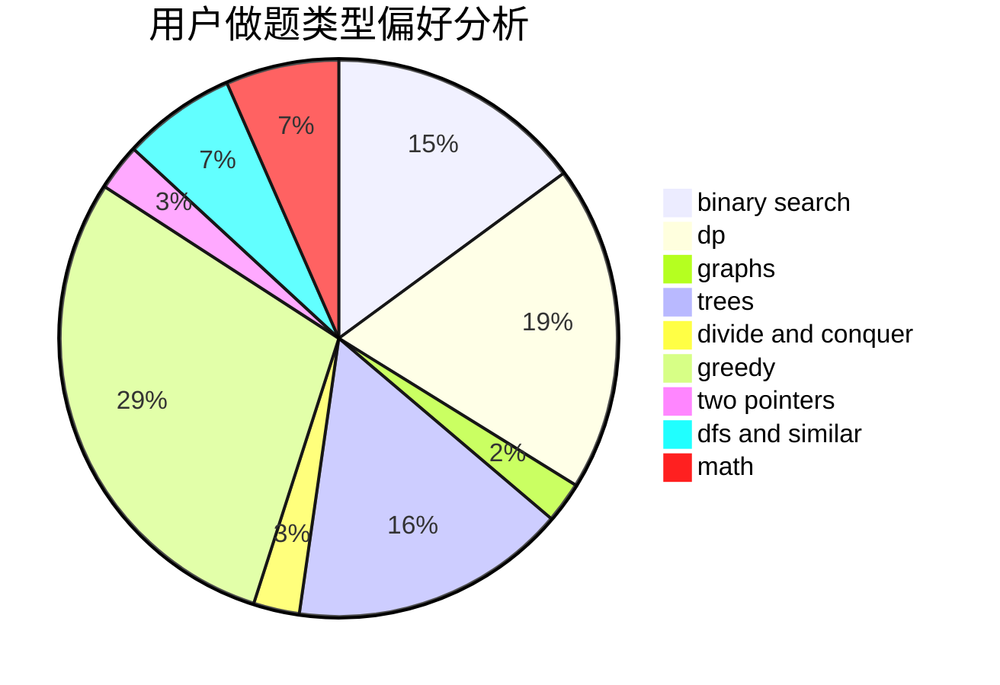

# tang666

<!-- tabs:start -->

#### **用户提交结果分析**

#### **用户做题类型偏好分析**

<!-- tabs:end -->
# 推荐题目
[1446C](https://codeforces.com/contest/1446/problem/C)
[14461](https://codeforces.com/contest/1446/problem/1)
[700D](https://codeforces.com/contest/700/problem/D)
[351E](https://codeforces.com/contest/351/problem/E)
[828C](https://codeforces.com/contest/828/problem/C)
[681A](https://codeforces.com/contest/681/problem/A)
[540B](https://codeforces.com/contest/540/problem/B)
[1473G](https://codeforces.com/contest/1473/problem/G)
[611A](https://codeforces.com/contest/611/problem/A)
[235A](https://codeforces.com/contest/235/problem/A)
