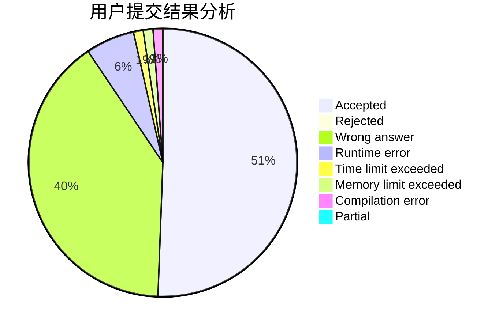
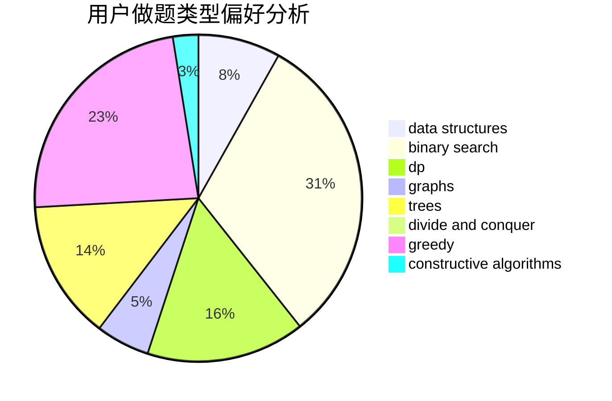
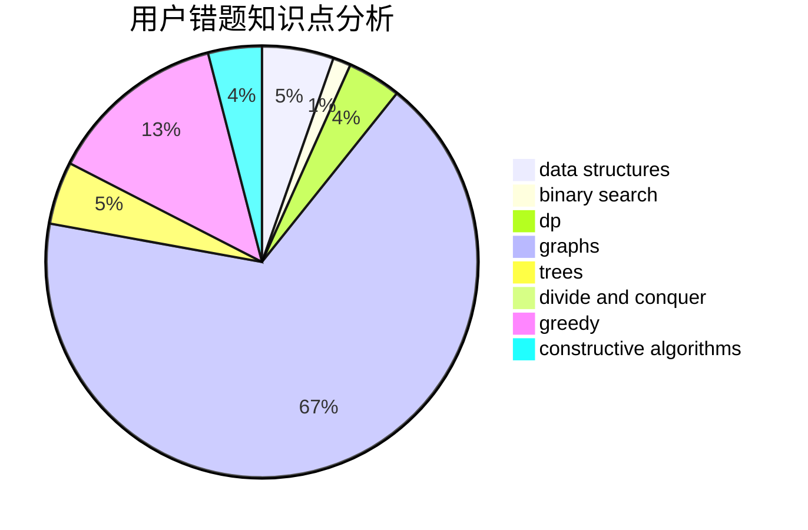

# tang666

<!-- tabs:start -->

#### **用户提交结果分析**

#### **用户做题类型偏好分析**

#### **用户错题知识点分析**

<!-- tabs:end -->
# 推荐题目
[1446C](https://codeforces.com/contest/1446/problem/C)		binary search,
                        bitmasks,
                        data structures,
                        divide and conquer,
                        dp,
                        trees		  
[14461](https://codeforces.com/contest/1446/problem/1)		dsu,graphs,sortings,trees		  
[700D](https://codeforces.com/contest/700/problem/D)		data structures,
                        greedy		  
[351E](https://codeforces.com/contest/351/problem/E)		greedy		  
[828C](https://codeforces.com/contest/828/problem/C)		dsu,graphs,sortings,trees		  
[681A](https://codeforces.com/contest/681/problem/A)		implementation		  
[540B](https://codeforces.com/contest/540/problem/B)		greedy,
                        implementation		  
[1473G](https://codeforces.com/contest/1473/problem/G)		combinatorics,
                        dp,
                        fft,
                        math		  
[611A](https://codeforces.com/contest/611/problem/A)		implementation		  
[235A](https://codeforces.com/contest/235/problem/A)		number theory		  
