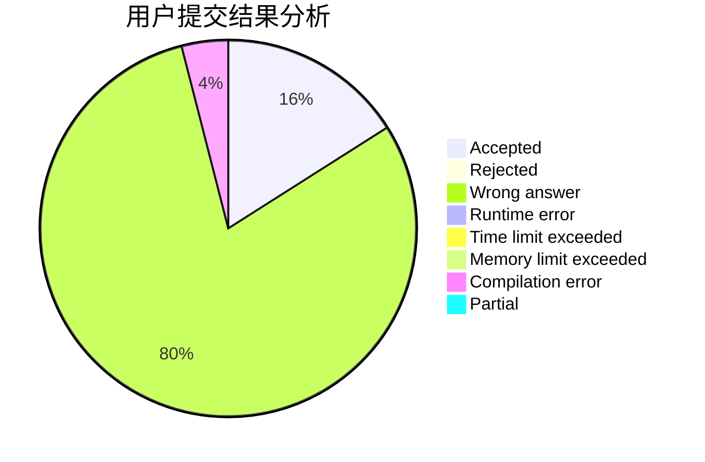
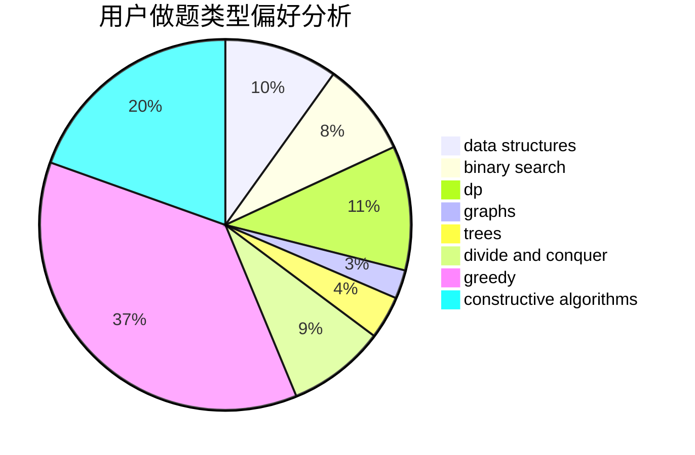
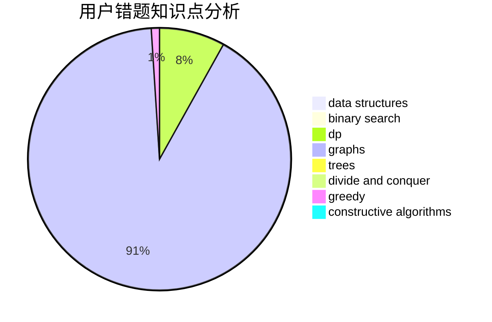

# tc-imba
<!-- tabs:start -->
#### **用户提交结果分析**

#### **用户做题类型偏好分析**

#### **用户错题知识点分析**

<!-- tabs:end -->
# 推荐题目
[New Game Plus!](https://codeforces.com/contest/1457/problem/E)		constructive algorithms,
                        greedy,
                        math		  
[Bad Triangle](http://codeforces.com/problemset/problem/1398/A)		geometry,
                        math		  
[Remembering Strings](http://codeforces.com/problemset/problem/543/C)		bitmasks,
                        dp		  
[Cleaning the Phone](http://codeforces.com/problemset/problem/1475/D)		binary search,
                        dp,
                        sortings,
                        two pointers		  
[The Child and Zoo](https://codeforces.com/contest/438/problem/B)		dsu,
                        sortings		  
[Bus of Characters](http://codeforces.com/problemset/problem/982/B)		data structures,
                        greedy,
                        implementation		  
[Strange Game On Matrix](http://codeforces.com/problemset/problem/873/C)		greedy,
                        two pointers		  
[Bear in the Field](http://codeforces.com/problemset/problem/385/E)		math,
                        matrices		  
[Buttons](http://codeforces.com/problemset/problem/268/B)		implementation,
                        math		  
[Vasya and Good Sequences](http://codeforces.com/problemset/problem/1030/E)		bitmasks,
                        dp		  
<!-- tabs:start -->
#### **data structures**
[New Game Plus!](http://codeforces.com/problemset/problem/982/B)		data structures,
                        greedy,
                        implementation		  
[Bad Triangle](http://codeforces.com/problemset/problem/198/E)		binary search,
                        data structures,
                        sortings		  
[Remembering Strings](http://codeforces.com/problemset/problem/1344/E)		data structures,
                        trees		  
[Cleaning the Phone](http://codeforces.com/problemset/problem/920/E)		data structures,
                        dfs and similar,
                        dsu,
                        graphs		  
[The Child and Zoo](https://codeforces.com/contest/462/problem/E)		data structures,
                        implementation		  
[Bus of Characters](http://codeforces.com/problemset/problem/1286/D)		data structures,
                        math,
                        matrices,
                        probabilities		  
[Strange Game On Matrix](http://codeforces.com/problemset/problem/1492/C)		binary search,
                        data structures,
                        dp,
                        greedy,
                        two pointers		  
[Bear in the Field](http://codeforces.com/problemset/problem/1490/G)		binary search,
                        data structures,
                        math		  
[Buttons](http://codeforces.com/problemset/problem/1479/D)		binary search,
                        bitmasks,
                        brute force,
                        data structures,
                        probabilities,
                        trees		  
[Vasya and Good Sequences](http://codeforces.com/problemset/problem/1497/A)		brute force,
                        data structures,
                        greedy,
                        sortings		  
#### **binary search**
[New Game Plus!](http://codeforces.com/problemset/problem/1475/D)		binary search,
                        dp,
                        sortings,
                        two pointers		  
[Bad Triangle](http://codeforces.com/problemset/problem/679/B)		binary search,
                        dp,
                        greedy		  
[Remembering Strings](http://codeforces.com/problemset/problem/198/E)		binary search,
                        data structures,
                        sortings		  
[Cleaning the Phone](http://codeforces.com/problemset/problem/727/F)		binary search,
                        dp,
                        greedy		  
[The Child and Zoo](http://codeforces.com/problemset/problem/609/D)		binary search,
                        greedy,
                        two pointers		  
[Bus of Characters](http://codeforces.com/problemset/problem/1492/C)		binary search,
                        data structures,
                        dp,
                        greedy,
                        two pointers		  
[Strange Game On Matrix](http://codeforces.com/problemset/problem/1463/D)		binary search,
                        constructive algorithms,
                        greedy,
                        two pointers		  
[Bear in the Field](http://codeforces.com/problemset/problem/1490/G)		binary search,
                        data structures,
                        math		  
[Buttons](http://codeforces.com/problemset/problem/1479/D)		binary search,
                        bitmasks,
                        brute force,
                        data structures,
                        probabilities,
                        trees		  
[Vasya and Good Sequences](http://codeforces.com/problemset/problem/1436/E)		binary search,
                        data structures,
                        two pointers		  
#### **dp**
[New Game Plus!](http://codeforces.com/problemset/problem/543/C)		bitmasks,
                        dp		  
[Bad Triangle](http://codeforces.com/problemset/problem/1475/D)		binary search,
                        dp,
                        sortings,
                        two pointers		  
[Remembering Strings](http://codeforces.com/problemset/problem/1030/E)		bitmasks,
                        dp		  
[Cleaning the Phone](http://codeforces.com/problemset/problem/1142/D)		dp		  
[The Child and Zoo](http://codeforces.com/problemset/problem/679/B)		binary search,
                        dp,
                        greedy		  
[Bus of Characters](http://codeforces.com/problemset/problem/671/A)		dp,
                        geometry,
                        greedy,
                        implementation		  
[Strange Game On Matrix](http://codeforces.com/problemset/problem/891/A)		brute force,
                        dp,
                        greedy,
                        math,
                        number theory		  
[Bear in the Field](http://codeforces.com/problemset/problem/727/F)		binary search,
                        dp,
                        greedy		  
[Buttons](http://codeforces.com/problemset/problem/1174/E)		combinatorics,
                        dp,
                        math,
                        number theory		  
[Vasya and Good Sequences](http://codeforces.com/problemset/problem/1476/C)		dp,
                        graphs,
                        greedy		  
#### **graph**
[New Game Plus!](http://codeforces.com/problemset/problem/825/G)		dfs and similar,
                        graphs,
                        trees		  
[Bad Triangle](http://codeforces.com/problemset/problem/750/H)		dfs and similar,
                        dsu,
                        graphs,
                        interactive		  
[Remembering Strings](http://codeforces.com/problemset/problem/369/C)		dfs and similar,
                        graphs,
                        trees		  
[Cleaning the Phone](https://codeforces.com/contest/1219/problem/B)		divide and conquer,
                        fft,
                        graphs		  
[The Child and Zoo](http://codeforces.com/problemset/problem/920/E)		data structures,
                        dfs and similar,
                        dsu,
                        graphs		  
[Bus of Characters](http://codeforces.com/problemset/problem/550/D)		constructive algorithms,
                        graphs,
                        implementation		  
[Strange Game On Matrix](http://codeforces.com/problemset/problem/666/B)		graphs,
                        shortest paths		  
[Bear in the Field](http://codeforces.com/problemset/problem/1245/D)		dsu,
                        graphs,
                        greedy,
                        shortest paths,
                        trees		  
[Buttons](http://codeforces.com/problemset/problem/1476/C)		dp,
                        graphs,
                        greedy		  
[Vasya and Good Sequences](http://codeforces.com/problemset/problem/682/C)		dfs and similar,
                        dp,
                        graphs,
                        trees		  
#### **trees**
[New Game Plus!](http://codeforces.com/problemset/problem/825/G)		dfs and similar,
                        graphs,
                        trees		  
[Bad Triangle](http://codeforces.com/problemset/problem/369/C)		dfs and similar,
                        graphs,
                        trees		  
[Remembering Strings](http://codeforces.com/problemset/problem/1344/E)		data structures,
                        trees		  
[Cleaning the Phone](http://codeforces.com/problemset/problem/1252/F)		hashing,
                        trees		  
[The Child and Zoo](http://codeforces.com/problemset/problem/1245/D)		dsu,
                        graphs,
                        greedy,
                        shortest paths,
                        trees		  
[Bus of Characters](http://codeforces.com/problemset/problem/682/C)		dfs and similar,
                        dp,
                        graphs,
                        trees		  
[Strange Game On Matrix](http://codeforces.com/problemset/problem/1479/D)		binary search,
                        bitmasks,
                        brute force,
                        data structures,
                        probabilities,
                        trees		  
[Bear in the Field](http://codeforces.com/problemset/problem/1511/C)		brute force,
                        data structures,
                        implementation,
                        trees		  
[Buttons](http://codeforces.com/problemset/problem/1499/F)		combinatorics,
                        dfs and similar,
                        dp,
                        trees		  
[Vasya and Good Sequences](http://codeforces.com/problemset/problem/1491/E)		brute force,
                        dfs and similar,
                        divide and conquer,
                        number theory,
                        trees		  
#### **divide and conquer**
[New Game Plus!](https://codeforces.com/contest/1219/problem/B)		divide and conquer,
                        fft,
                        graphs		  
[Bad Triangle](http://codeforces.com/problemset/problem/1461/D)		binary search,
                        brute force,
                        data structures,
                        divide and conquer,
                        implementation,
                        sortings		  
[Remembering Strings](http://codeforces.com/problemset/problem/1466/G)		combinatorics,
                        divide and conquer,
                        hashing,
                        math,
                        string suffix structures,
                        strings		  
[Cleaning the Phone](http://codeforces.com/problemset/problem/1490/D)		dfs and similar,
                        divide and conquer,
                        implementation		  
[The Child and Zoo](https://codeforces.com/contest/1483/problem/C)		data structures,
                        divide and conquer,
                        dp		  
[Bus of Characters](http://codeforces.com/problemset/problem/1491/E)		brute force,
                        dfs and similar,
                        divide and conquer,
                        number theory,
                        trees		  
[Strange Game On Matrix](http://codeforces.com/problemset/problem/1303/G)		data structures,
                        divide and conquer,
                        geometry,
                        trees		  
[Bear in the Field](http://codeforces.com/problemset/problem/1494/D)		constructive algorithms,
                        data structures,
                        dfs and similar,
                        divide and conquer,
                        dsu,
                        greedy,
                        sortings,
                        trees		  
[Buttons](http://codeforces.com/problemset/problem/1482/E)		data structures,
                        divide and conquer,
                        dp		  
[Vasya and Good Sequences](http://codeforces.com/problemset/problem/566/C)		dfs and similar,
                        divide and conquer,
                        trees		  
#### **greedy**
[New Game Plus!](https://codeforces.com/contest/1457/problem/E)		constructive algorithms,
                        greedy,
                        math		  
[Bad Triangle](http://codeforces.com/problemset/problem/982/B)		data structures,
                        greedy,
                        implementation		  
[Remembering Strings](http://codeforces.com/problemset/problem/873/C)		greedy,
                        two pointers		  
[Cleaning the Phone](http://codeforces.com/problemset/problem/508/C)		constructive algorithms,
                        greedy		  
[The Child and Zoo](http://codeforces.com/problemset/problem/246/C)		brute force,
                        constructive algorithms,
                        greedy		  
[Bus of Characters](http://codeforces.com/problemset/problem/910/B)		greedy,
                        implementation		  
[Strange Game On Matrix](http://codeforces.com/problemset/problem/679/B)		binary search,
                        dp,
                        greedy		  
[Bear in the Field](http://codeforces.com/problemset/problem/671/A)		dp,
                        geometry,
                        greedy,
                        implementation		  
[Buttons](https://codeforces.com/contest/443/problem/D)		greedy,
                        math,
                        probabilities		  
[Vasya and Good Sequences](http://codeforces.com/problemset/problem/463/C)		greedy,
                        hashing,
                        implementation		  
#### **constructive algorithms**
[New Game Plus!](https://codeforces.com/contest/1457/problem/E)		constructive algorithms,
                        greedy,
                        math		  
[Bad Triangle](http://codeforces.com/problemset/problem/508/C)		constructive algorithms,
                        greedy		  
[Remembering Strings](http://codeforces.com/problemset/problem/246/C)		brute force,
                        constructive algorithms,
                        greedy		  
[Cleaning the Phone](http://codeforces.com/problemset/problem/753/C)		brute force,
                        constructive algorithms,
                        interactive		  
[The Child and Zoo](http://codeforces.com/problemset/problem/550/D)		constructive algorithms,
                        graphs,
                        implementation		  
[Bus of Characters](http://codeforces.com/problemset/problem/1513/A)		constructive algorithms,
                        implementation		  
[Strange Game On Matrix](http://codeforces.com/problemset/problem/1513/D)		constructive algorithms,
                        dsu,
                        graphs,
                        greedy,
                        number theory,
                        sortings		  
[Bear in the Field](http://codeforces.com/problemset/problem/1493/A)		constructive algorithms,
                        greedy		  
[Buttons](http://codeforces.com/problemset/problem/1463/D)		binary search,
                        constructive algorithms,
                        greedy,
                        two pointers		  
[Vasya and Good Sequences](https://codeforces.com/contest/1456/problem/B)		bitmasks,
                        brute force,
                        constructive algorithms		  
#### **sortings**
[New Game Plus!](http://codeforces.com/problemset/problem/1475/D)		binary search,
                        dp,
                        sortings,
                        two pointers		  
[Bad Triangle](https://codeforces.com/contest/438/problem/B)		dsu,
                        sortings		  
[Remembering Strings](http://codeforces.com/problemset/problem/198/E)		binary search,
                        data structures,
                        sortings		  
[Cleaning the Phone](http://codeforces.com/problemset/problem/268/E)		math,
                        probabilities,
                        sortings		  
[The Child and Zoo](http://codeforces.com/problemset/problem/1513/D)		constructive algorithms,
                        dsu,
                        graphs,
                        greedy,
                        number theory,
                        sortings		  
[Bus of Characters](https://codeforces.com/contest/1496/problem/C)		geometry,
                        greedy,
                        math,
                        sortings		  
[Strange Game On Matrix](http://codeforces.com/problemset/problem/1495/A)		geometry,
                        greedy,
                        math,
                        sortings		  
[Bear in the Field](http://codeforces.com/problemset/problem/1497/A)		brute force,
                        data structures,
                        greedy,
                        sortings		  
[Buttons](http://codeforces.com/problemset/problem/1427/A)		math,
                        sortings		  
[Vasya and Good Sequences](http://codeforces.com/problemset/problem/1461/D)		binary search,
                        brute force,
                        data structures,
                        divide and conquer,
                        implementation,
                        sortings		  
<!-- tabs:end -->
